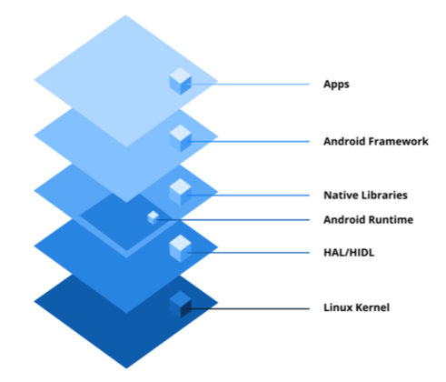
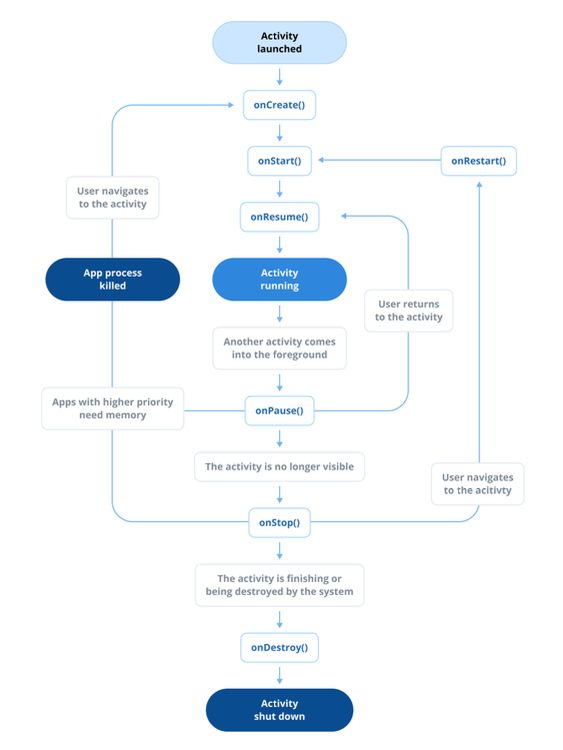
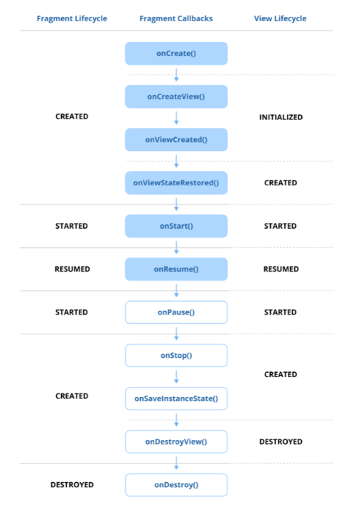
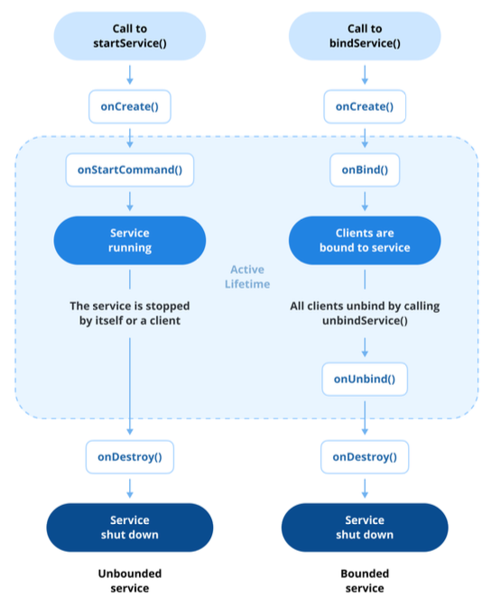

### Q0. 안드로이드란 무엇인가요?

#### 안드로이드 OS의 주요 특징
1. 오픈 소스 및 커스텀화
   - 안드로이드 운영 체제는 오픈 소스이며, 개발자와 제조업체가 자유롭게 커스터마이징 가능
   - 웨어러블, TV, IoT 기기를 포함한 당야한 기기에서의 광범위한 채택과 혁신에 기여
2. SDK를 이용한 애플리케이션 개발
   - Java 또는 Kotlin과 안드로이드 소프트웨어 개발 키트(SDK)를 사용하여 개발
   - Android Studio와 같은 툴을 사용해 애플리케이션을 설계, 개발 및 디버그
3. 풍부한 앱 생태계
   - Google Play Store는 안드로이드의 공식 앱 배포 플랫폼으로, 게임부터 생산성 도구까지 다양한 카테고리에 걸쳐 수백만 개의 앱 제공
   - 서드파티 스토어나 직접 다운로드를 통한 독립적인 배포도 가능
4. 멀티태스킹 및 리소스 관리
   - 안드로이드는 멀티태스킹을 지원하여 여러 애플리케이션을 동시에 실행 가능
   - 관리형 메모리 시스템과 효율적인 가비지 컬렉션을 사용하여 다양한 기기에서 성능을 최적화
5. 다양한 하드웨어 지원
   - 광범위한 기기 구동 및 광범위한 호환성 제공

#### 안드로이드 아키텍처



1. 리눅스 커널 (Linux Kernel)
   - 안드로이드 운영 체제의 기반을 형성
   - 하드웨어 추상화를 처리하여 소프트웨어와 하드웨어 간의 원활한 상호 작용 보장
   - 메모리 및 프로세스 관리, 보안 강화, 하드웨어 구성 요소의 장치 드라이버 관리
2. 하드웨어 추상화 레이어 (Hardware Abstraction Layer (HAL))
   - 안드로이드의 Java API 프레임워크를 기기 하드웨어에 연결하는 표준 인터페이스 제공
   - 프레임워크 API가 하드웨어 접근을 요청하면, 안드로이드 시스템은 해당 HAL 모듈을 동적으로 로드하여 요청 처리
3. 안드로이드 런타임 및 코어 라이브러리 (Android Runtime (ART) 및 Core Libraries)
   - Kotlin이나 Java에서 컴파일된 바이트코드를 사용하여 애플리케이션을 실행
   - 최적화된 성능을 위해 Ahead-of-Time (AOT) 및 Just-in-Time (JIT) 컴파일 지원
   - 코어 라이브러리는 데이터 구조, 파일 조작, 스레드 등을 위한 필수 API를 제공
4. 네이티브 C/C++ 라이브러리 모음 (Native C/C++ Libraries)
   - C 및 C++로 작성된 라이브러리 모음을 포함
       - OpenGL: 그래픽 렌더링 관리
       - SQLite: 데이터베이스 관리
       - WebKit: 웹 콘텐츠 표시를 용이하게 함
   - 안드로이드 프레임워크와 애플리케이션에서 성능 집약적인 작업을 위해 사용
5. 안드로이드 프레임워크 (Android Framework (APIs))
   - 앱 개발을 위한 고수준 서비스와 API를 제공
     - ActivityManager, NotifictionManager, ContentProviders 등
6. 애플리케이션 (Applications)
   - 시스템 앱(연락처나 설정 앱 등)과 안드로이드 SDK를 사용하여 생성된 서드파티 앱을 포함한 모든 유저 기반의 앱

#### 실전 질문
Q) 안드로이드 플랫폼 아키텍처는 Linux Kernel, Android Runtime (ART), Hardware Abstraction Layer (HAL) 등 여러 계층으로 구성됩니다. 이 구성 요소들이 애플리케이션 실행과 하드웨어와의 상호 작용을 위해 어떻게 작동하는지 설명해 주세요.

A) 안드로이드는 리눅스 커널 위에서 작동하며, 모든 하드웨어 접근은 커널을 통해 이루어진다. 하드웨어 추상화 계층 (HAL)은 기기 하드웨어 접근할 수 있는 표준 인터페이스를 제공해준다. ART는 자바 기반 애플리케이션을 실행하는 환경으로 가비지 컬렉션, 메모리 관리 등을 담당하여 효율적인 실행 환경을 보장한다.
네이티브 C/C++ 라이브러리는 고성능 작업을 위해 사용되며, 안드로이드 프레임워크는 애플리케이션 개발을 위한 API를 제공한다. 애플리케이션은 이 모든 구성 요소를 활용하여 사용자 인터페이스를 제공하고, 시스템 리소스에 접근하며, 다양한 기능을 수행한다.

하나의 예시를 들자면
1. 사용자가 앱에서 카메라 버튼을 누름
2. 앱 -> Android Framework API (CameraManager) 호출
3. ANdroid Framework -> HAL 계층에서 카메라 제어 명령 전송
4. HAL -> Linux Kernel의 카메라 드라이버 호출
5. 촬영된 데이터는 Native C/C++ 라이브러리를 통해 처리되고, 결과는 다시 Android Framework를 통해 앱으로 전달됨


### Q1. 인텐트(Intent)란 무엇인가요?

- 수행될 작업에 대한 추상적인 설명으로 Activity, Service, BroadcastReceiver가 통신할 수 있도록 메시징 객체 역할 수행
- 컴포넌트 간에 데이터 전달 가능

#### 1. 명시적 인텐트 (Explicit Intent)
- 정의: 호출할 컴포넌트(Activity 또는 Service)를 직접 이름으로 지정하여 정확히 명시
- 사용 사례: 대상 컴포넌트를 알고 있을 때 사용 (예를 들어, 특정 Activity 시작)
- 시나리오: 다른 Activity를 시작하거나 특정 Service를 호출할 때 사용

```kotlin
val intent = Intent(this, TargetActivity::class.java)
startActivity(intent)
```

#### 2. 암시적 인텐트 (Implicit Intent)
- 정의: 특정 컴포넌트를 지정하지 않고 수행할 일반적인 작업 선언. action, category, data를 기반으로 어떤 컴포넌트가 Intent를 처리할 수 있는지 결정
- 사용 사례: 다른 앱이나 시스템 컴포넌트가 처리할 수 있는 작업을 수행하려할 때 유용 (예를 들어, URL 열기 또는 콘텐츠 공유)
- 시나리오: 브라우저에서 웹 페이지를 열거나, 다른 앱에 데이터를 공유할 때 사용

```kotlin
val intent = Intent(Intent.ACTION_VIEW)
intent.data = Uri.parse("https://www.example.com")
startActivity(intent)
```

#### 실전 질문

Q) 명시적 인텐트와 암시적 인텐트의 차이점은 무어이며, 각각 어떤 시나리오에서 사용해야 하나요?

A) 명시적 인텐트는 호출할 컴포넌트를 직접 지정하는 반면, 암시적 인텐트는 수행할 작업을 선언하고 시스템이 적절한 컴포넌트를 찾아 실행한다. 대표적인 시나리오로 다른 Activity를 시작할 때는 명시적 인텐트를 사용하고, 웹 페이지를 열거나 다른 앱에 데이터를 공유할 때는 암시적 인텐트를 사용한다.

Q) 안드로이드 시스템은 암시적 인텐트를 처리할 앱을 어떻게 결정하며, 적합한 애플리케이션을 찾지 못하면 어떻게 되나요?

A) 안드로이드 시스템은 암시적 인텐트의 action, category, data를 기반으로 해당 작업을 처리할 수 있는 앱을 검색한다. 만약 적합한 애플리케이션을 찾지 못하면, 시스템은 "No Activity found to handle Intent"와 같은 오류 메시지를 표시하며, 사용자는 해당 작업을 수행할 수 없다.

#### Pro Tips for Mastery: 인텐트 필터(Intent Filters)란 무엇인가요?

- 인텐트 필터는 앱 컴포넌트가 특정 Intent에 어떻게 응답할 수 있는지를 정의
- Activity, Service, BroadcastReceiver가 처리할 있는 Intent 유형을 선언
- 각 인텐트 필터는 action, category, data 요소를 포함하여 어떤 Intent가 해당 컴포넌트에 의해 처리될 수 있는지 지정
- 암시적 인텐트를 사용할 때, 시스템은 인텐트 필터를 통해 적합한 컴포넌트를 찾음

### Q2. PendingIntent의 목적은 무엇인가요?

- 다른 애플리케이션이나 시스템 컴포넌트가 애플리케이션을 대신하여 미리 정의된 Intent를 나중에 실행할 있는 권한을 부여하는 Intent
- 알림이나 서비스와의 상호작용과 같이 앱의 수명 주기를 벗어나 트리거되어야 하는 작업에 유용

#### PendingIntent의 주요 특징

- 일반 Intent의 래퍼(Wrapper) 역할을 하여 앱의 생명주기를 넘어서 지속될 수 있도록 함
- 앱과 동일한 권한으로 다른 앱이나 시스템 서비스에 Intent 실행을 위임
- 세 가지 주요 형태로 사용
  - Activity: Activity를 시작
  - Service: Service를 시작
  - Broadcast: 브로드캐스트를 보냄
- PendingIntent.getActivity(), PendingIntent.getService(), PendingIntent.getBroadcast() 메소드를 사용하여 생성
```kotlin
val intent = Intnet(this, MyActivity::class.java)
// FLAG_IMMUTABLE 또는 FLAG_MUTABLE 플래그 지정 필수 (Android 12+)
val pendingIntentFlags = if (Build.VERSION.SDK_INT >= Build.VERSION_CODES.S) {
    PendingIntent.FLAG_CURRENT or PendingIntent.FLAG_IMMUTABLE
} else {
    PendingIntent.FLAG_UPDATE_CURRENT
}
val pendingIntent = PendingIntent.getActivity(
    this,
    0,  // requestCode
    intent,
    pendingIntentFlags
)

val notification = NotificationCompat.Builder(this, CHANNEL_ID)
    .setContentTitle("Title")
    .setContentText("Content")
    .setSmallIcon(R.drawable.ic_notification)
    .setContentIntent(pendingIntent)  // 알람을 탭했을 때 트리거됨
    .setAutoCancel(true)  // 탭하면 알림 자동 삭제
    .build()

NotificationManagerCompat.from(this).notify(NOTIFICATION_ID, notification)
```
- 동작 방식과 시스템 또는 다른 컴포넌트와의 상호 작용 방식을 제어하는 다양한 플래그를 지원
  - FLAG_UPDATE_CURRENT: 동일한 requestCode를 가진 PendingIntent가 이미 존재할 경우, 기존 Intent를 업데이트
  - FLAG_CANCEL_CURRENT: 기존 PendingIntent를 취소하고 새로운 PendingIntent를 생성
  - FLAG_IMMUTABLE: PendingIntent를 수정할 수 없도록 설정 (Android 12 이상 필수)
  - FLAG_ONE_SHOT: PendingIntent가 한 번만 사용되도록 설정

#### 사용 사례

1. 알림 (Notification)
   - 사용자가 알림을 탭했을 때 특정 Activity를 여는 것과 같은 작업 허용
2. 알람 (Alarms)
   - AlarmManager를 사용하여 작업 예약
3. 서비스 (Services)
   - 백그라운드 작업을 위해 ForegroundService 또는 BroadcastReceiver에 작업을 위임

#### 보안 고려 사항

- 악의적인 앱이 기본 Intent를 가로채거나 수정하는 것을 방지하기 위해 PendingIntent에 FLAG_IMMUTABLE 플래그를 설정하는 것이 중요

#### 실전 질문

Q) PendingIntent란 무엇이며 일반 Intent와 어떻게 다른가요? PendingIntent 사용이 필요한 시나리오를 제시해 줄 수 있나요?

A) PendingIntent는 다른 애플리케이션이나 시스템 컴포넌트가 앱을 대신하여 미리 정의된 Intent를 나중에 실행할 수 있는 권한을 부여하는 객체입니다. 일반 Intent와 달리, PendingIntent는 앱의 생명주기를 넘어 지속될 수 있으며, 알림이나 서비스와의 상호작용과 같이 앱이 활성화되지 않은 상태에서도 작업을 트리거할 수 있습니다. 예를 들어, 알림 (Notification)을 탭했을 때 특정 Activity를 여는 경우에 사용됩니다.

### Q3. Serializable과 Parcelable의 차이점은 무엇인가요?

#### Serializable

- Java 표준 인터페이스 (Java Standard Interface)
  - 객체를 ByteStream으로 변환하여 Activity 간에 전달하거나 디스크에 수 있도록 하는 표준 Java 인터페이스
- 리플렉션 기반 (Reflection-based)
  - 시스템이 런타임에 클래스와 필드를 동적으로 검사하여 객체를 직렬화
- 성능
  - 리플렉션은 느린 프로세스이기 떄문에 Parcelable보다 성능이 떨어짐
  - 직렬화 중에 많은 임시 객체를 생성하여 메모리 오버헤드를 증가
- 사용 사례
  - 성능이 중요하지 않거나 안드로이드 특정 코드가 아닌 코드베이스를 다룰 때 유용

#### Parcelable

- 안드로이드 기반 인터페이스 (Android-Specific Interface)
  - 안드로이드 컴포넌트 내에서 고성능 프로세스 통신(IPC)을 위한 설계된 안드로이드 특정 인터페이스
- 성능
  - 안드로이드에 최적화되어 있고 리플렉션에 의존하지 않기 때문에 Serializable보다 빠름
  - 많은 임시 객체 생성을 피하여 가비지 컬렉션을 최소화
- 사용 사례
  - 성능이 주용한 안드로이드 데이터 전달, 특히 IPC나 Activity 간 데이터 전달에 선호
```kotlin
import kolinx.parcelize.Parcelize
import android.os.Parcelable

@Parcelize
class User(val firstName: String, val lastName: String, val age: Int) : Parcelable
```
- kotlin-parcelize plugin을 사용하여 Parcelable을 쉽게 구현할 수 있음
- @Parcelize 어노테이션을 사용하여 Parcelable 인터페이스를 구현하는 클래스를 정의
- writeToParcel과 같은 메소드를 재정의하거나 CREATOR를 정의할 필요 없이, 컴파일러가 자동으로 필요한 메소드를 생성

#### Additional Tips
- @Parcelize로 표기된 클래스가 원시 타입(primitive type)이 아니고, @Parcelize로 표기되지 않은 클래스를 property로 포함 시 다음 오류 발생
  - Type is not directly supported by 'Parcelize'. Annotate the parameter type with '@RawValue' if you want it to be serialized using 'writeValue()'
  - Parcelize Compiler 플러그인이 직렬화 중에 모든 속성을 평면화하려고 하기 때문에 발생하는 문제
- 모든 property의 타입이 primitive type이거나 @Parcelize로 표기된 클래스여야 함
- 수동으로 직렬화를 한다면 property에 @RawValue 어노테이션을 추가하여 수동으로 직렬화 로직 추가

#### 주요 차이점

| 기능       | Serializable                            | Parcelable                                |
|------------|------------------------------------------|--------------------------------------------|
| 유형       | 표준 Java 인터페이스                    | 안드로이드에 특화된 인터페이스            |
| 성능       | 느림, 리플렉션 사용                     | 빠름, 안드로이드에 최적화됨               |
| 가비지 생성 | 더 많은 가비지 생성 (더 많은 객체)     | 더 적은 가비지 생성 (효율적)              |
| 사용 사례  | 일반적인 Java 사용에 적합               | 안드로이드, 특히 IPC에 선호됨             |

#### 실전 질문

Q) 안드로이드에서 Serializable과 Parcelable의 차이점은 무엇이며, 일반적으로 컴포넌트 간 데이터 전달에 Parcelable이 선호되는 이유는 무엇인가요?

A) Serializable은 Java 표준 인터페이스로, 객체를 ByteStream으로 변환하여 전달하는 데 사용되며, 리플렉션 기반이기 때문에 성능이 떨어집니다. 반면, Parcelable은 안드로이드에 최적화된 인터페이스로, 리플렉션을 사용하지 않고 빠른 데이터 직렬화를 지원합니다.<br>
Parcelable은 메모리 오버헤드를 최소화하고 IPC(프로세스 간 통신)에 최적화되어 있어 안드로이드 컴포넌트 간 데이터 전달에 선호됩니다.

#### Pro Tips for Mastery: Parcel과 Parcelable이란 무엇인가요?

- Parcel은 안드로이드에서 애플리케이셔의 다른 컴포넌트 간의 고성능 프로세스 통신(IPC)을 가능하게 하는 컨테이너 클래스
- 주로 데이터를 직렬화하고 역직렬화하여 안드로이드의 IPC 경계를 넘어서 전달할 수 있도록 사용
- Parcelable은 객체를 직렬화하여 Parcel을 통해 전달할 수 있도록 하는 안드로이드에 특화된 인터페이스
- Parcelable을 구현하는 클래스는 Parcel에 쓰고 복원할 수 있어 안드로이드 컴포넌트 간에 복잡한 데이터를 전달하는 데 적합

#### 추가) IPC와 Parcel의 관계

- IPC란?
  - 두 개 이상의 앱 또는 시스템 서비스가 서로 다른 프로세스에서 실행될 때 데이터를 주고받는 메커니즘
- 왜 필요한가?
  - 각 앱은 샌드박스로 보호되므로 다른 앱의 메모리에 직접 접근 불가
  - 대신 시스템이 제공하는 통신 수단을 사용해야 함
- Parcel이란?
  - 안드로이드에서 IPC에 최적화된 고성능 직렬화 포맷. 일반 Serializable보다 빠르고 효율적
- 사용처
  - AIML, Messenger, Bundle, Intent, Binder 등
  - 안드로이드 IPC 메커니즘 내부에서 데이터 전송 시 거의 모두 Pacel을 사용


### Q4. Context란 무엇이며 어떤 유형의 Context가 있나요?

- Context는 애플리케이션의 환경 또는 상태를 나타내며 애플리케이션별 리소스 및 클래스에 대한 접근을 제공
- Activity 실행, assets 접근 또는 레이아웃 인플레이션과 같은 작업에 필수적인 컴포넌트

#### Application Context (애플리케이션 컨텍스트)

- 애플리케이션의 생명주기와 연결되어 있어 Activity나 Fragment와 독립적인 전역적이고 오래 지속되는 Context가 필요할 때 사용
- getApplicationContext() 메소드를 통해 접근 가능
- 사용 사례
  - SharedPreferences나 데이터베이스와 같은 애플리케이션 전체 리소스 접근
  - 전체 앱 생명주기 동안 지속되어야 하는 BroadcastReceiver 등록
  - 앱 생명주기 동안 유지되는 라이브러나 컴포넌트를 초기화

#### Activity Context (액티비티 컨텍스트)

- Activity의 생명주기와 연결
- Activity에 특정한 리소스 접근, 다른 Activity 시작, 레이아웃 인플레이션에 사용
- 사용 사례
  - UI 컴포넌트를 생성 또는 업데이트
  - 다른 Activity 시작
  - 현재 Activity 범위에 있는 리소스나 테마에 접근

#### Service Context (서비스 컨텍스트)

- Service의 생명주기와 연결
- 주로 네트워크 작업 수행이나 음악 재생과 같은 백그라운드 작업에 사용

#### Broadcast Context (브로드캐스트 컨텍스트)

- BroadcastReceiver가 호출될 때 제공
- 수명이 짧으며 특정 브로드캐스트에 응답하는 데 사용. 따라서, 장기적인 작업을 수행하면 안됨

#### Context의 일반적인 사용 사례

1. 리소스 접근
   - getString() 또는 getDrawable()과 같은 메소드를 사용하여 문자열, Drawable, Dimension과 같은 리소스에 대한 접근 제공
2. 레아아웃 인플레이션
   - LayoutInflater를 사용하여 XML 레이아웃 파일을 View 객체로 변환
3. 액티비티 및 서비스 시작
   - startActivity() 또는 startService()를 시작하려면 context가 필요
4. 시스템 서비스 접근
   - getSystemService()를 통해 ClipboardManager, ConnectivityManager와 같은 시스템 수준 서비스에 대한 접근 제공 
5. 데이터베이스 및 SharedPreferences 접근
   - SQLite 데이터베이스나 SharedPreferences와 같은 애플리케이션 데이터를 저장하고 검색하는 데 사용

#### 실전 질문

Q) 안드로이드 애플리케이션에서 올바른 유형의 Context를 사용하는 것이 왜 중요하며, Activity Context에 대해 오랜 참조를 유지하는 것은 잠재적으로 어떤 문제를 발생시킬 수 있나요?

A) 올바른 유형의 Context를 사용하는 것은 메모리 누수 및 애플리케이션 성능에 영향을 미치는 문제를 방지하는 데 중요하다. Activity Context는 Activity의 생명주기와 연결되어 있기 때문에 Activity가 종료된 후에도 오랜 참조를 유지하면 메모리 누수가 발생할 수 있다.

#### Pro Tips for Mastery: Context 사용 시 주의할 점은 무엇인가요?

- Activity 또는 Fragment Context에 대한 참조를 해당 생명주기보다 오래 유지
- 가비지 컬렉터가 Context 또는 관련 리소스에 대한 메모리를 회수할 수 없게 하므로 메모리 누수 발생
```kotlin
object Singleton {
    var context: Context? = null // Context를 유지하여 메모리 누수 유발
}
```
- Context가 필요한 오래 지속되는 객체에는 Application Context를 사용
```kotlin
object Singleton {
    lateinit var applicationContext: Context
}
```
- 레이아웃 인플레이션이나 다이얼로그 표시와 같은 UI 관련 작업에는 Activity Context를 사용하는 것이 적합
- 라이브러리 초기화와 같이 UI 생명주기와 독립적인 작업에는 Application Context를 사용

```kotlin
// Application Context는 테마에 대한 리소스 정보가 없으므로 AlertDialog 사용에 부적합
val dialog = AlertDialog.Builder(context.applicationContext)

val dialog = AlertDialog.Builder(activityContext) // 올바름
```

- 소멸된 컴포넌트에 연결된 Context에 접근하면 해당 Context에 연결된 리소스가 더 이상 존재하지 않을 있으므로 예상 못한 동작 발생
```kotlin
// 액티비티 참조를 유지하는 버튼 (메모리 누수 가능성)
val button = Button(activity)
activity.finish()   // 액티비티는 소멸되었지만 버튼은 참조를 유지
```

- Context는 메인 스레드용으로 설계되었으며, 백그라운드 스레드에서 사용하면 예기치 않은 크래시나 스레딩 관련 문제가 발생
- 백그라운드 작업 도중 UI 관련 Context 리소스와 상호작용이 필요하다면 메인 스레드로 다시 전환 필요

```kotlin
viewModelScope.launch {
    val data = fetchDate()
    // UI 업데이트는 메인 스레드에서 수행해야 하빈다.
    withContext(Dispatchers.Main) {
        Toast.makeText(context, "Data fetched", Toast.LENGTH_SHORT).show()
    }
}
```

#### Pro Tips for Mastery: ContextWrapper란 무엇인가요?

- Context를 상속받고 있는 클래스로, Context 객체를 감싸서(wrapping) 래핑된 Context에 대한 호출을 위임하는 기능 제공
- 기존 Context의 특정 동작을 개선시키거나 재정의할 때 사용. 
- Context에 대한 호출을 중개하고 추가 기능이나 커스텀 동작을 제공하는 목적으로 많이 사용
- 사용 사례
  1. 커스텀 컨텍스트
     - 앱 전체에 다른 테마 적용 또는 리소스를 특수한 방식으로 처리하는 등 특정 목적을 위한 커스텀 Context를 만들 때 사용
  2. 동적 리소스 처리
     - 문자열, dimensions, style과 같은 리소스를 동적으로 제공하거나 수정하기 위해 Context를 래핑
  3. 의존성 주입
     - Dagger나 Hilt와 같은 라이브러리는 의존성 주입을 위해 커스텀 ContextWrapper를 사용하여 컴포넌트에 ContextWrapper를 Context 타입으로 제공
```kotlin
class CustomThemeContextWrapper(base: Context) : ContextWrapper(base) {
    private var theme: Resources.Theme? = null
    
    override fun getTheme(): Resources.Theme { 
        if (theme == null) {
         theme = super.getTheme()
         theme?.applyStyle(R.style.CustomTheme, true)   // 커스텀 테마 적용 
        }
        return theme!!
    }
    
    override fun setTheme(themeResId: Int) {
        // 테마 리소스 ID 설정 시 내부 테마 초기화
        theme = null
        super.setTheme(themeResId)
    }
}

class MyActivity : AppCompatActivity() {
    override fun attachBaseContext(newBase: Context) {
        super.attachBaseContext(CustomThemeContextWrapper(newBase)) // 커스텀 ContextWrapper 사용
    }
}
```
- 주요 이점
  1. 재사용성
     - 커스텀 로직을 Wrapper 클래스에 캡슐화하고 여러 컴포넌트에서 재사용
  2. 캡슐화
     - 원본 Context 구현을 변경하지 않고 동작을 개선하거나 필요에 맞게 재정의
  3. 호환성
     - 이미 존재하던 Context 객체와 원활하게 작동하여 호환성 유지

#### Pro Tips for Mastery: Activity에서 this와 baseContext 인스턴스의 차이점은 무엇인가요?
- Activity에서의 this
  - Activity의 현재 컨텍스트를 참조하므로, 해당 Activity에서 제공하는 고유한 메소드를 호출 가능
  - 다른 Activity를 시작하거나, 해당 Activity에 종속된 다이얼로그를 띄울 때 사용
  ```kotlin
  val intent = Intent(this, AnotherActivity::class.java)
  startActivity(intent)
  
  val dialog = AlertDialog.Builder(this)
        .setTitle("Title")
        .setMessage("This dialog is tied to this Activity instance.")
        .create()
  ```
- Activity에서의 baseContext
  - Activity과 상속하고 있는 ContextWrapper 클래스의 일부
  - Context 메소드에 대한 핵심 구현을 제공하는 ContextImpl 인스턴스
  - 커스텀 ContextWrapper을 작업을 하거나 ContextWrapper가 가지고 있는 원본 Context를 참조해야할 때 사용
  ```kotlin
  val systemService = baseContext.getSystemService(Context.LAYOUT_INLFATER_SERVICE)
  ```
- this와 baseContext의 차이점
  - 범위(Scope)
    - this는 현재 Activity 인스턴스와 그 생명주기를 나타냄
    - baseContext는 Actviity가 구축된 low level의 Context를 참조
  - 사용(Usage)
    - this는 다른 Activity를 시작하거나 다이얼로그를 띄우는 작업과 같이 Activity의 생명주기나 UI와 관련된 작업에 사용
    - 주로 CustomWrapper를 구현하는 시나리오에서 Context의 핵심 구현체와 상호 작용할 때 사용
  - 계층(Hierarchy)
    - baseContext는 Activity의 기반 Context
    - baseContext에 접근하면 Activity가 ContextWrapper로서 제공하는 API에 대한 우회적인 접근 가능
  - 보통은 this가 baseContext보다 더 많은 기능을 제공
  - 하지만 일부 특수한 경우에는 baseContext가 더 적합하거나 필요한 상황 존재
- 예제: 커스텀 ContextWrapper
    ```kotlin
    class CustomContextWrapper(base: Context) : ContextWrapper(base) {
        override fun getSystemService(name: String): Any? {
            // LayoutInflater 수정
            if (name == Context.LAYOUT_INFLATER_SERVICE) {
                val inflater = super.getSystemService(name) as LayoutInflater
                // 'this'는 CustomContextWrapper 인스턴스를 참조
                return inflater.cloneInContext(this)
            }
            // 다른 서비스는 baseContext에서 가져옴
            return super.getSystemService(name)   
        }
    }
  
    override fun attachBaseContext(newBase: Context) {
        // baseContext를 CustomContextWrapper로 감쌈
        super.attachBaseContext(CustomContextWrapper(newBase))
    }
    ```

### Q5. Application 클래스란 무엇인가요?

- 전역 애플리케이션 상태와 생명주기를 유지하기 위한 역할을 하고 다른 컴포넌트보다 가장 먼저 초기화되는 앱의 프로세스 진입점 역할을 수행
- 앱의 전체 생명주기 동안 사용 가능한 Context를 제공하므로 앱 전역에 걸쳐 공유되는 리소스 및 인스턴스를 초기화하는 데 이상적

#### Application 클래스의 목적

- 전역 상태를 유지하고 애플리케이션 전체 초기화를 수행하도록 설계
- 의존성 설정, 라이브러리 구성, Activity와 Service 전반에 걸쳐 지속되어야 하는 리소스 초기화

#### Application 클래스의 주요 메소드

1. onCreate()
   - 앱 프로세스가 생성될 때 호출. 애플리케이션 전체 의존성을 초기화
   - 애플리케이션 생명주기 동안 단 한 번만 호출
2. onTerminate()
   - 에뮬레이션된 환경에서 애플리케이션이 종료될 때 호출
   - 안드로이드가 호출을 보장하지 않으므로 실제 기기의 프로덕션 환경에서는 호출되지 않음
3. onLowMemory() 및 onTrimMemory()
   - onLowMemory()는 이전 API 레벨에서 사용
   - onTrimMemory()는 앱의 현재 메모리 상태에 따라 더 세분화된 제어 제공

#### Application 클래스 사용 방법

- 커스텀 Application 클래스를 만드려면 Application 클래스를 상속받아 구현
- AndroidManifest.xml 파일의 <application> 태그에 android:name 속성을 사용하여 커스텀 Application 클래스를 지정
```kotlin
class CustomApplication : Application() {
    
    override fun onCreate() {
        super.onCreate()
        // 전역 의존성 초기화
        initializeDatabase()
        initializeAnalytics()
    }
    
    private fun initializeDatabase() {
        // 데이터베이스 인스턴스 설정
    }
    
    private fun initializeAnalytics() {
        // 분석 라이브러리 초기화
    }
}
```
```xml
<application
    android:name=".CustomApplication"
    ... >
    ...
</application>
```

#### Application 클래스의 사용 사례
1. 전역 리소스 관리
   - 데이터베이스, SharedPreferences, 네트워크 클라이언트와 같은 전역 리소스 초기화 및 관리
   - 애플리케이션 생명주기 전역에 걸쳐서 재사용 가능
2. 컴포넌트 초기화
   - Firebase Analytics, Timber 등과 같은 도구를 애플리케이션 시작 중에 적절하게 초기화
3. 의존성 추입
   - Dagger나 Hilt와 같은 프레임워크를 초기화하여 앱 전체에 의존성 제공

#### 주의 사항
1. 초기에 앱 실행 지연 방지를 위해 onCreate() 메소드에서 무거운 작업을 피해야 함
2. 관련 없는 로직을 넣는 것을 자제하고 전역 초기화 및 리소스 관리에만 집중하는 것이 좋음
3. 앱 전반에 걸쳐 사용되는 공유 리소스에 대해서는 스레드 안정성을 보자해야 함

#### 실전 질문

Q) Application 클래스의 목적은 무엇이고, 생명주기 및 리소스 관리 측면에서 Activity와는 어떻게 다른가요?

A) Application 클래스는 애플리케이션의 전역 상태와 생명주기를 유지하는 역할을 하며, 앱 전체에 걸쳐 공유되는 리소스 및 인스턴스를 초기화하는 데 사용된다. Activity는 사용자 인터페이스와 관련된 생명주기를 관리하는 반면, Application 클래스는 앱의 전반적인 초기화 및 리소스 관리를 담당한다. Application 클래스는 앱 프로세스가 시작될 때 한 번만 호출되며, Activity가 생성되고 소멸되는 것과는 달리 앱 전체 생명주기 동안 지속된다.

### Q6. AndroidManifest 파일의 목적은 무엇인가요?

- 안드로이드 운영 체제에 애플리케이션에 대한 필수 정보를 정의
- 애플리케이션과 OS 간의 브릿지 역할을 하며 컴포넌트, 권한, 하드웨어 및 소프트웨어 기능 등을 정의

#### AndroidManifest.xml의 주요 기능
1. 애플리케이션 컴포넌트 선언
   - Activity, Service, BroadcastReceiver, ContentProvider와 같은 필수 컴포넌트를 등록
2. 권한(Permissions)
   - INTERNET, ACCESS_FINE_LOCATION 또는 READ_CONTACTS와 같은 권한을 선언
3. 하드웨어 및 소프트웨어 요구 사항
   - 카메라, GPS 또는 특정 화면 크기와 같이 앱이 의존하는 기능을 명시하여 Play Store가 이러한 요구 사항을 충족하지 않는 기능을 필터링
4. 앱 메타 정보(App Metadata)
   - 앱의 패키지 이름, 버전, 최소 및 대상 API 레벨, 테마, 스타일과 같은 필수 정보 제공
5. 인텐트 필터(Intent Filters)
   - 컴포넌트에 대한 Intent Filter를 절의하여 링크를 열거나 콘텐츠 공유와 같이 특정 작업을 수행할 수 있는 앱을 정의
6. 앱 구성 및 세팅(App Configuration and Settings)
   - 메인 런처 Activity 정의, 백업 동작 구성, 테마 지정과 같은 구성을 포함

```xml
<manifest xmlns:android="http://schemas.android.com/apk/res/android">

    <!‑‑ Permissions ‑‑>
    <uses‑permission android:name="android.permission.INTERNET" />
    <uses‑permission android:name="android.permission.ACCESS_FINE_LOCATION" />
    
    <application
        android:allowBackup="true"
        android:icon="@mipmap/ic_launcher"
        android:label="@string/app_name"
        android:theme="@style/AppTheme">
    
        <!‑‑ Main Activity ‑‑>
        <activity android:name=".MainActivity"
                  android:exported="true">
            <intent‑filter>
                <action android:name="android.intent.action.MAIN" />
                <category android:name="android.intent.category.LAUNCHER" />
            </intent‑filter>
        </activity>
        
        <!‑‑ Additional Components ‑‑>
        <service android:name=".MyService" />
        <receiver android:name=".MyBroadcastReceiver"
                  android:exported="false" />
        
    </application>
</manifest>
```

#### 실전 질문

Q) AndroidManifest의 인텐트 필터는 앱 상호 작용을 어떻게 가능하게 하고, 액티비티 클래스가 AndroidManifest에 등록되어 있지 않으면 어떻게 되나요?

A) 인텐트 필터는 앱이 특정 작업을 수행할 수 있는 컴포넌트를 정의하여 다른 앱이나 시스템 서비스가 해당 컴포넌트와 상호 작용할 수 있도록 한다. 예를 들어, ACTION_VIEW 인텐트 필터를 사용하여 웹 페이지를 열 수 있는 Activity를 정의할 수 있다. 만약 액티비티 클래스가 AndroidManifest에 등록되어 있지 않으면, 해당 액티비티를 시작하려고 할 때 "Activity not found" 오류가 발생하며, 시스템은 해당 액티비티를 찾을 수 없게 된다.

### Q7. Activity 생명주기를 설명해주세요

- Activity 생명주기는 Activity가 생성부터 소멸까지 거치는 다양한 상태를 나타냄



1. onCreate()
   - Activity가 생성될 때 호출되며, UI 컴포넌트를 설정하며, 초기화하고, 저장된 인스턴스 상태를 복원
   - Activity의 생명주기 동안 단 한 번만 호출
2. onStart()
   - Activity가 사용자에게 보이지만 아직 상호작용할 수는 없음
   - onCreate() 이후와 onResume() 이전에 호출
3. onRestart()
   - Activity가 중지되었다가 다시 시작되는 경우, onStart() 전에 호출
4. onResume()
   - Actvity가 포그라운드(foreground)에 있으며 사용자와 상호작용할 있음
   - 일시 중지된 UI 업데이트, 애니메이션 또는 입력 리스너를 재개
5. onPause()
   - 다른 Activity(예: 다이얼로그)에 의해 Activity가 부분적으로 가려질 때 호출
   - Activity가 여전히 보이지만 포커스된 상태는 아님
   - 애니메이션, 센서 업데이트 또는 데이터 저장과 같은 작업을 일시 중지하는 데 사용
6. onStop()
   - Activity가 더 이상 사용자에게 보이지 않을 때 호출
   - Activity가 중지된 동안 필요하지 않은 리소스를 해제해야 함 (예: 백그라운드 작업 또는 무거운 객체)
7. onDestroy()
   - Activity가 완전히 소멸되고 메모리에서 제거되기 전에 호출
   - 남아 있는 리소스를 해제하기 위한 최종 메소드

#### 실전 질문

Q) onPause()와 onStop()의 차이점은 무엇인지 설명하고, 리소스 점유율이 높은 작업을 처리하는 경우 해당 메서드들을 어떤 시나리오에서 사용해야 하나요?

A) onPause()는 Activity가 사용자와 상호작용을 중단할 때 호출되며, UI 업데이트나 애니메이션을 일시 중지하는 데 사용된다. 반면, onStop()은 Activity가 더 이상 사용자에게 보이지 않을 때 호출되며, 백그라운드 작업이나 리소스 점유율이 높은 작업을 중지하거나 해제하는 데 사용된다. 예를 들어, 비디오 재생을 일시 중지하려면 onPause()를 사용하고, 네트워크 작업을 중지하려면 onStop()을 사용할 수 있다.

#### Pro Tips for Mastery: 액티비티 간의 생명주기 변화 심층적으로 살펴보기

"Activity A를 시작한 다음 Activity B를 시작하고, 다시 Activity A로 순차적으로 돌아올 생명주기에 어떤 변화가 일어나는지 각각 설명해 보세요."

- Activity A의 초기 실행
  - Activity A
    - onCreate() -> onStart() -> onResume() 순서로 호출되고 사용자가 Activity A와 상호작용 가능
- Activity A에서 Activity B로 이동
  - Activity A
    - onPause(), UI를 일시 중지하고 시각적으로 보이는 상태 관련 리소스 해제
  - Activity B
    - onCreate() -> onStart() -> onResume(), 포커스를 가져오고 포그라운드 Activity가 됨
  - Activity A
    - onStop(), Activity B가 Activity A 위에 완전히 오버레이되는 순간 호출
- Activity B에서 Activity A로 돌아오는 경우
  - Activity B
    - onPuase()
  - Activity A
    - onRestart() -> onStart() -> onResume(), 포커스를 다시 얻고 포그라운드 Activity가 됨
  - Activity B
    - onStop() -> onDestroy()

#### Pro Tips for Mastery: Activity의 lifecycle 인스턴스란 무엇인가요?

- 모든 Activity는 Lifecycle 인스턴스를 가지고 있으며, 이는 Activity의 생명주기 이벤트를 관찰하고 이에 반응하는 방법을 제공
- lifecycle 속성은 ComponentActivity의 하위 클래스에서 노출하는 Lifecycle 클래스의 인스턴스
- Activity의 현재 생명주기 상태를 나타내며 onCreate, onStart, onResume 등과 같은 생명주기 이벤트를 해당 메소드를 직접 재정의하지 않고 관찰하는 방법 제공

- Lifecycle 인스턴스 사용 방법
  - lifecycle 인스턴스에 생명주기 이벤트를 관찰 가능한 LifecycleObserver 또는 DefaultLifecycleObserver 추가 가능
    ```kotlin
    class MyObserver : DefaultLifecycleObserver {
        
        override fun onStart(owner: LifecycleOwner) {
            super.onStart(owner)
            // onStart 시 수행할 작업
        }
        
        override fun onStop(owner: LifecycleOwner) {
            super.onStop(owner)
            // onStop 시 수행할 작업
        }
    } 
    
    class MainActivity : ComponentActivity() {
        override fun onCreate(savedInstanceState: Bundle?) {
            super.onCreate(savedInstanceState)
            lifecycle.addObserver(MyObserver())
        }
    }
    ```
- Lifecycle 인스턴스 사용 시 이점
  1. 생명주기 인식
     - 생명주기 관찰자를 추가하고, Activity에서 필요하지 않은 작업을 취소하거나 해제함으로써 불필요한 작업 및 메모리 누수를 사전에 방지
  2. 관심사 분리
     - 생명주기 관찰과 관련된 로직을 Activity 클래스 외부로 이동하여 가독성과 유지 관리 향상
  3. Jetpack 라이브러리와의 호환성
     - LiveData 및 ViewModel과 같은 라이브러리는 lifecycle 인스턴스와 원활하게 작동하도록 설계되어 있음


### Q8. Fragment 생명주기를 설명해주세요
- 각 Fragment 인스턴스는 연결된 부모 Activity의 생명주기와 별도로 자체 생명주기를 가짐



1. onAttach()
   - Fragment가 Activity에 연결될 때 호출
   - Fragment가 Activity에 연결되었으며 Activity 컨텍스트와 상호 작용 가능
1. onCreate()
   - Fragment를 초기화하기 위해 호출
   - 필수 컴포넌트를 초기화하거나 저장된 상태를 복원
1. onCreateView()
   - Fragment의 UI가 처음 그려질 . 호출
   - Fragment 레이아웃의 루트 뷰를 반환하고 LayoutInflater를 사용하여 Fragment의 레이아웃을 인플레이션
1. onViewStateRestored()
   - Fragment의 뷰 계층이 생성되고 저장된 상태가 뷰에 복원되고 호출
1. onViewCreated()
   - Fragment의 뷰가 생성된 후 호출
   - UI 컴포넌트와 사용자 상호 작용 처리에 필요한 로직을 설정하는 데 사용
1. onStart()
   - Fragment가 사용자에게 보이기 시작할 때 호출
   - Fragment가 활성화 상태이지만 아직 포그라운드에 있지는 않음
1. onResume()
   - Fragment가 활성 상태이므로 포그라운드에서 실행 중이므로 사용자와 상호 작용이 가능
   - UI가 완전히 표시되고 사용자가 상호 작용할 수 있을 때 호출
1. onPause()
   - Fragment가 더 이상 포그라운드에 있지 않지만 여전히 화면에 보이는 경우 호출
   - Fragment가 포커스를 잃기 직전이며, 포그라운드에 없을 때 지속해서는 안 될 작업은 일시 중지해야 함
1. onStop()
   - Fragment가 더 이상 사용자에게 보이지 않을 때 호출
   - Fragment가 화면에 보이지 않는 동안 지속해야할 필요가 없는 작업을 중지
1. onSaveInstanceState()
   - Fragment가 소멸되기 전에 UI 관련 상태 데이터를 저장하여 나중에 복원할 수 있도록 호출 
1. onDestroyView()
   - Fragment의 뷰 계층이 제거될 때 호출
   - 메모리 누수를 방지하기 위해 어댑터를 지우거나 참조를 null로 만드는 등 뷰와 관련된 리소스 정리
1. onDestroy()
   - Fragment가 소멸될 때 호출
   - 모든 리소스를 정리해야 하지만 아직은 부모 Activity에 연결되어 있음
1. onDetach()
   - Fragment가 Activity에서 분리될 때 호출

#### 실전 질문

Q) onCreateView()와 onDestroyView()의 목적은 무엇이며, 해당 메서드에서 뷰 관련 리소스를 올바르게 처리하는 것이 왜 중요한가요?

A) onCreateView()는 Fragment의 UI를 인플레이션하고 초기화하는 데 사용되며, onDestroyView()는 Fragment의 뷰 계층이 제거될 때 호출되어 뷰 관련 리소스를 정리하는 데 사용된다. 뷰 관련 리소스를 올바르게 처리하는 것은 메모리 누수를 방지하고 앱의 성능을 유지하는 데 중요하다. 예를 들어, onDestroyView()에서 어댑터를 지우거나 참조를 null로 설정하여 Fragment가 소멸된 후에도 뷰에 대한 참조가 남아 있지 않도록 해야 한다.

#### Pro Tips for Mastery: fragmentManager와 childFramgentManager의 차이점은 무엇인가요?

- fragmentManger
  - FragmentManager 또는 Fragment와 연결되어 있으며 Activity 수준에서 Fragment를 관리
  - Activity에서 supportFragmentManager를 사용하여 FragmentActivity에서 관리하는 FragmentManager에 접근 가능
  - fragmentManager에 의해 관리되는 Fragment는 구조적으로 형제 관계이며 동일한 계층 수준에서 동작
  ```kotlin
  // 액티비티 수준에서 프래그먼트 관리하기
  supportFragmentManager.beginTransaction()
        .replace(R.id.container, ExampleFragment())
        .commit()
  ```
- childFragmentManager
  - 하나의 Fragment에 속하며 해당 Fragment의 자식 Fragment를 관리
  - Fragment가 다른 Fragment를 호스팅하여 중첩된 Fragment 구조를 만들 수 있음
  - 부모 Fragment의 생명주기 내에서 Fragment를 정의
  ```kotlin
  // 부모 프래그먼트 내에서 자식 프래그먼트 관리하기
  childFragmentManager.beginTransaction()
        .replace(R.id.child_container, ChildFragment())
        .commit()
  ```

| 구분         | fragmentManager                                 | childFragmentManager                                        |
|--------------|--------------------------------------------------|-------------------------------------------------------------|
| **범위(Scope)** | Activity 수준에서 작동, Activity에 연결된 Fragment 관리 | Fragment 내부에서 작동, 부모 Fragment 내 중첩 Fragment 관리 |
| **사용 사례**   | Activity의 주요 UI 컴포넌트를 구성할 때 사용         | Fragment 내부에 재사용 가능한 UI 컴포넌트를 만들 때 사용   |
| **생명주기**   | Activity의 생명주기를 따름                        | 부모 Fragment의 생명주기를 따름                            |

#### Pro Tips for Mastery: Fragment의 viewLifecycleOwnwer 인스턴스가 어떤 역할을 하는지 설명해 주세요.

- viewLifecycleOwner는 Fragment의 뷰 계층과 관련된 LifecycleOwnwer
- 데이터나 생명주기 이벤트 관찰을 위해 Fragment의 생명주기를 사용하면 뷰가 소멸된 후에도 여전히 뷰에 접근할 가능성이 있음
- viewLifecycleOwner를 사용하면 관찰자나 생명주기 인식 컴포넌트가 뷰의 생명주기에 연결되어 뷰가 소멸될 때 업데이트를 안전하게 중지 가능
```kotlin
class MyFragment : Fragment(R.layout.fragment_exmaple) {
    
    private val viewModel: MyViewModel by viewModels()
    
    override fun onViewCreated(view: View, savedInstanceState: Bundle?) {
        super.onViewCreated(view, savedInstanceState)
        
        // viewLifecycleOwner를 사용하여 LiveData 관찰
        viewModel.data.observe(viewLifecycleOwner) { data ->
            // 새 데이터로 UI 업데이트
            textView.text = data
        }
    }
} 
```
- lifecycleOwner와 viewLifecycleOwner의 차이점
  - lifecycleOwner (Fragment의 생명주기)
    - Fragment의 전체 생명주기를 나타내며 상대적으로 생명주기가 더 긺
    - 호스팅 Activity에 연결
  - viewLifeCycleOnwer (Fragment 뷰의 생명주기)
    - Fragment의 뷰 계층과 관련된 생명주기를 나타냄
    - onCreateView()에서 onDestroyView() 사이의 생명주기를 나타내며, 뷰가 소멸되면 더 이상 유효하지 않음

### Q9. Service란 무엇인가요?

- Service는 앱이 사용자 상호 작용과 독립적으로 장기적으로 작업을 수행할 수 있도록 하는 백그라운드 컴포넌트
- 일반적으로 파일 다운로드, 음악 재생, 데이터 동기화 또는 네트워크 작업 처리와 같은 백그라운드 작업에 사용

#### 1. Started Service
- 앱에서 startService()를 호출할 때 시작
- stopSelf()를 사용하여 스스로 작업을 중지하거나 stopService()를 사용하여 명시적으로 중지될 때까지 백그라운드에서 지속적으로 실행
- 사용 예시
  - 백그라운드 음악 재생, 파일 업로드 또는 다운로드
```kotlin
class MyService : Service() {
    override fun onStartCommand(intent: Intent?, flags: Int, startId: Int): Int {
        // 백그라운드에서 장기 실행 작업 수행
        return START_STICKY // 서비스가 종료되면 시스템이 재시작 시도
    }
    
    override fun onBind(intent: Intent?): IBinder? = null // 바인딩 사용 안 함
}
```

#### 2. Bound Service
- 안드로이드의 컴포넌트가 bindService()를 호출하여 서비스에 바인딩할 수 있도록 함
- 바인딩된 클라이언트가 있는 동안 활성 상태를 유지하며 모든 클라이언트의 연결이 끊어지면 자동으로 중지
- 사용 예시
  - 원격 서버에서 데이터 가져요기, 백그라운드 블루투스 연결 관리
```kotlin
class BoundService : Service() {
    private val binder = LocalBinder()
    
    inner class LocalBinder : Binder() {
        fun getService(): BoundService = this@BoundService
    }
    
    override fun onBind(intent: Intent?): Ibinder = binder // 클라이언트에게 Binder 반환
}
```

#### 3. Foregorund Service (포그라운드 Service)
- 지속적인 알림을 표시하면서 활성 상태를 유지하는 특별한 유형의 Service
- 사용자가 계속 인지해야 하는 작업 (음악 재생, 네비게이션 등) 에 사용
```kotlin
class ForegroundService : Service() {
    override fun onStartCommand(intent: Intent?, flags: Int, startId: Int): Int {
        val notification = createNotification()
        startForeground(1, notification) // 서비스를 포그라운드 상태로 시작
        return START_STICKY
    }
    
    private fun createNotification(): Notification {
        // Android 8.0 (API 26) 이상에서는 알림 채널 생성 필수
        val channelId = "ForegroundServiceChannel"
        if (Build.VERSION.SDK_INT >= Build.VERSION_CODES.O) {
            val channel = NotificationChannel(
                channelId, 
                "Foreground Service Channel", 
                NotificationManager.IMPORTANCE_DEFAULT
            )
            getSystemService(NotificationManager::class.java)
                ?.createNotificationChannel(channel)
        }
        
        return NotificationCompat.Builder(this, channelId)
            .setContentTitle("Foreground Service")
            .setContentText("Running...")
            .setSmallIcon(R.drawable.ic_notification)
            .build()
    }
    
    override fun onBind(intent: Intent?): IBinder? = null
} 
```

#### 서비스 유형 간 차이점

| Service 유형             | 백그라운드 실행 | 자동 중지                          | UI 알림 필요 |
|--------------------------|------------------|-------------------------------------|----------------|
| Started Service          | ✅ 예             | ❌ 아니요                           | ❌ 아니요     |
| Bound Service            | ✅ 예             | ✅ 예 (모든 클라이언트가 언바인드 시) | ❌ 아니요     |
| Foreground Service(포그라운드 서비스) | ✅ 예             | ❌ 아니요                           | ✅ 예         |

#### 서비스 사용 모범 사례
- 즉시 실행이 필요하지 않은 백그라운드 작업에는 Service 대신 Jetpack WorkManager 사용
- 불필요한 리소스 소비를 방지하기 위해 작업이 완료되면 Service를 중지
- 투명성을 위해 명확한 알림을 제공하기 위해 포그라운드 Service를 책임감 있게 사용
- 메모리 누수를 방지하기 위해 생명주기 변화(Service 생명주기)을 적절하게 처리

#### 실전 질문

Q) 안드로이드에서 Started 서비스와 Bound 서비스의 차이점은 무엇이며, 각각 언제 사용해야 하나요?

A) Started 서비스는 앱에서 startService()를 호출하여 시작되며, stopSelf()를 사용하여 스스로 중지하거나 stopService()를 사용하여 명시적으로 중지될 때까지 백그라운드에서 지속적으로 실행된다. Bound 서비스는 bindService()를 호출하여 클라이언트가 서비스에 바인딩할 수 있도록 하며, 바인딩된 클라이언트가 있는 동안 활성 상태를 유지하고 모든 클라이언트의 연결이 끊어지면 자동으로 중지된다. Started 서비스는 백그라운드에서 계속 실행되어야 하는 독립 작업(예: 음악 플레이어 앱에서 배경 음악 재생)에 적합하며, Bound 서비스는 컴포넌트와의 지속적으로 상호작용해야하는 경우(예: 디바이스 센서 정보 수신)에 사용된다.

#### Pro Tips for Mastery: 포그라운드 서비스(foreground service)를 어떻게 처리하나요?

- 알림 표시줄에 지속적인 알림을 표시하여 사용자가 해당 작업이 진행 중이라는 사실을 인지하도록 보장
- Foreground Service는 미디어 재생, 위치 추적, 파일 다운로드와 같이 우선순위가 높은 작업에 사용
```kotlin
class ForegroundService : Service() {
    
    override fun onCreate() {
        super.onCreate()
        // 리소스 초기화
    }
    
    override fun onStartCommand(intent: Intent?, flags: Int, startId: Int): Int {
        val notification = createNotification()
        startForeground(1, notification) // 서비스를 포그라운드로 시작
        // 작업 수행
        return START_STICKY
    }
    
    private fun createNotification(): Notification {
        val channelId = "ForegroundServiceChannel"
        if (Build.VERSION.SDK_INT >= Build.VERSION_CODES.O) {
            val channel = NotificationChannel(
                channelId, 
                "Foreground Service Channel", 
                NotificationManager.IMPORTANCE_DEFAULT
            )
            getSystemService(NotificationManager::class.java)
                ?.createNotificationChannel(channel)
        }
        
        return NotificationCompat.Builder(this, channelId)
            .setContentTitle("Foreground Service")
            .setContentText("Running in the foreground")
            .setSmallIcon(R.drawable.ic_notification)
            .build()
    }
    
    override fun onDestroy() {
        super.onDestroy()
        // 리소스 정리
    }
    
    override fun onBind(intent: Intent?): IBinder? = null
} 
```

- Service와 Foreground Service의 차이점

| 항목         | Service 설명 | Foreground Service 설명 |
|--------------|--------------|--------------------------|
| **사용자 인지** | 눈에 띄지 않게 백그라운드에서 실행되며 사용자에게 표시되지 않음 | 알림(Notification)을 통해 사용자에게 작업 중임을 명확히 표시 |
| **우선순위**   | 시스템 메모리 부족 시 종료될 가능성이 높음 | 시스템에 의해 종료될 가능성이 낮고, 더 높은 우선순위 부여 |
| **사용 사례**  | 짧고 가벼운 백그라운드 작업 (예: 데이터 동기화) | 지속적이고 사용자 인지가 필요한 작업 (예: 음악 재생, 위치 추적) |

#### Pro Tips for Mastery: 서비스(service)의 생명주기는 어떻게 되나요?

1. Started Service
   - startService()를 사용하여 시작되며 stopSelf() 또는 stopService()를 호출하여 중지될 때까지 계속 실행
2. Bound Service
   - bindService()를 사용하여 클라이언트가 서비스에 바인딩할 수 있도록 하며, 바인딩된 클라이언트가 있는 동안 활성 상태를 유지



- StartedService의 생명주기
  1. onCreate()
     - Service()가 처음 생성될 때 호출
     - Service에 필요한 리소스를 초기화하는 데 사용
  2. onStartCommand()
     - startService()로 Service가 시작될 때 호출
     - 실제 작업 실행을 처리하고 Service가 종료될 경우 반환 값(예: START_STICKY, START_NOT_STICKY)을 사용하여 재시작 동작을 결정
  3. onDestroy()
     - stopSelf() 또는 stopService()가 호출되어 Service가 종료될 때 호출
     - 리소스 해제나 스레드 중지와 같은 정리 작업에 사용
```kotlin
class SimpleStaredService : Service() {
    override fun onCreate() {
        super.onCreate()
        // 리소스 초기화
    }
    
    override fun onStartCommand(intent: Intent?, flags: Int, startId: Int): Int {
        // 장기 실행 작업 수행
        return START_STICKY // 서비스가 종료되면 재시작
    }
    
    override fun onDestroy() {
        super.onDestroy()
        // 리소스 정리
    }
    
    override fun onBind(intent: Intent?) = null // 시작된 서비스에는 사용되지 않음
}
```

- Bound Service의 생명주기
  1. onCreate()
     - Service가 생성될 때 리소스를 초기화
  2. onBind()
     - bindService()를 호출하여 컴포넌트가 Service에 바인딩될 때 호출
     - Service에 대한 인터페이스(IBinder)를 제공
  3. onUnbind()
     - 마지막 클라이언트가 Service에서 언바인드될 때 호출
     - 바인딩된 클라이언트에 특정한 리소스를 정리
  4. onDestroy()
     - Service가 종료될 때 호출
     - 리소스 정리 및 진행 중인 작업을 중지
```kotlin
class SimpleBoundService : Service() {
    private val binder = LocalBinder()
    
    override fun onCreate() {
        super.onCreate()
        // 리소스 초기화
    }
    
    override fun onBind(intent: Intent?): IBinder {
        return binder // 바인딩된 서비스의 인터페이스 반환
    } 
    
    override fun onUnbind(intent: Intent?): Boolean {
        // 바인딩된 클라이언트가 없을 때 정리
        return super.onUnbind(intent)   // 기본값은 false, true 반환 시 재바인딩 시 onRebind(intent) 호출
    }
    
    override fun onDestroy() {
        super.onDestroy()
        // 리소스 정리
    }

    inner class LocalBinder : Binder() {
        fun getService(): SimpleBoundService = this@SimpleBoundService
    }

}
```

- Started Service와 Bound Service 생명주기의 차이점
  1. Started Service
     - 어떤 컴포넌트와도 독립적이며 명시적으로 중지될 때까지 실행
  2. Bound Service
     - 최소 하나 이상의 클라이언트에 바인딩되어 있는 동안에만 존재