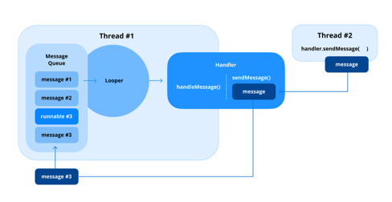

### Q17. Bundle의 사용 목적에 대해서 설명해 주세요.

- Bundle은 컴포넌트 간에 데이터를 전달하는 데 사용하는 키-값 쌍 데이터 구조
- 가볍고 안드로이드 운영 체제가 쉽게 관리하고 전송할 수 있는 형식으로 데이터를 직렬화하도록 설계

#### Bundle의 일반적인 사용 사례

1. Activity 간 데이터 전달
   - 새 Activity를 시작할 때 Intent에 Bundle을 담아서 대상 Activity에 데이터 전달
2. Fragment 간 데이터 전달
   - Fragment 트랜잭션에서 Bundle은 setArguments() 및 getArguments()와 함께 전달되어 Fragment 간에 데이터를 보냄
3. 인스턴스 상태 저장 및 복원
   - onSaveInstanceState() 및 onRestoreInstanceState()와 같은 생명주기 메소드에서 구성 변경 중에 임시 UI 상태를 저장하고 복원하는 데 사용
4. Service에 데이터 전달
   - Service를 시작하거나 바인딩된 Service에 데이터를 전달할 때 Bundle을 통해 데이터를 운반

#### Bundle 작동 방식

- Bundle은 데이터를 키-값 구조로 직렬화하여 작동
- 키는 문자열이며 값은 기본 유형, Serializable, Parcelable 객체 또는 다른 Bundle일 수 있음

Activity 간 데이터 전달
```kotlin
val intent = Intent(this, ActivityB::class.java).apply {
    putExtra("user_name", "John Doe")
    putExtra("user_age", 25)
}
startActivity(intent)

val name = intent.getStringExtra("user_name")
val age = intent.getIntExtra("user_age", -1)
```

Fragment 간 데이터 전달
```kotlin
val fragment = MyFragment().apply {
    arguments = Bundle().apply {
        putString("user_name", "John Doe")
        putInt("user_age", 30)
    }
}

val name = arguments?.getString("user_name")
val age = arguments?.getInt("user_age")
```

상태 저장 및 복원
```kotlin
override fun onSaveInstanceState(outState: Bundle) {
    super.onSaveInstanceState(outState)
    outState.putString("user_input", editText.text.toString())
}

override fun onRestoreInstanceState(savedInstanceState: Bundle) {
    super.onRestoreInstanceState(savedInstanceState)
    val userInput = savedInstanceState.getString("user_input")
    editText.setText(userInput)
}
```

#### 실전 질문

Q) 구성 변경 중 onSaveInstanceState()는 UI 상태를 보존하기 위해 Bundle을 어떻게 활용하며, Bundle에 어떤 유형의 데이터를 담을 수 있나요?

A) Bundle을 사용하여 UI 상태를 보존할 때, 일반적으로 문자열, 정수, 불리언 등 기본 데이터 유형을 저장합니다. 또한 Parcelable 또는 Serializable 객체를 저장할 수도 있습니다. 예를 들어, 사용자가 입력한 텍스트나 선택한 옵션 등을 Bundle에 담아 onSaveInstanceState()에서 전달하고, onRestoreInstanceState()에서 복원할 수 있습니다.

### Q18. Activity 또는 Fragment 간에 데이터를 어떻게 전달하나요?

#### Activity 간 데이터 전달

- 다른 Activity로 데이터를 전달하는 가장 일반적인 방법은 Intnet
- 데이터는 키-값 쌍(putExtra())의 형태로 Intent에 추가되고, 수신하는 Acitity는 getIntent()를 통해 해당 값을 가져옴

```kotlin
val intent = Intent(this, SecondActivity::class.java).apply {
    putExtra("USER_NAME", "John Doe")
    putExtra("USER_AGE", 25)
}

class SecondActivity : AppCompatActivity() {
    override fun onCreate(savedInstanceState: Bundle?) {
        super.onCreate(savedInstanceState)
        setContentView(R.layout.activity_second)

        val userName = intent.getStringExtra("USER_NAME")
        val userAge = intent.getIntExtra("USER_AGE", 0)
        Log.d("SecondActivity", "User Name: $userName, User Age: $userAge")
    }
}
```

#### Fragment 간 데이터 전달

- 보내는 Fragment에서 키-값 쌍 형태로 Bundle을 생성하고 arguments를 통해 수신하는 Fragmet로 전달

```kotlin
val fragment = SecondFragment().apply {
    arguments = Bundle().apply {
        putString("USER_NAME", "John Doe")
        putInt("USER_AGE", 25)
    }
}

parentFragmentManager.beginTransaction()
    .replace(R.id.fragment_container, fragment)
    .commit()

class SecondFragment : Fragment() {
    override fun onCreateView(
        inflater: LayoutInflater, container: ViewGroup?,
        savedInstanceState: Bundle?
    ): View? {
        val view = inflater.inflate(R.layout.fragment_second, container, false)

        val userName = arguments?.getString("USER_NAME")
        val userAge = arguments?.getInt("USER_AGE", 0)
        Log.d("SecondFragment", "User Name: $userName, User Age: $userAge")

        return view
    }
}
```

#### Jetpack Navigation 라이브러리로 Fragment 간 데이터 전달하기

- Jetpack Navigation 라이브러리가 지원하는 Safe Args 플러그인을 사용하면 대상간 type-safe 네비게이션과 인수 전달을 가능하게 하는 direction 및 argument 클래스가 컴파일 타임에 자동적으로 생성

1. 네비게이션 그래프에서 인수(argument) 정의하기

```xml
<fragment
    android:id="@+id/secondFragment"
    android:name="com.example.SecondFragment">
    <argument
        android:name="userName"
        app:argType="string" />
</fragment>
```

2. 소스 프래그먼트에서 데이터 전달하기

```kotlin
val action = FirstFragmentDirections
    .actionFirstFragmentToSecondFragment(username = "John Doe")
findNavController().navigate(action)
```

3. 대상 프래그먼트에서 데이터 검색하기

```kotlin
val username = arguments?.let {
    SecondFragmentArgs.fromBundle(it).userName
}
```

- Safe Args를 사용하여 정의된 인수를 컴파일 타임에 검사하여 정적인 코드로 만들고, 런타임에 해당 인수 값을 안전하게 가져옴으로써 런타임 오류를 줄일 수 있음

#### Shared ViewModel 사용하기

- Shared ViewModel은 동일한 Activity 내의 여러 Fragment 간에 공유되는 ViewModel 인스턴스를 의미
- Jetpack의 androidx.fragment:fragment-ktx 에서 제공하는 activityViewModels() 메소드를 사용하여 구현
- ViewModel의 범위를 Activity로 지정하여 Fragment가 동일한 ViewModel 인스턴스에 접근하고 공유

```kotlin
class SharedViewModel : ViewModel() {
    
    private val _userData = MutableStateFlow<User?>(null)
    val userData: StateFlow<User?> = _userData
    
    fun setUserData(user: User) {
        _userData.value = user
    }
}

class FirstFragment : Fragment() {
    private val sharedViewModel: SharedViewModel by activityViewModels()

    fun updateUser(user: User) {
        sharedViewModel.setUserData(user)
    }
}

class SecondFragment : Fragment() {
    private val sharedViewModel: SharedViewModel by activityViewModels()

    override fun onViewCreated(view: View, savedInstanceState: Bundle?) {
        lifecycleScope.launch {
            viewLifecycleOwner.repeatOnLifecycle(Lifecycle.State.STARTED) {
                sharedViewModel.userData.collectLatest { user ->
                    // 사용자 데이터가 변경되면 UI 업데이트
                    user?.let {
                        Log.d("SecondFragment", "User Name: ${it.name}, User Age: ${it.age}")
                    }
                }
            }
        }
    }
}

class MainActivity : ComponentActivity() {
    private val sharedViewModel: SharedViewModel by viewModels()
    
    override fun onCreate(savedInstanceState: Bundle?) {
        lifecycleScope.launch {
            lifecycle.repeatOnLifecycle(Lifecycle.State.RESUMED) {
                sharedViewModel.userData.collectLatest { user ->
                    // 사용자 데이터가 변경되면 UI 업데이트
                    user?.let {
                        Log.d("MainActivity", "User Name: ${it.name}, User Age: ${it.age}")
                    }
                }
            }
        }
    }
}
```

#### 실전 질문

Q) 동일한 Activity 내의 Fragment 간 데이터를 주고받을 때 어떤 방법이 효과적인지 설명해 주시고, ViewModel을 활용한다면 Bundle이나 직접적인 Fragment 트랜잭션을 사용하는 것과 비교했을 때 어떤 이점이 있나요?

A) 동일한 Activity 내의 Fragment 간 데이터를 주고받는 효과적인 방법은 Shared ViewModel을 사용하는 것이다. ViewModel의 범위를 Activity로 지정하여 Fragment가 동일한 인스턴스에 접근할 수 있다. 이 방법은 Bundle이나 직접적인 Fragment 트랜잭션을 사용하는 것과 비교했을 때 다음과 같은 이점이 있다:
1. Activity의 생명주기를 따르므로, Fragment가 재생성되더라도 데이터가 유지된다.
2. ViewModel을 사용하면 공통 데이터 소스만 공유하고 Fragment 간 서로를 몰라도 되기 때문에 낮은 결합도를 유지할 수 있다.

#### Pro Tips for Mastery: Fragment Result API

- 상황에 따라 Fragment에서 다른 Fragment 혹은 Activity 간에 일회성으로 값을 전달해야 한다.
- FragmentResultOwner를 구현하여 Fragment가 서로 직접 참조하지 않고도 리스너를 통해 통신할 수 있다.
- Fragment B(송신자)에서 Fragment A(수신자)로 데이터를 전달할 때 아래와 같은 방법을 사용할 수 있다:
    - Fragment A(결과를 받는 프래그먼트)에서 결과 리스너 설정하기
    - Fragment B에서 동일한 requestKey를 사용하여 결과 전달하기

Fragment A에서 결과 리스너 설정하기

```kotlin
class FragmentA : Fragment() {
    
    override fun onCreate(savedInstanceState: Bundle?) {
        super.onCreate(savedInstanceState)
        
        // 데이터를 수신하기 위해 리스너 등록
        parentFragmentManager.setFragmentResultListener("requestKey", this) { requestKey, bundle ->
            val result = bundle.getString("resultKey")
            // 수신한 결과 값 처리
        }
    }
}
```

setFragmentResultListener("requestKey", ...)는 고유한 키 값을 사용하여 리스너를 등록한다.
따라서 여러 개의 리스너가 등록된 경우 리스너끼리 구분이 용이해진다. 모든 콜백은 Fragment가 STARTED 상태에 들어갈 때 실행된다.

Fragment B에서 결과 보내기

```kotlin
class FragmentB : Fragment() {

    private lateinit var button: Button
    
    override fun onViewCreated(view: View, savedInstanceState: Bundle?) {
        super.onViewCreated(view, savedInstanceState)
        
        button = view.findViewById(R.id.button)
        button.setOnClickListener {
            val result = "result"
            parentFragmentManager.setFragmentResult("requestKey", bundleOf("bundleKey" to result))
        }
    }
}
```

Fragment B는 setFragmentResult()를 사용하여 결과를 전달할 수 있으며, Fragment A가 활성화될 때 데이터를 받아볼 수 있도록 보장

프래그먼트 결과의 동작
- 키-리스너의 1:1 관계: 각 키는 한 번에 하나의 리스너와 하나의 결과만 가질 수 있음
- 보류 중인 결과는 덮어쓰여짐: 리스너가 활성화되기 전에 여러 결과가 설정되면 최신 결과만 저장됨
- 결과는 소비 후 삭제됨: Fragment가 결과를 수신하고 처리하면 결과는 FragmentManager에서 제거됨
- 백 스택의 프래그먼트는 결과를 받지 못함: Fragment는 결과를 받으려면 백 스택에서 팝(pop)되고 STARTED 상태여야 함
- STARTED 상태의 리스너는 즉시 트리거됨: Fragment B가 결과를 설정할 때 Fragment A가 이미 활성 상태이면 리스너는 즉시 실행됨

해당 접근 방식은 QR 코드 스캔, 사용자 입력 다이얼로그 또는 양식 제출과 같은 다양한 시나리오(A->B->A 형태의 화면 이동)에 유용하다.

### Q19. 화면 회전과 같은 구성 변경이 발생하면 Activity에 어떤 변화가 생기나요?

#### 구성 변경 중 기본 동작

1. Activity 종료 및 재시작
    - 시스템이 현재 실행 중인 Activity의 onPause(), onStop(), onDestroy() 메소드를 순차적으로 호출
    - 구성을 변경하면 Activity가 다시 시작되고, onCreate() 메소드가 호출
2. 리소스 다시 로드하기
    - 새 구성에 따라 리소스(레이아웃, 드로어블 또는 문자열)를 다시 로드하여 앱이 화면 방향, 테마 또는 언어와 같은 변경 사항이 반영되도록 함
3. 데이터 손실 방지
    - 재생성 중 데이터 손실을 방지하기 위해 onSaveInstanceState() 및 onRestoreInstanceState() 메소드를 사용
    - ViewModel을 활용하여 인스턴스 상태를 저장하고 복원할 수 있음

```kotlin
override fun onSaveInstanceState(outState: Bundle) {
    super.onSaveInstanceState(outState)
    outState.putString("user_input", editText.text.toString())
}

override fun onCreate(savedInstanceState: Bundle?) {
    super.onCreate(savedInstanceState)
    setContentView(R.layout.activity_main)

    if (savedInstanceState != null) {
        val restoredInput = savedInstanceState.getString("user_input")
        editText.setText(restoredInput)
    }
}
```

#### 재생성을 유발하는 구성 변경

1. 화면 회전: 화면 방향이 변경되면 새 크기에 맞게 레이아웃을 다시 로드
2. 다크/라이트 테마 변경: 사용자가 다크 모드와 라이트 모드 간에 전호나하면 앱은 테마별 리소스를 다시 로드
3. 글꼴 크기 변경: 기기의 글꼴 크기 설정이 변경되면 앱은 새 글꼴 크기에 맞게 텍스트 리소스를 다시 로드
4. 언어 변경: 시스템 업데이트는 현지화된 리소스(예를 들어, 다른 언어의 문자열)를 다시 로드

#### Activity 재생성 피하기

Activity를 다시 시작하지 않고 구성 변경을 처리하려면 android:configChanges 속성을 추가

```xml
<activity
    android:name=".MainActivity"
    android:configChanges="orientation|screenSize|keyboardHidden">
```

이렇게 되면 시스템은 Activity를 소멸시키고 재생성하지 않고, 대신 onConfigurationChanged() 메소드를 호출하여 구성 변경을 처리할 수 있게도미.

```kotlin
override fun onConfigurationChanged(newConfig: Configuration) {
    super.onConfigurationChanged(newConfig)
    // 구성 변경에 따른 UI 업데이트
    if (newConfig.orientation == Configuration.ORIENTATION_LANDSCAPE) {
        // 가로 모드 처리
    } else if (newConfig.orientation == Configuration.ORIENTATION_PORTRAIT) {
        // 세로 모드 처리
    }
}
```

##### 실전 질문

Q) 구성 변경으로 인한 Activity 재생성 중 발생하는 데이터 손실을 어떻게 복원 및 보존할 수 있으며, UI 상태를 어떻게 복수시키는지 설명해주세요.

A) 구성 변경으로 인한 Activity 재생성 중 데이터 손실을 방지하기 위해 onSaveInstanceState() 메소드를 사용하여 UI 상태를 Bundle에 저장하고, onRestoreInstanceState() 또는 onCreate() 메소드에서 해당 Bundle을 통해 데이터를 복원할 수 있다. 이외에도 ViewModel을 사용하는 방법도 있다.

### Q20. ActivityManager란 무엇인가요?

ActivityManager는 기기에서 실행 중인 Activity, 태스크(Task), 프로세스(Process)에 대한 정보를 제공하고 관리하는 안드로이드 시스템 서비스이다.
다음은 ActivityManager의 주요 기능이다:
1. 태스크 및 Activity 정보
    - 실행 중인 태스크, Activity 및 해당 스택에 대한 세부 정보를 추적
2. 메모리 관리
   - 앱의 메모리 소비 및 시스템 전체 메모리 상태를 포함하여 시스템 전체의 메모리 사용량에 대한 정보를 제공
3. 앱 프로세스 관리
   - ActivityManager는 실행 중인 앱 프로세스 및 Service에 대한 세부 정보를 쿼리
4. 디버깅 및 진단
   - 힙 덤프 생성 또는 앱 프로파일링과 같이 디버깅을 위한 도구를 제공하여 성능 병목이나 메모리 누수를 식별하는 데 도움이 

#### ActivityManager에서 제공하는 메소드
- getRunningAppProcesses()
  - 기기에서 현재 실행 중인 프로세스 목록을 반환
- getMemoryInfo(ActivityManager.MemoryInfo info)
  - 사용 가능한 메모리, 임계 메모리, 기기가 메모리 부족 상태인지 여부 등 시스템에 대한 자세한 메모리 정보를 탐색
- killBackgroundProcesses(String packageName)
  - 시스템 리소스를 확보하기 위해 지정된 앱의 백그라운드 프로세스를 종료
- isLowRamDevice()
  - 기기가 저사양 RAM으로 분류되는지 확인
- appNotResponding(String message)
  - 테스트 목적으로 ANR(Application Not Responding) 이벤트를 시뮬레이션
- clearApplicationUserData()
  - 파일, 데이터베이스 및 SharedPreferences를 포함하여 애플리케이션과 관련된 모든 사용자별 데이터를 지움

```kotlin
val activityManager = getSystemService(Context.ACTIVITY_SERVICE) as ActivityManager
val memoryInfo = ActivityManager.MemoryInfo()
activityManager.getMemoryInfo(memoryInfo)

Log.d(TAG, "Low memory state: ${memoryInfo.lowMemory}")
Log.d(TAG, "Available memory: ${memoryInfo.availMem / (1024 * 1024)} MB")
Log.d(TAG, "Threshold memory: ${memoryInfo.threshold / (1024 * 1024)} MB")

val processes = activityManager.runningAppProcesses
if (processes != null && processes.isNotEmpty()) {
    Log.d(TAG, "Process name: ${processes.first().processName}")
}

// 테스트 목적으로 ANR(App Not Responding) 이벤트를 시뮬레이션
// activityManager.appNotResponding("App is not responding")

// 애플리케이션이 디스크에서 할당 중인 데이터를 지우도록 허용
// activityManager.clearApplicationUserData()
```

#### LeakCanary에서 ActivityManager 활용 사례

- LeakCanary는 안드로이드 애플리케이션용 오픈 소스 메모리 누수 감지 라이브러리로, 개발 중에 메모리 누수를 자동으로 모니터링하고 감지하여, 개발자가 메모리 누수를 효율적으로 고치는 데 도움이 될만한 분석을 제공
- LeakCanary는 내부적으로 메모리 상태 및 정보 추적을 위해 ActivityManager를 활용

#### 실전 질문

Q) ActivityManager.getMemoryInfo()를 어떻게 앱 성능 최적화에 활용할 수 있으며, 시스템이 메모리 부족 상태에 들어가면 개발자는 어떤 조치를 취해야 하나요?

A) ActivityManager.getMemoryInfo()를 사용하여 시스템의 메모리 상태를 모니터링하고, 사용 가능한 메모리와 임계 메모리를 확인할 수 있다. 이를 통해 앱이 메모리 부족 상태에 들어가기 전에 리소스를 최적화하거나 불필요한 작업을 중지하는 등의 조치를 취할 수 있다. 예를 들어, 백그라운드 프로세스를 종료하거나 캐시 데이터를 정리하여 메모리 사용량을 줄이는 등의 방법을 사용할 수 있다.

### Q21. SparseArray를 사용하면 어떤 이점이 있나요?

SparseArray (android.util 패키지)는 HashMap과 유사하게 정수 키를 객체 값에 매핑하는 안드로이드에 최적화된 데이터 구조이다.
정수인 키와 함께 사용되도록 최적화되어 있어 정수 기반 키를 사용할 때 Map이나 HashMap보다 메모리 측면에서 효율이 좋고 상황에 따라 성능이 더 좋음.

#### SparseArray의 주요 특징

1. 메모리 효율성
   - 키-값 매핑을 위해 HashTable을 사용하는 HashMap과 달리, SparseArray는 오토박싱(기본 int를 Integer로 변환)를 피하고 Entry 객체와 같은 추가 데이터 구조에 의존하지 않음
   - 훨씬 적은 메모리를 소비
2. 성능
   - 매우 큰 데이터셋의 경우 HashMap만큼 빠르지는 않지만, 메모리 최적화로 인해 중간 크기의 데이터셋에서 더 나은 성능을 제공
3. Null 키 값 사용 불가
   - SparseArray는 키 값으로 기본 ㅈ어수를 사용하므로 키 값에 null을 사용할 수 없음

```kotlin
import android.util.SparseArray

val sparseArray = SparseArray<String>()
sparseArray.put(1, "One")
sparseArray.put(2, "Two")

// 요소 접근
val value = sparseArray[1]

// 요소 제거
sparseArray.remove(2)

// 요소 순회
for (i in 0 until sparseArray.size()) {
    val key = sparseArray.keyAt(i)
    val value = sparseArray.valueAt(i)
    println("Key: $key, Value: $value")
}
```

#### SparseArray 사용의 이점

1. 오토박싱 방지
   - HashMap<Integer, Object>에서는 키가 Integer 객체로 저장되어 박싱 및 언박싱 작업으로 인한 오버헤드가 발생
   - SparseArray는 int 키로 직접 작동하여 메모리와 계산 작업을 절약
2. 메모리 절약
   - SparseArray는 키와 값을 저장하기 위해 내부적으로 기본 배열을 사용
   - Entry와 같은 여러 객체를 생성하는 HashMap 구현에 비해 메모리 차지 공간이 적음
3. 컴팩트한 데이터 저장에 효율적
   - 적은 수의 키-값 쌍이 있는 밀도 낮은(sparse) 데이터 셋이나 키가 넓은 정수 범위에 걸쳐 드문드문 분포된 데이터셋에 적합
4. 안드로이드 특화
   - 제한된 리소스 시나리오를 처리하기 위해 안드로이드에 특화된 구조로 설계
   - 안드로이드 UI 컴포넌트에서 View ID를 객체에 매핑하는 등의 시나리오에 효과적

#### SparseArray의 한계

1. 성능 트레이드오프
   - SparseArray의 요소 접근은 키 조회를 위해 이진 탐색을 사용하기 때문에 매우 큰 데이터셋의 경우 HashMap보다 느림
2. 정수 키만 사용 가능
   - 정수 키로 제한되어 다른 유형의 키가 필요한 사용 사례에는 적합하지 않음

#### 실전 질문

Q) HashMap 대신 SparseArray를 사용하는 것이 어떤 시나리오에서 더 효율적이며, 성능 및 사용성 측면에서 트레이드오프는 무엇인가요?

A) SparseArray는 HashMap보다 메모리 효율성이 높고 오토박싱을 피할 수 있기 때문에, 정수 키를 사용하는 경우에 더 효율적이다. 예를 들어, View ID와 같은 정수 기반 키를 사용하여 UI 요소를 매핑할 때 SparseArray가 더 적합하다. 그러나 SparseArray는 정수 키로 제한되므로 다른 유형의 키가 필요한 경우 HashMap이 더 유용할 수 있다. 성능 측면에서 SparseArray는 작은 데이터셋에서는 빠르지만, 매우 큰 데이터셋에서는 HashMap이 더 나은 성능을 제공할 수 있다.

### Q22. 런타임 권한(runtime permissions)을 어떻게 처리하나요?

안드로이드 6.0 (API 23)부터 앱은 설치 시 자동으로 권한을 획득하는 대신 런타임에 위험 권한을 명시적으로 요청해야 함

#### 권한 선언 및 확인

- 권한을 요청하기 전에 앱은 AndroidManifest.xml 파일에 필요한 권한을 선언해야 함
- 사용자에게 요청하기 전에 ContextCompat.checkSelfPermission)을 사용하여 이미 권한이 부여되었는지 확인하는 것이 중요함

```kotlin
when {
    ContextCompat.checkSelfPermission(this, Manifest.permission.CAMERA) == PackageManager.PERMISSION_GRANTED -> {
        // 권한 부여됨, 동작 이어서 진행
    }
    ActivityCompat.shouldShowRequestPermissionRationale(this, Manifest.permission.CAMERA) -> {
        // 사용자가 권한 요청을 거부한 경우
        showPermissionRationale()
    }
    else -> {
        // 사용자 권한 요청
        requestPermissionLauncher.launch(Manifest.permission.CAMERA)
    }
}
```

#### 권한 요청하기

- 권한 처리를 단순화하는 ActivityResultLauncher API를 사용할 수 있음

```kotlin
val requestPermissionLauncher = registerForActivityResult(
    ActivityResultContracts.RequestPermission()
) { isGranted ->
    if (isGranted) {
        // 권한 부여됨, 동작 이어서 진행
    } else {
        // 권한 거부됨
    }
}
```

#### 권한 요청 근거(Rationale) 제공하기

- shouldShowRequestPermissionRationale()을 사용하여 권한을 요청하기 전에 권한이 필요한 근거(rationale)를 표시할 것을 권장함

```kotlin
fun showPermissionRationale() {
    AlertDialog.Builder(this)
        .setTitle("권한 필요")
        .setMessage("이 기능이 제대로 작동하기 위해 카메라 접근 권한이 필요합니다.")
        .setPositiveButton("확인") { _, _ -> 
            requestPermissionLauncher.launch(Manifest.permission.CAMERA)
        }
        .setNegaiveButton("취소", null)
        .show()
}
```

#### 권한 거부 처리하기

- 사용자가 권한을 여러 번 거부하면 안드로이드는 이를 영구 거부로 처리하여 앱이 다시. ㅛ청할 수 없게 됨
- 이 경우 사용장게 기능 제한을 알리고 필요한 경우 시스템 설정으로 안내해야 함

```kotlin
if (!ActivityCompat.shouldShowRequestPermissionRationale(this, Manifest.permission.CAMERA) &&
    ContextCompat.checkSelfPermission(this, Manifest.permisison.CAMERA != PackageManager.PERMISSION_GRANTED)) {
    // 사용자가 영구적으로 권한을 거부함 ('다시 묻지 않음' 선택)
    showSettingsDialog()
}

fun showSettingsDialog() {
    val intent = Intent(Settings.ACTION_APPLICATION_DETAILS_SETTINGS).apply {
        data = Uri.parse("package:$packageName")
    }
    startActivity(intent)
}
```

#### 위치 권한 처리하기

- 포그라운드 위치 접근에는 ACCESS_FINE_LOCATION 또는 ACCESS_COARSE_LOCATION 권한이 필요
- 백그라운드 위치 접근에는 ACCESS_BACKGROUND_LOCATION 권한이 필요
- 안드로이드 10 (API 29)부터 백그라운 위치를 요청하는 앱은 먼저 포그라운드 위치 권한을 요청해야 함

```xml
<uses-permission android:name="android.permission.ACCESS_FINE_LOCATION" />
<uses-permission android:name="android.permission.ACCESS_BACKGROUND_LOCATION" />
```

#### 일회성 권한 (One-Time Permissions)

- 안드로이드 11 (API 30)부터 위치, 카메라, 마이크에 대해 일회성 권한을 요청할 수 있음
- 사용자는 임시적으로 권한을 부여하고, 앱을 종료하면 해당 권한이 사라짐

#### 실전 질문

Q) 안드로이드의 런타임 권한 시스템은 사용자 개인 정보를 어떻게 보호하며, 민감한 권한을 요청하기 전에 앱은 어떤 시나리오를 고려해야 하나요?

A) 안드로이드의 런타임 권한 시스템은 사용자가 앱이 민감한 데이터에 접근하기 전에 명시적으로 권한을 부여하도록 요구함으로써 개인 정보를 보호한다. 앱은 권한 요청 전에 사용자가 해당 권한이 필요한 이유를 이해할 수 있도록 명확한 근거(rationale)를 제공해야 하며, 사용자가 권한을 거부할 경우 기능 제한을 알리고 시스템 설정으로 안내하는 등의 조치를 취해야 한다.

### Q23. Looper, Handler, HandlerThread의 역할은 무엇인가요?

Looper, Handler, HandlerThread는 스레드를 관리하고 비동기 통신을 처리하기 위해 함께 작동하는 컴포넌트다.
이들은 백그라운드에서 작업을 수행하면서 UI 업데이트를 위해 메인 스레드와 상호작용하기 위한 필수적인 컴포넌트이다.



#### Looper

- 목적: 메시지 큐를 지속적으로 모니터링하고 메시지나 작업을 적절한 Handler에 가져와 디스패치
- 사용법: 메시지를 처리하는 모든 스레드에는 Looper가 필요. 메인 스레드에는 자동으로 Looper가 있지만, 워커 스레드의 경우 명시적으로 준비해야 함
- 초기화: Looper.prepare()를 사용하여 스레드에 Looper를 연결하고 Looper.loop()를 사용하여 루프를 시작함

```kotlin
val thread = Thread {
    Looper.prepare() // Looper를 준비
    val handler = Handler(Looper.myLooper()!!) // 현재 스레드의 Looper를 사용하여 Handler 생성
    Looper.loop() // 메시지 루프 시작
}
thread.start()
```

#### Handler

- 목적: 한 스레드에서 다른 스레드로 작업이나 메시지를 전달함 (예를 들어, 백그라운드 스레드에서 UI 업데이트)
- 동작: Handler가 생성될 때, 생성된 스레드 및 해당 스레드의 Looper에 연결됨, Handler로 전송된 작업은 해당 스레드에서 처리됨

```kotlin
val handler = Handler(Looper.getMainLooper()) // 메인 스레드에서 실행됨

handler.post {
    // UI 업데이트 작업
    textView.text = "Updated from background thread"
}
```

#### HandlerThread

- 목적: 자체 Looper를 가진 워커 스레드를 생성하여 해당 스레드에서 작업을 순차적으로 처리할 수 있도록 함
- 생명주기: start()로 HandlerThread를 시작하고 getLoopr()를 사용하여 Looper를 얻음. 리소스를 해제하려면 항상 quit() 또는 quitSafely()를 사용하여 Looper를 종료해야 함

```kotlin
val handlerThread = HandlerThread("WorkerThread")
handlerThread.start()   // 스레드 시작

val workerHandler = Handler(handlerThread.looper) // 해당 Looper를 사용하여 작업 처리

workerHandler.post {
    // 백그라운드 작업 수행
    Thread.sleep(1000)
    Log.d("HandlerThread", "Task completed")
}

// 스레드 종료
handlerThread.quitSafely() // 처리 중인 메시지 완료 후 안전하게 종료
```

#### 주요 차이점 및 관계

> Handler는 메시지를 MessageQueue에 넣고, Looper는 MessageQueue에서 메시지를 꺼내 그 메시지를 보낸 Handler에게 전달한다.

1. Looper: 메시지 처리의 중추이며, 스레드를 살아있게 유지하고 메시지 큐를 처리함
2. Handler: Looper와 상호작용하여 메시지와 작업을 큐에 넣거나 처리함
3. HandlerThread: 자동 Looper 설정으로 백그라운드 스레드 생성을 단순화함

#### 사용 사례

- Looper: 메인 스레드 또는 워커 스레드에서 연속적인 메시지 큐를 관리하는 데 사용됨
- Handler: 스레드 간 통신(예를 들어, 백그라운드 스레드에서 UI 업데이트)에 이상적임
- HandlerThread: 데이터 처리나 네트워크 요청과 같이 전용 스레드가 필요한 작업에 적합함

#### 실전 질문

Q) Handler는 Looper와 어떻게 작동하여 스레드 간 통신을 용이하게 하며, Handler의 일반적인 사용 사례를 말씀해주세요.

A) Handler는 Looper와 함께 작동하여 스레드 간 통신을 용이하게 한다. Looper는 메시지 큐를 관리하고, Handler는 해당 큐에 작업이나 메시지를 추가하여 다른 스레드에서 처리할 수 있도록 한다. 일반적인 사용 사례로는 백그라운드 스레드에서 UI 업데이트를 수행하거나, 네트워크 요청 후 결과를 메인 스레드로 전달하는 경우가 있다.

Q) HandlerThread란 무엇이며, Looper.prepare()를 사용하여 수동으로 스렏르르 생성하는 것과 비교하여 백그라운드 스레드 관리를 어떻게 단순화하나요?

A) HandlerThread는 자체 Looper를 가진 워커 스레드를 생성하여 백그라운드 작업을 처리하는 데 사용된다. Looper.prepare()를 사용하여 수동으로 스레드를 생성하는 것과 비교하여, HandlerThread는 Looper를 자동으로 설정하고, 스레드 생명주기를 관리하기 때문에 코드가 간결해지고 관리가 용이하다. HandlerThread를 사용하면 별도의 Looper를 준비할 필요 없이 Handler를 통해 작업을 쉽게 큐에 추가하고 처리할 수 있다.