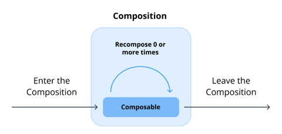
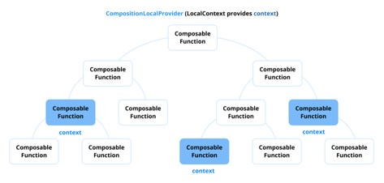

### 20. 컴포저블 함수 또는 컴포지션의 생명주기는 어떻게 되나요?



#### 1. 초기 컴포지션 (Initial Composition)

- 함수는 주어진 상태를 기반으로 초기 UI 컴포넌트를 생성
- LaunchedEffect 또는 remember와 같은 사이드 이펙트(side-effect)가 초기화되고 향후 recomposition 발생 시 데이터 복원을 위해 필요한 데이터를 메모리에 저장
- UI 계층 구조가 구축되고 컴포지션 트리에 추가

#### 2. 리컴포지션 (Recomposition)

- 컴포지션 트리 전체를 recompose 하는 것이 아니라, 업데이트가 필요한 부분만 recompose
- Compose는 업데이트가 필요하지 않는 UI 트리 부분을 건너뚜어 성능 최적화
- remember 등과 같이 메모리에 값을 저장하는 사이드 이펙트 API의 경우 값이 recomposition 간에 유지됨

#### 3. 컴포지션 떠나기 (Leaving the Composition)

- 컴포저블에 연결된 모든 리소스가 자동으로 정리
- DisposableEffect와 같은 사이드 이펙트의 경우 리소스를 해제
- rememberCoroutineScope의 경우 현재 실행 중인 코루틴 작업을 안전하게 취소

#### 컴포지션 생명주기의 주요 사항

- 컴포지션 단계(Phases of Composition)
  - 초기 컴포지션, 리컴포지션, 컴포지션 떠나기 세 가지 주요 단계로 구성
  - 초기 컴포지션은 컴포저블 함수가 컴포지션 트리에 들어갈 때 발생
  - recomposition은 상태 변경이 특정 UI 컴포넌트에 대한 업데이트를 필요로 할 때 발생
- 건너뛰기 및 최적화(Skipping and Optimization)
  - 업데이트하지 않아도 되는 컴포저블 함수에 대한 recomposition을 건너뛰어 성능 최적화
  - remember, derivedStateOf 및 Stability와 같은 메커니즘을 통해 성능 향상
- 폐기 및 정리(Disposal and Cleanup)
  - 컴포저블 함수가 컴포지션을 떠나면 UI 트리에서 제거
  - LaunchedEffect, DisposableEffect 및 rememberCoroutineScope와 같은 사이드 이펙트의 경우 메모리 누수를 방지하기 위해 적절하게 정리

#### 실전 질문

Q) 컴포저블 함수의 각 생명주기를 단계별로 설명하고 상태 변경 시 Compose가 recomposition을 어떻게 처리하는지 설명해 주세요.

A) 컴포저블 함수의 생명주기는 초기 컴포지션, 리컴포지션, 컴포지션 떠나기의 세 단계로 나눌 수 있습니다. 초기 컴포지션에서는 컴포저블 함수가 처음으로 컴포지션 트리에 추가되어 UI 요소가 생성됩니다. 이때 remember와 같은 사이드 이펙트가 초기화되고 필요한 데이터가 메모리에 저장됩니다.
리컴포지션 단계에서는 상태 변경이 발생할 때 Compose가 업데이트가 필요한 부분만 다시 그립니다. 이 과정에서 업데이트가 필요 없는 컴포저블 함수는 건너뛰어 성능을 최적화합니다. 마지막으로 컴포지션 떠나기 단계에서는 컴포저블 함수가 컴포지션 트리에서 제거되고, 관련된 리소스가 정리됩니다. 예를 들어, DisposableEffect는 리소스를 해제하고 rememberCoroutineScope는 실행 중인 코루틴 작업을 안전하게 취소합니다.

### 21. SaveableStateHolder에 대해서 설명해 주세요. 그리고 어떤 시나리오에서 유용한가요?

SaveableStateHolder는 고유 키와 연결된 컴포저블의 상태를 관리하고 보존하기 위해 rememberSaveable과 함께 작동하는 Compose Runtime API

#### 예제: 네비게이션과 함께 SaveableStateHolder 사용하기

```kotlin
@Composable
fun <T: Any> Navigation(
    currentScreen: T,  // 현재 표시할 화면을 나타내는 키
    modifier: Modifier = Modifier,
    content: @Composable (T) -> Unit
) {
    val saveableStateHolder = rememberSaveableStateHolder()

    Box(modifier) {
        AnimatedContent(
            targetState = currentScreen,
            transitionSpec = {
                fadeIn(tween(300)) with fadeOut(tween(300))
            },
            label = "NavigationAnimation"
        ) { targetScreen ->
            // key는 targetScreen으로 화면별로 상태를 구분하여 저장
            saveableStateHolder.SaveableStateProvider(currentScreen) {
              content(targetScreen) // 실제 화면 콘텐츠 렌더링
            }
        }
    }
}

@Composable
fun SaveableStateHolderExample() {
    // 현재 화면 상태를 rememberSaveable로 관리 (구성 변경 시 유지)
    var screen by rememberSaveable { mutableStateOf("screen1") }
  
    Column {
        // 화면 전환 버튼
        Row(
            modifier = Modifier.fillMaxWidth(),
            horizontalArrangement = Arrangement.SpaceEvenly
        ) {
            Button(onClick = { screen = "screen1" }) {
                Text("Screen 1")
            }
            Button(onClick = { screen = "screen2" }) {
                Text("Screen 2")
            }
        }
      
        // SaveableStateHolder를 사용하는 Navigation 컴포저블 호출
        Navigation(screen, Modifier.fillMaxSize()) { currentScreen ->
            when (currentScreen) {
                "screen1" -> ScreenOne()
                "screen2" -> ScreenTwo()
            }
        }
    }
}

@Composable
fun Screen1() {
    var counter by rememberSaveable { mutableStateOf(0) }
    Column(
        modifier = Modifier.fillMaxSize(),
        horizontalAlignment = Alignment.CenterHorizontally
    ) {
        Text("Screen 1")
        Spacer(modifier = Modifier.height(16.dp))
        Button(onClick = { counter++ }) {
            Text("Counter: $counter")
        }
    }
}

@Composable
fun Screen2() {
    var text by rememberSaveable { mutableStateOf("") }
    Column(
        modifier = Modifier.fillMaxSize(),
        horizontalAlignment = Alignment.CenterHorizontally
    ) {
        Text("Screen 2")
        Spacer(modifier = Modifier.height(16.dp))
        TextField(
            value = text,
            onValueChange = { text = it },
            label = { Text("Enter text") }
        )
    }
}
```

- 네비게이션 래퍼(Navigation Wrapper)
  - Navigation 컴포저블은 현재 화면을 가져와 SaveableStateProvider로 래핑
  - 각 화면의 상태가 화면 키를 기반으로 독립적으로 저장되고 복원되도록 보장
- 상태 유지(State Retention)
  - 각 화면은 rememberSaveable을 사용하여 상태 유지
- 동적 상태 처리(Dynamic State Handling)
  - 네비게이션 버튼을 사용하여 화면 간 전환이 발생해도 각 화면의 상태가 보존

#### SaveableStateHolder의 장점

- 화면 간 상태 지속성(State Persistence Across Screens)
  - 다른 화면 간 전환 시에도 각 화면의 상태를 유지
  - 컴포저블 간 교체가 발생하면서 이미 컴포지션을 벗어난 컴포저블 함수에 대해서도 상태를 유지
- 단순화된 상태 관리(Simplified State Management)
  - 상태 저장 및 복원 작업을 자동으로 처리하여 보일러 플레이트 코드를 줄임
- 구성 변경 처리(Configuration Change Handling)
  - rememberSaveable과 함께 원활하게 작동하며, 화면 회전과 같은 구성 변경 시에도 상태를 보존

#### 실전 질문

Q) 여러 화면이 있는 탭 기반 사용자 인터페이스에서 Jetpack Navigation 라이브러리를 사용하지 않고 각 탭이 화면 전환 시에도 스크롤 위치나 입력 상태를 유지하도록 하는 방법에 대해 설명해 주세요.

A) 해당 시나리오에서는 SaveableStateHolder를 사용하여 각 탭의 상태를 독립적으로 관리할 수 있습니다. 각 탭을 컴포저블 함수로 정의하고, rememberSaveableStateHolder를 사용하여 각 탭의 상태를 저장하고 복원합니다. 네비게이션 래퍼 컴포저블을 만들어 현재 선택된 탭에 따라 해당 탭의 컴포저블을 SaveableStateProvider로 래핑합니다. 이렇게 하면 탭 간 전환 시에도 각 탭의 스크롤 위치나 입력 상태가 유지됩니다. 또한, rememberSaveable을 사용하여 각 탭 내에서 상태를 관리하면 구성 변경 시에도 상태가 보존됩니다.

### 22. 스냅샷 시스템(snapshot system)이란 무엇이며 어디에 사용하나요?

- Jetpack Compose에서 상태 관리는 스냅샷 시스템에 의해 작동하며, 이는 특정 시점의 애플리케이션 내 모든 관찰 가능한 객체의 상태를 캡처
- Snapshot.takeSnapshot()은 현재 상태의 읽기 전용(read-only) 스냅샷을 생성하여 값을 수정하지 않고 캡처된 값을 검사하거나 일시적으로 사용할 수 있도록 함

#### Snapshot.takeSnapshot()을 사용하는 이유

현재 상태에 대한 값의 변동이 없는 읽기 전용 상태를 생성
- 값을 변경하지 않고 현재 상태를 디버깅하거나 분석할 때
- 현재 상태를 기반으로 연산 작업 또는 임시 작업을 수행할 때
- 멀티스레드 환경에서 상태 값을 읽을 때 스레드 안전성을 보장해야 할 때

#### Snapshot.takeSnapshot() 사용하기

```kotlin
class User {
    var name: MutableState<String> = mutableStateOf("")
}

fun main() {
    val user = User()
  
    // 초기 이름 설정
    user.name.value = "skydoves"
    
    // 현재 상태의 읽기 전용 스냅샷 생성
    val snapshot = Snapshot.takeSnapshot()
  
    // 스냅샷 생성 후 상태 수정
    user.name.value = "Android"
  
    println("Current name: ${user.name.value}")
  
    snapshot.enter {
        // 스냅샷을 찍을 당시의 상태 값에 접근
        println("Snapshot name: ${user.name.value}")
    }
  
    snapshot.dispose()
}
```

1. 초기 상태: User 객체의 name 속성이 "skydoves"로 설정
2. 스냅샷 생성: Snapshot.takeSnapshot()을 호출하여 현재 상태의 스냅샷 생성. 이 순간 name 값은 "skydoves"로 고정
3. 상태 수정: 스냅샷은 생성한 후 name 값이 "Android"로 변경되지만, 스냅샷에 영향을 미치지 않음
4. 스냅샷 진입: enter 함수는 해당 블록 내에서 캡처된 상태를 일시적으로 복원. 블록 내부에서 name은 여전히 "skydoves"로 출력
5. 스냅샷 폐기: 리소스를 해제하기 위해 스냅샷이 폐기

#### Snapshot.takeSnapshot()의 주요 특징

1. 읽기 전용(Read-Only): 읽기 전용으로 스냅샷 내부에서 상태를 수정하려고 하면 IllegalStateException 발생
2. 스레드 안전성(Thread Safety): 상태를 고정함으로써 스냅샷은 값 변화에 대한 걱정 없이 값을 읽을 수 있도록 보장
3. 격리(Isolation): 스냅샷 외부에서 변경된 상태는 캡처된 상태에 영향을 미치지 않음

#### 읽기 전용 스냅샷의 이점

- 디버깅(Debugging): 스냅샷은 상태에 대한 일관된 시점을 제공하여 디버깅 등 문제 분석을 용이하게 함
- 일관성(Consistency): 스냅샷은 읽기 전용이므로 값을 읽는 동안 실수로 상태를 수정하지 않도록 보장
- 단순성(Simplicity): 상태를 격리함으로써 스냅샷은 개발 중 의도하지 않은 사이드 이펙트를 유발할 가능성을 줄임

#### 실전 질문

Q) 컴포저블 함수에서 직접 상태를 관찰하는 것보다 스냅샷을 찍는 것(Snapshot.takeSnapshot())이 선호되는 시나리오에 대해 설명해 주세요.

A) UI 렌더링과 상관없는 비 Compose 로직에서 일관된 상태가 필요할 때, 상태를 읽는 순간에 일관성을 보장해야 할 때 선호된다. 읽는 순간에도 변화할 수 있는 Compose State의 값을 읽을 때, 스냅샷을 찍으면 그 순간의 상태를 고정하여 안정적으로 읽을 수 있다. 또한, 멀티스레드 환경에서 상태 값을 읽을 때 스레드 안전성을 보장해야 할 때도 유용하다. 스냅샷은 읽기 전용이므로 상태를 변경하지 않고도 현재 상태를 분석하거나 디버깅하는 데 도움이 된다.

#### Pro Tips for Mastery: 가변적인 스냅샷(mutable snapshot)은 어떻게 생성하나요?

- 가변적인 스냅샷은 Snapshot.takeMutableSnapshot() API를 사용해서 생성
- 해당 API를 사용하면 전역 상태에 아무 영향을 주지 않고 상태 값을 안전하게 수정할 수 있는 독립적인 상태를 만듦
- 다음과 같은 작업을 수행할 수 있음:
  - 전역 상태에 영향을 주지 않고 로컬로 상태 수정
  - 변경 사항을 반영하기 전에 안전하게 테스트하거나 유효성 검사
  - 필요한 경우 원하지 않는 변경 사항 폐기
- apply()를 사용하여 스냅샷을 적용하면 해당 변경 사항이 전역 상태로 전파

##### 가변적인 스냅샷 생성 및 사용하기

```kotlin
class User {
    var name: MutableState<String> = mutableStateOf("")
}

fun main() {
    val user = User()
    // 초기 이름 설정
    user.name.value = "skydoves"
    
    // 가변적인 스냅샷 생성
    val mutableSnapshot = Snapshot.takeMutableSnapshot()

    // 스냅샷 내부에서 상태 수정
    mutableSnapshot.enter {
        user.name.value = "Android"
        println("Inside mutable snapshot: ${user.name.value}") // 출력: Android
    }

    println("After applying mutable snapshot: ${user.name.value}") // 출력: skydoves
  
    // 스냅샷을 적요하여 변경 사항을 전역 상태로 전파
    mutableSnapshot.apply()
    println("After applying snapshot: ${user.name.value}") // 출력: Android

    // 사용 후 스냅샷 폐기 (리소스 해제)
    mutableSnapshot.dispose()
}
```

1. 초기 단계: User 객체의 name 속성이 "skydoves"로 설정
2. 가변 스냅샷 생성: Snapshot.takeMutableSnapshot()을 호출하여 가변 스냅샷 생성
3. 스냅샷 상태 수정: enter 블록 내에서 name 값을 "Android"로 변경. 전역 상태에는 영향을 미치지 않음
4. 적용 전 상태 확인: enter 스코프를 빠져나온 후 전역 상태는 변경되지 않은 상태("skydoves")로 유지
5. 스냅샷 적용: apply() 함수를 호출하여 스냅샷의 변경 사항을 전역 상태에 반영

##### 주요 사항

- 격리(Isolation): 스냅샷 내부에서 변경된 사항은 수동적으로 적용될 때까지 로컬에 따로 격리
- 명시적 허용(Explicit Application): 변경 사항을 전역 상태로 반영하려면 apply() 함수를 호출
- 안전성(Safety): 스냅샷을 적용하지 않기로 했다면, 스냅샷을 dispose 함수로 폐기

##### 가변적인 스냅샷의 장점

1. 상태 실험(State Experimentation): 라이브 애플리케이션 상태에 영향을 주지 않고 안전하게 상태를 수정
2. 되돌리기 가능(Revertibility): 스냅샷을 곧바로 적용하지 않고 원하지 않는 변경 사항을 간단히 폐기
3. 충돌 해결(Conflict Resolution): 여러 스냅샷이 동일한 상태를 수정할 때 충돌 변경 사항을 처리하기 위해 커스텀 충돌 해결 정책을 정의
   - 예: 마지막 쓰기 우선 정책, 병합 전략 등

##### 가변적인 스냅샷 사용 시나리오

- 즉시 반영하지 않고 상태 변경을 안전하게 테스트하기 위해
- 실행 취소/다시 실행 기능과 같은 시나리오(예를 들어, 텍스트 편집기)에서 임시적으로 상태 변화를 관리하기 위해
- 상태에 대해 격리 및 유효성 검사가 필요한 시나리오

### 23. State에 List 유형을 바로 넣어서 사용하면 어떤 문제가 발생하나요? mutableStateListOf와 mutableStateMapOf에 대해서 설명해 주세요.

- List 유형을 State에 바로 넣어서 사용하면 리스트 내부의 항목이 변경되더라도 Compose가 이를 감지하지 못해 UI가 업데이트되지 않는 문제가 발생
- Compose는 컬렉션의 아이템 변화를 제대로 추적하기 위해 mutableStateListOf와 MutableStateMapOf라는 별도의 API 제공

#### mutableStateListOf

일반적인 MutableList처럼 동작하지만, 내부적으로는 Compose에 최적화된 SnapshotStateList를 사용

```kotlin
val items = remember { mutableStateListOf("Item 1", "Item 2", "Item 3") }
```

항목을 추가하거나 제거하는 등 아이템을 수정하면 Compose는 즉시 변경 사항을 감지하고 자동적으로 상태와 UI를 업데이트

#### mutableStateMapOf

mutableStateMapOf는 mutableMap과 유사하게 동작하는 SnapshotStateMap을 생성하며, 데이터가 변경될 때 상태 및 UI 업데이트를 보장

```kotlin
val userSettings = remember { mutableStatemapOf("theme" to "dark", "notifications" to "enabled") }
```

값을 업데이트하면 해당 상태를 참조하는 UI 컴포넌트에서 recomposition이 트리거

```kotlin
userSettings["theme"] = "light"
userSettings.remove("notifications")
```

#### 실전 질문

Q) mutableStateOf로 래핑된 MutableList에 아이템을 추가하거나 삭제해도 recomposition이 트리거 되지 않는 이유는 무엇인가요?

A) mutableStateOf로 래핑된 MutableList는 리스트 객체 자체의 참조가 변경되지 않는 한 Compose가 내부 아이템의 변화를 감지하지 못하기 때문입니다. 즉, 리스트에 아이템을 추가하거나 삭제해도 리스트 객체의 참조는 동일하게 유지되므로 Compose는 상태 변경을 인식하지 못하고 recomposition이 발생하지 않습니다. 이를 해결하기 위해서는 mutableStateListOf를 사용하여 리스트를 관리해야 하며, 이렇게 하면 리스트 내부의 아이템 변경이 Compose에 의해 감지되어 UI가 자동으로 업데이트됩니다.

Q) LazyColumn에서 리스트의 아이템을 동적으로 추가하거나 제거할 때 UI 업데이트를 효율적으로 추적하려면 리스트의 상태를 어떻게 관리해야 하나요?

A) LazyColumn에서 리스트의 아이템을 동적으로 추가하거나 제거할 때는 mutableStateListOf를 사용하여 리스트의 상태를 관리하는 것이 효율적입니다. mutableStateListOf는 Compose에 최적화된 SnapshotStateList를 생성하므로, 리스트 내부의 아이템이 변경될 때 Compose가 이를 감지하고 자동으로 recomposition을 트리거합니다.

### 24. 컴포저블 함수에서 Kotlin의 Flow를 메모리 누수 없이 안전하게 관찰하는 방법은 무엇인가요?

#### collectAsState

- Flow를 수집하고 이를 State 객체로 변환해주는 API
- flow가 새 값을 방출할 때마다 상태값에 반영되어 recomposition을 트리거

```kotlin
@Composable
fun UserProfileScreen(viewModel: UserViewModel) {
    // viewModel.userNameFlow를 State로 수집, 초기값은 "skydoves"
    val userName by viewModel.userNameFlow.collectAsState(initial = "skydoves")
  
    Column {
        Text(text = "UserL $userName")
    }
}
```

1. viewModel의 userNameFlow가 Compose의 상태로서 수집
2. userNameFlow가 새 값을 방출할 때마다 UI가 recompose
3. 관찰은 컴포지션 내에서 발생하며 컴포저블 함수가 컴포지션을 떠날 때 중지

collectAsState는 안드로이드의 생명 주기를 인식하지 못하기 때문에, 컴포저블 함수에 메모리에 남아있지만 사용되지 않을 경우 불필요한 리소스 사용으로 이어짐

#### collectAsStateWithLifecycle

- Flow 수집이 안드로이드의 생명주기에 바인딩되도록 보장하는 안드로이드 전용 API
- 컴포저블 함수가 포그라운드에 있지 않을 때 Flow 수집을 자동으로 일시 중지하여 불필요한 백그라운드 작업 방지

#### 올바른 접근 방식 선택하기

- 컴포저블이 컴포지션에 있는 동안 flow 수집이 항상 활성 상태여야 하는 경우 collectAsState 사용
- 반대로, 컴포저블이 보이지 않을 때 리소스 낭비를 방지하려면 collectAsStateWithLifecycle 사용

#### 실전 질문

Q) collectAsState는 안드로이드 생명주기를 인식하지 못하기 때문에 UI가 보이지 않을 때도 계속 Flow를 수집하여 잠재적인 메모리 누수를 유발할 수 있습니다. 이 문제를 어떻게 해결할 수 있나요? 만약 collectAsStateWithLifecycle를 사용하지 않고 직접 해결해야 한다면 어떻게 구현하실 건가요?

A) collectAsState는 produceState를 내부적으로 사용하여 상태를 Flow로 변환한다. 만약, collectAsStateWithLifecycle을 사용하지 않고 직접해결해야 한다면 기존의 produceState에 repeatOnLifecycle(Lifecycle.State.STARTED) 블록을 결합하여 구현할 수 있다.

### 25. CompositionLocals의 역할과 목적에 대해 설명해 주세요.

- CompositionLocals는 컴포저블 함수의 매개변수를 통해 데이터를 명시적으로 전달하지 않고도 컴포지션 트리를 통해 데이터를 암시적으로 전달할 수 있는 Jetpack Compose 메커니즘
- 텍스트 스타일, 네비게이션 핸들러와 같은 전역적인 값을 구상하거나 시스템 전반적인 영역에 영향을 미치는 테마나 의존성을 하위 계층에서 사용하고 관리하는 데 유용

#### CompositionLocals을 사용하는 이유

- 레이아웃의 가장 높은 계층에서 제공된 데이터가 가장 아래 계층에서 필요한 경우 과도한 매개변수 전달이 생기는 문제 발생



- CompositionLocals를 사용하면 깊게 중첩되고 복잡한 UI 계층 구조에서 제한된 범위 내에서 제공된 데이터에 접근하는 것이 더 깔끔하고 쉬워짐
- 대부분의 경우 테마 정보와 같이 한 번 초기화되고 나면 변경되지 않는 비교적 정적인 정보를 전달하는 데 사용

#### 실전 질문

Q) CompositionLocal이란 무엇이며, 보통 어떤 시나리오에서 유용하게 사용하시나요?

A) ComposotionLocal를 매개변수를 통해 데이터를 명시적으로 전달하지 않아도 컴포지션 트리를 통해 데이터를 암시적으로 전달할 수 있는 메커니즘이다. 예를 들어, 테마 정보와 같은 전역 정보 값을 매개변수를 사용하지 않고 전달할 때 사용한다.

Q) CompositionLocalProvider는 어떻게 작동하며, 만약 값이 제공되지 않은 CompositionLocal에 접근하려고 하면 어떤 일이 발생하나요?

A) CompositionLocalProvider는 컴포지션 트리의 특정 범위 내에서 CompositionLocal에 값을 제공하는 역할을 한다. 만약 값이 제공되지 않은 CompositionLocal에 접근하려고 하면, 기본값이 설정되어 있지 않은 경우 예외가 발생한다. 따라서 CompositionLocal을 정의할 때 기본값을 설정하는 것이 좋다.

#### Pro Tips for Mastery: CompositionLocal을 신중하게 사용해야 하는 이유

- CompositionLocal을 부적절하게 사용할 경우 과도한 recomposition을 유발하여 앱 전반적인 성능에 영향을 미칠 수 있음
- Jetpack Compose는 CompositionLocal을 생성하기 위해 compositionLocalOf와 staticCompositionLocalOf 두 가지 주요 API를 제공

##### compositionLocalOf: 세분화된 Recomposition을 통한 동적 상태 관리에 효율적

- compositionLocalOf는 CompositionLocal의 값을 동적으로 변경할 수 있도록 설계되어, 값이 변경될 때 해당 값을 참조하는 컴포저블 함수에 대해 recomposition이 발생
- 자주 변경되지만 어느 정도의 범위에 걸쳐서 업데이트가 필요한 시나리오에 적합

##### staticCompositionLocalOf: 정적 값에 효율적

- staticCompositionLocalOf는 compositionLocalOf와 달리 컴포지션에서 해당 값을 어디에서 읽고 있는지 추적하지 않음
- 즉, 값이 변경될 경우 Compose는 provider 내에 속한 모든 UI 트리에 대해서 광범위하게 recomposition을 트리거

##### Recomposition 고려 사항

| API | Recomposition 동작                                | 사용 시나리오                                  |
|-----|-------------------------------------------------|------------------------------------------|
| compositionLocalOf | current가 호출된 곳에 한하여 다시 트리거                      | 자주 변경되는 상태 (사용자 환경 설정, UI의 로컬라이제이션 업데이트) |
| staticCompositionLocalOf | provider scope 내 전체 UI 트리에 대해 recomposition 트리거 | 전역 정적 값 (테마)                             |

- 거의 변경되지 않는 전역 값에는 staticCompositionLocalOf를 사용하여 과도한 recomposition 방지
  - staticCompositionLocalOf는 읽기를 추적하지 않으므로 값이 변경되더라도 전체 CompositionProvider 블록만 다시 그림
- 범위가 작고 자주 변경되는 동적인 값에는 compositionLocalOf를 사용하여 업데이트가 특정 컴포저블에만 영향을 미치도록 함
- 매우 동적인 데이터에는 CompositionLocal 사용 자체를 지양하고 remember와 State를 사용하여 로컬 컴포저블에서 UI 상태를 효율적으로 관리

### 26. Modifier란 무엇인가요?

- Modifier는 스타일, 동작을 적용하고 컴포저블을 연계적으로 수정할 수 있도록 하는 Compose UI의 초석이라고 할 수 있는 API
- 메소드를 체이닝 형태로 연결하는 방식으로 적용되며, 체인의 각 함수는 이전에 적용된 수정을 유지하면서 새 Modifier 인스턴스 반환

#### Modifier 순서의 중요성

- 체이닝 시 각 함수는 이전 함수를 래핑하고 그 위에 구축됨
- 이는 트리 순회와 유사하게 작동하며, 수정 사항이 위에서 아래로 단계별로 적용되어 UI의 최종 레이아웃 및 상호 작용 속성에 영향을 미침
- 예를 들어, padding 전에 clickable을 적용하면 패딩을 포함한 전체 영역을 클릭할 수 있지만, padding을 먼저 적용하면 클릭 가능한 영역이 내부 콘텐츠로만 제한

#### 보편적으로 사용되는 Modifier 함수 알아보기

##### 크기 조절 및 제약 조건 (Sizing and Constraints)

- 기본적으로 Compose 레이아웃은 자식을 감싸지만 size, fillMaxSize, fillMaxWidth 또는 fillMaxHeight를 사용하여 제약 조건을 지정할 수 있음
- 부모 제약 조건 없이 고정 크기 강제 시 requiredSize() 사용
```kotlin
@Composable
fun ArtistCard() {
    Row(
        modifier = Modifier.size(400.dp, 100.dp)
    ) {
        Text(
            text = "skydoves",
            modifier = Modifier.requiredSize(150.dp)
        )
    }
}
```
- wrapContentSize()는 사용 가능한 공간이 내부에 있는 구성만큼 커야 한다고 지정
  - 내부의 구성요소가 사용 가능한 공간보다 작으면 Alignment 객체를 사용 가능한 공간 내에서 구성요소 정렬

##### 레이아웃 위치 지정 (Layout Positioning)

- offset()을 사용하면 상대적인 위치를 지정 가능. 패딩과 달리 컴포넌트 크기를 변경하지 않고 이동

##### 범위 지정 Modifier (Scoped Modifiers)

- 일부 Modifier는 특정 컴포저블 스코프 내에서만 사용 가능
- 예를 들어, matchParentSize()는 Box 내에서만 사용 가능
- weight() Modifier는 Row 또는 Column 내에서 자식 컴포저블이 사용 가능한 공간을 비율에 따라 분배하도록 지정

#### 실전 질문

Q) Modifier의 순서가 중요한 이유를 설명해 주세요. Modifier의 순서 변경으로 다른 동작을 하게 되는 시나리오를 예를 들어서 설명해 주세요.

A) Modifier는 체이닝 형태로 적용되며, 각 함수는 이전에 적용된 수정을 유지하면서 새 Modifier 인스턴스를 반환한다. 따라서 Modifier가 적용되는 순서에 따라 UI의 최종 레이아웃 및 상호 작용 속성이 달라질 수 있다. 예를 들어, padding 전에 clickable을 적용하면 패딩을 포함한 전체 영역을 클릭할 수 있지만, padding을 먼저 적용하면 클릭 가능한 영역이 내부 콘텐츠로만 제한된다. 이처럼 Modifier의 순서를 변경하면 UI 요소의 동작과 레이아웃에 큰 영향을 미칠 수 있다.

#### Pro Tips for Mastery: Modifier 사용 규칙

##### 1. 가장 바깥쪽 레이아웃에 Modifier 적용하기

```kotlin
@Composable
fun RoundedButton(
    modifier: Modifier = Modifier,
    onClick: () -> Unit
) {
    Button(
        // Button 자체에는 기본 Modifier만 적용됨
        modifier = Modifier.clip(RoundedCornerShape(32.dp)),
        onClick = onClick
    ) {
        Text(
            // Text에 외부 modifier 적용 (잘못된 사용)
            modifier = modifier.padding(10.dp),
            text = "Rounded"
        )
    }
}
```

- RoundedButton 이름 자체가 Button을 명시적으로 표기하고 있기 때문에 Modifier의 스타일링 적용 기준 또한 버튼 수준에서 이루어져야 함
- 계층 구조 내에서 Modifier를 일관성 없게 적용하면 컴포넌트를 사용하는 개발자에게 혼란을 초래함

##### 2. 단일 Modifier 매개변수 사용하기

- 컴포저블 내 다른 요소를 제어하기 위해 여러 Modifier 매개변수 제공 시 불필요한 복잡성을 유발하고 명확성을 감소
- 여러 Modifier 매개변수를 제공하는 대신 슬롯 기반 접근 방식을 통해 유연성을 제공하는 것이 좋음

```kotlin
@Composable
fun RoundedButton(
    modifier: Modifier = Modifier,
    onClick: () -> Unit,
    content: @Composable RowScope.() -> Unit
) {
    Button(
        modifier = modifier.clip(RoundedCornerShape(32.dp)),
        onClick = onClick,
        content = content
    )
}
```

##### 3. 여러 컴포넌트에서 Modifier 매개변수 재사용 하지 않기

- 경우에 따라서는 동일한 Modifier 체인을 여러 컴포저블에서 재사용하기 위해 Modifier를 변수로 추출하고 상위 범주로 호이스팅할 수 있음
- 그러나, 레이아웃의 여러 컴포저블에서 여러 컴포저블에서 동일한 Modifier 매개변수 인스턴스를 재사용하는 경우 의도하지 않은 부작용이 발생할 수 있음

```kotlin
@Composable
fun MyButtons(
    modifier: Modifier = Modifier, // 단일 Modifier 매개변수
    onClick: () -> Unit
) {
    Column(modifier = modifier) { // Column에 modifier 적용
        Button(
            modifier = modifier, // Button에도 동일한 modifier 적용
            onClick = onClick
        ) {
            Text(
                modifier = modifier.padding(10.dp), // Text에도 동일한 modifier 적용
                text = "Rounded"
            )
        }
      
        Button(
            modifier = modifier, // 두 번째 Button에도 동일한 modifier 적용
            onClick = onClick
        ) {
            Text(
                modifier = modifier.padding(10.dp),
                text = "Not Rounded"
            )
        }
    }
}
```

- 호출자 쪼에서 아래와 같이 Modifier를 전달할 때 의도치 않은 결과 발생 가능

```kotlin
MyButtons(
    modifier = Modifier
        .clip(RoundedCornerShape(32.dp)) // 최상위 Column과 모든 자식에 적용
        .background(Color.Blue),
    onClick = {  }
)
```

#### Pro Tips for Mastery: 커스텀 Modifier 만들기

- 커스텀 Modifier는 Modifier 팩토리 메소드, composed { }, Modifier.Node 등을 통해 만듦

##### Composable Modifier Factory

- Composable Modifier Factory를 사용하면 애니메이션 및 테마 설정과 같은 상위 수준 기능을 활성화하는 커스텀 Modifier를 만들 수 있음

```kotlin
@Composable
fun Modifier.fade(enabled: Boolean): Modifier {
    // enabled 상태에 따라 alpha 값 애니메이션
    val alpha by animateFloatAsState(if (enabled) 1.0f else 0.5f)
    // graphicsLayer를 사용하여 alpha 적용
    return this.graphicsLayer { this.alpha = alpha }
}
```

##### composed { }

- 현재는 성능 문제로 권장되지 않는 방법
- Modifier 팩토리와 달리 composed { } 는 컴포지션 내에서 초기화 및 업데이트될 때 추가적인 recomposition 및 오버헤드를 유발

```kotlin
fun Modifier.customPadding(value: Dp) = composed {
    // composed 블록 내에서 다른 Modifier 호출
    padding(value)
}
```

##### Modifier.Node

- 효율성과 생명주기 관리 기능으로 커스텀 Modifier를 구현하는 데 있어 가장 선호되는 방법
- 세 가지 구성요소로 이루어짐:
  - Modifier.Node: Modifier의 동작을 정의
  - ModifierNodeElement: 노드를 생성하거나 업데이트하기 위한 상태를 저장하지 않는 팩토리를 제공
  - Modifier Factory: UI에서 사용할 Modifier에 대한 확장 함수 정의

```kotlin
import java.lang.reflect.Modifier

// 1. Modifier Factory (확장 함수)
fun Modifier.circle(color: Color): Modifier = this.then(CircleElement(color))

// 2. ModifierNodeElement (노드 생성 및 업데이트)
private data class CircleElement(val color: Color) : ModifierNodeElement<CircleNode>() {
  // 노드 생성
  override fun create(): CircleNode = CircleNode(color)

  // 노드 업데이트 (색상 변경 시)
  override fun update(node: CircleNode) {
    node.color = color
  }

  // Layout Inspector 정보 (선택 사항)
  override fun InspectorInfo.inspectableProperties() {
    name = "circle"
    properties["color"] = color
  }
}

// 3. Modifier.Node (실제 그리기 로직 구현)
private class CircleNode(var color: Color) : DrawModifierNode, Modifier.Node() {
  // DrawModifierNode 인터페이스 구현
  override fun contentDrawScope.draw() {
    // 콘텐츠를 먼저 그린 후 원을 그림 (순서 변경 가능)
    drawContent()
    // 원 그리기 로직
    drawCircle(color = color, radius = size.minDimension / 2)
  }
}

// 사용 예시
@Composable
fun CircleExample() {
  Box(
    modifier = Modifier
        .size(150.dp)
        .cirlce(Color.Blue)
        .background(Color.LightGray)
  ) {
      
  }
}
```

- Modifier.Node는 recomposition이 발생해도 상태를 보존하며, 생명주기에 대해 더 나은 핸들링 제공