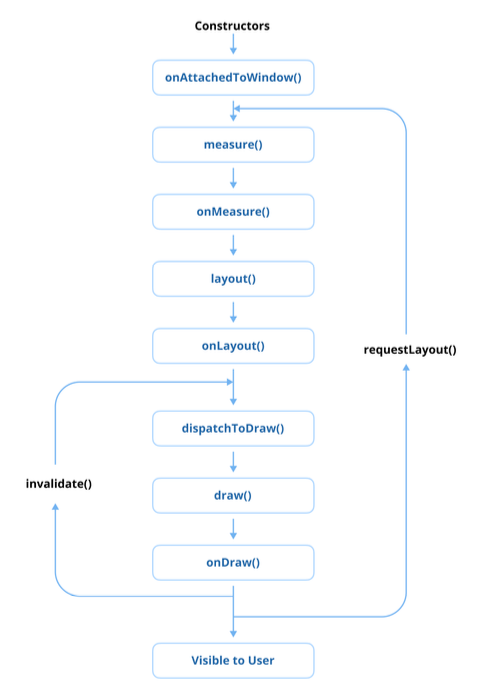

### 31. 애플리케이션 용량을 어떻게 줄이나요?

#### 사용하지 않는 리소스 제거하기

- 이미지, 레이아웃 또는 문자열과 같이 사용되지 않는 리소스는 불필요하게 APK 또는 AAB 크기를 증가시킴
- Android Studio의 Lint와 같은 도구는 이러한 리소스를 식별하는 데 도움이 됨
- 사용하지 않는 리소스를 제거한 후, build.gradle 파일에서 shrinkResources를 활성화하여 빌드 프로세스 중에 사용되지 않는 리소스를 자동으로 제거

```xml
android {
    buildTypes {
        release {
            minifyEnabled true
            shrinkResources true
        }
    }
}
```

#### R8로 코드 축소 활성화하기

- R8은 사용되지 않는 클래스와 메소드를 제거하며, 코드를 난독화하여 더 컴팩트하게 만듦
- ProGuard를 적절하게 사용하면 중요한 코드나 리플렉션 기반 라이브러리는 난독화를 생략하고 오동작하지 않도록 보장

```xml
android {
    buildTypes {
        release {
            minifyEnabled true
            proguardFiles getDefaultProguardFile('proguard-android-optimize.txt'), 'proguard-rules.pro'
        }
    }
}
```

#### 리소스 최적화 사용하기

이미지 및 XML 파일과 같은 리소스를 최적화하면 앱 용얄을 크게 줄일 수 있음
- 벡터 드로어블(Vector Drawable): 확장 가능한 그래픽을 위해 래스터 이미지(가령, PNG, JPEG) 대신 용량을 덜 차지하는 벡터 드로어블로 대체
- 이미지 압축: TinyPNG 또는 ImageMagick과 같은 도구를 사용하여 눈에 띄는 품질 손상 없이 래스터 이미지를 압축
- WebP 형식: 이미지를 PNG 또는 JPEG보다 압축률이 좋은 WebP 형식으로 변환

```xml
android {
    defaultConfig {
        vectorDrawables.useSupportLibrary = true
    }
}
```

#### Android App Bundle (AAB) 사용하기

- AAB 형식으로 전환하면 Google Play가 개별 기기에 맞는 최적화된 APK를 제공
- 이는 특정 구성에 필요한 리소스와 코드만 포함하여 앱 용량을 줄임

```xml
android {
    bundle {
        density {
            enableSplit = true
        }
        abi {
            enableSplit = true
        }
        language {
            enableSplit = true
        }
    }
}
```

#### 불필요한 의존성 제거하기

- 프로젝트의 의존성을 검토하고 사용되지 않거나 중복되는 라이브러리를 제거
- Android Studio의 Gradle Dependency Analyzer를 사용하여 무거운 라이브러리 및 전이 의존성(transitive dependencies)을 식별할 수 있음

#### 네이티브 라이브러리 최적화하기

앱에 네이티브 라이브러리가 포함된 경우 다음 전략을 사용하여 앱 용량을 줄일 수 있음

- 사용하지 않는 아키텍처 제외: build.gradle 파일의 abiFilters 옵션을 사용하여 필요한 API만 포함
- 디버그 심볼 제거: stripDebugSymbols를 사용하여 네이티브 라이브러리에게 디버깅 심볼을 제거

```xml
android {
    defaultConfig {
        ndk {
            abiFilters 'armeabi-v7a', 'arm64-v8a' // 필요한 ABI만 포함
        }
    }
    packagingOptions {
        exclude "**/lib/**/*.so.debug"
    }
}
```

#### ProGuard 규칙을 구성하여 디버그 정보 줄이기

- 디버깅 메타데이터는 최종 APK 또는 AAB에 불필요한 무게를 더함
- ProGuard 규칙을 사용하여 이러한 메타데이터를 제거

```pro
-dontwarn com.example.unusedlibrary.**
-keep class com.example.important.** { *; }
```

#### 동적 기능(Dynamic Features) 사용하기

- 동적 기능 모듈을 사용하면 자주 사용되지 않는 기능을 주문형 모듈로 분리하여 앱을 모듈화할 수 있음

```xml
// app/build.gradle (Grooby DSL)
android {
    dynamicFeatures = [":feature1", ":feature2"]
}
```

#### 앱 내 대용량 애셋 피하기

- 비디오나 고해상도 이미지와 같은 대용량 애셋은 콘텐츠 전송 네트워크(CDN)에 호스팅하고 런타임에 동적으로 로드
- 미디어 콘텐츠는 앱과 함께 번들링하는 대신 스트리밍을 사용

#### 실전 질문

Q) 앱에 APK/AAB 크기를 크게 증가시키는 고해상도 이미지가 포함되어 있습니다. 시각적 품질을 유지하면서 이미지 리소스를 어떻게 최적화하고, 최대 효율성을 위해 어떤 이미지 포맷을 사용할 수 있을까요?

A) 이미지 최적화를 위해 .pngquant, TinyPNG, ImageMagick과 같은 도구를 사용하여 이미지 크기를 줄일 수 있습니다. 또한, WebP 포맷을 사용하면 PNG나 JPEG보다 더 나은 압축률을 제공하여 이미지 품질을 유지하면서 파일 크기를 줄일 수 있습니다. 벡터 드로어블을 사용할 수 있는 경우, 래스터 이미지 대신 벡터 드로어블을 사용하는 것도 좋은 방법입니다.

Q) 애플리케이션은 보통 여러 기능들이 포함되어 있지만 그중 일부는 사용자가 자주 사용하지 않았습니다. 해당 기능을 필요할 때부터 사용할 수 있도록 초기 앱 용량을 줄이는 방법에는 무엇이 있을까요?

A) 동적 기능 모듈(Dynamic Feature Modules)을 사용하여 자주 사용되지 않는 기능을 별도의 모듈로 분리할 수 있습니다. 이렇게 하면 사용자가 해당 기능을 필요로 할 때만 다운로드하고 설치할 수 있어 초기 앱 용량을 줄일 수 있습니다. Google Play에서 이를 지원하며, build.gradle 파일에서 dynamicFeatures 속성을 설정하여 구현할 수 있습니다.

### 32. 안드로이드 애플리케이션의 프로세스(process)란 무엇이며, 안드로이드 운영 체제는 이를 어떻게 관리하나요?

- 안드로이드에서 프로세스(process)는 애플리케이션이 실행되는 환경
- 각 안드로이드 앱은 다른 앱과 격리된 자체 프로세스에서 단일 실행 스레드로 작동하여 시스템 보안, 메모리 관리 및 내결함성(fault tolerance)을 보장
- 안드로이드 프로세스는 리눅스 커널을 사용하여 운영 체제에 의해 관리되며 엄격한 생명주기 규칙을 따름
- 기본적으로 동일한 애플리케이션의 모든 컴포넌트는 메인 스레드라고 하는 동일한 프로세스 및 스레드에서 실행

#### 안드로이드에서 프로세스 작동 방식

- 안드로이드 애플리케이션이 시자되면 운영 체제는 리눅스 fork() 시스템 함수를 호출하여 해당 앱을 위한 새 프로세스를 생성
- 각 프로세스는 Dalvik 또는 ART(Android Runtime) 가상 머신의 고유 인스턴스에서 실행되어 안전하게 독립적인 실행을 보장
- 안드로이드는 각 프로세스에 고유한 리눅스 사용자 ID(UID)를 할당하여 권한 제어 및 파일 시스템 격리를 포함한 엄격한 보안 경계를 적용

#### 애플리케이션 컴포넌트와 프로세스 연결

- AndroidManifest.xml 파일에서 android:process 속성을 사용하여 프로세스 할당을 커스텀할 수 있음
- 해당 속성은 <activity>, <service>, <receiver>, <provider> 와 같은 컴포넌트와 <application> 에 적용 가능

```xml
<service
    android:name=".MyService"
    android:process=":remote" />
```

- 다른 애플리케이션의 컴포넌트가 동일한 리눅스 사용자 ID를 가지고 동일한 인증서로 서명된 경우 동일한 프로세스를 공유할 수 있음
- 안드로이드는 시스템 리소스 요구에 따라 프로세스를 동적으로 관리하며, 필요할 때 우선순위가 낮은 프로세스를 종료
- 더 이상 보이지 않는 Activity를 호스팅하는 프로세스는 보이는 프로세스를 호스팅하는 프로세스보다 종료될 가능성이 높음
- 안드로이드 시스템은 연관된 컴포넌트가 작업을 수행해야할 때 프로세스를 다시 시작하여 최적의 시스템 성능과 사용자 경험을 보장

#### 프로세스와 앱 생명주기

1. 포그라운드 프로세스(Foreground Process): 사용자와 활발하게 상호 작용하며 실행 중인 프로세스. 가장 높은 우선순위의 프로세스이며 거의 종료되지 않음.
2. 보이는 프로세스(Visible Process): 사용자에게 보이지만 활발하게 상호 작용하지 않는 프로세스 (가령, 다이얼로그 뒤의 Activity)
3. 서비스 프로세스(Service Process): 데이터 동기화나 음악 재생과 같은 작업을 수행하는 백그라운드 Service를 실행하는 프로세스
4. 캐시된 프로세스(Cached Process): 더 빠른 재실행을 위해 메모리에 유지되는 유휴 프로세스. 캐시된 프로세스는 우선순위가 가장 낮으며 메모리가 부족할 때 가장 먼저 종료.

#### 보안 및 권한

- 각 안드로이드 프로세스는 리눅스 보안 모델을 사용하여 샌드박스 처리되어 엄격한 권한 기반 접근 제어를 시행
- 이러한 격리는 안드로이드 권한 시스템을 통해 명시적으로 권한이 부여되지 않는 한 애플리케이션이 다른 프로세스의 데이터에 접근할 수 없도록 보장

#### 실전 질문

Q) 서로 다른 안드로이드 컴포넌트들을 별도의 프로세스에서 실행해야 하는 애플리케이션을 개발 중이라고 해봅시다. AndroidManifest에서 이를 어떻게 구성하며, 여러 프로세스를 사용할 때의 잠재적인 단점은 무엇인가요?

A) AndroidManifest.xml 파일에서 android:process 속성을 사용하여 각 컴포넌트를 별도의 프로세스에서 실행하도록 지정할 수 있습니다. 예를 들어, 특정 서비스나 액티비티에 대해 android:process=":remote"와 같이 설정할 수 있습니다. 그러나 여러 프로세스를 사용할 때의 단점으로는 메모리 사용량 증가, 프로세스 간 통신(IPC)의 복잡성 증가, 애플리케이션 성능 저하, 디버깅 어려움 등이 있습니다. 또한, 각 프로세스가 독립적으로 관리되기 때문에 애플리케이션의 전체적인 상태를 추적하기 어려울 수 있습니다.

Q) 안드로이드는 메모리가 부족할 때 어떤 프로세스를 종료할지 결정하기 위해 우선순위 기반 프로세스 관리 시스템을 사용합니다. 시스템이 프로세스 우선순위를 어떻게 정하는지, 그리고 중요한 프로세스가 종료되는 것을 방지하기 위해 개발자가 따라야 할 전략은 무엇인지 설명해 주세요.

A) 안드로이드는 프로세스의 우선순위를 포그라운드 프로세스, 보이는 프로세스, 서비스 프로세스, 캐시된 프로세스의 순서로 정합니다. 포그라운드 프로세스는 사용자와 직접 상호작용하는 프로세스로 가장 높은 우선순위를 가지며, 캐시된 프로세스는 가장 낮은 우선순위를 가집니다. 개발자는 중요한 작업을 수행하는 컴포넌트를 포그라운드나 서비스 프로세스로 유지하고, 불필요한 리소스를 해제하여 메모리 사용량을 최소화하는 전략을 따라야 합니다. 또한, 백그라운드 작업을 효율적으로 관리하고, 필요하지 않은 경우에는 컴포넌트를 종료하여 시스템 리소스를 확보하는 것이 중요합니다.

#### Pro Tips for Mastery: Activities, Services, Broadcast Receivers, Content Providers가 안드로이드의 4대 주요 컴포넌트라고 불리는 이유는 무엇인가요?

Activity, Service, BroadcastReceiver, ContentProvider는 안드로이드 애플리케이션이 시스템 및 다른 애플리케이션과 상호 작용할 수 있도록 하는 필수 구성 요소이기 때문에 안드로이드의 4대 주요 컴포넌트로 불림

##### 각 컴포넌트가 안드로이드 프로세스와 어떤 관련이 있는가

1. Activities
    1. Activity는 사용자 인터페이스가 있는 단일 화면을 나타냄
    2. 사용자 상호 작용의 진입점이며 안드로이드 프로세스 생명주기와 밀접하게 연결되어 있음
    3. 사용자가 앱을 열면 시스템은 앱의 프로세스에서 Activity를 다시 시작
    4. 프로세스가 종료되면 Activity는 소멸되고, 앱을 다시 시작하면 프로세스가 생성
2. Services
    1. Service는 사용자 인터페이스 없이 백그라운드 작업을 수행
    2. 애플리케이션이 보이지 않을 때도 실행될 수 있어 음악 재생이나 파일 다운로드와 같은 작업을 허용
    3. android:process 속성에 따라 앱과 동일한 프로세스 또는 별도의 프로세스에서 실행 가능 
3. Broadcast Receivers
    1. 애플리케이션이 네트워크 변경이나 배터리 상태 업데이트와 같은 시스템 전체 브로드캐스트 메시지를 수신하고 응답
    2. 앱이 실행 중이 아니더라도 트리거되어 필요한 경우 안드로이드 시스템이 해당 프로세스를 시작하도록 함
4. Content Providers
    1. 공유 애플리케이션 데이터를 관리하여 앱이 중앙 집중식 데이터베이스에서 읽거나 쓸 수 있도록 함
    2. 프로세스 간 통신을 허용하므로 다른 애플리케이션 간에 데이터를 공유하는 데 사용될 수 있으며, 안드로이드 시스템이 프로세스를 안전하고 효율적으로 관리하도록 요구

##### 안드로이드 프로세스와의 연결

- 컴포넌트는 안드로이드 시스템이 앱 사용량, 메모리 가용성 및 작업 우선순위에 따라 프로세스를 관리하기 때문에 안드로이드 프로세스와 직접적으로 연결
- 컴포넌트가 트리거되면 안드로이드 시스템은 아직 실행 중이 아닌 앱의 프로세스를 새롭게 시작할 수도 있음
- 각 컴포넌트는 android:process 속성을 사용하여 자체 프로세스를 할당받을 수도 있어 리소스 집약적인 작업에 더 많은 유연성을 제공
- 해당 설계는 백그라운드 실행, IPC 및 시스템 수준 상호 작용을 가능하게 하여 안드로이드 앱이 복잡한 다중 프로세스 작업을 효율적으로 처리할 수 있도록 보장

### 33. View 생명주기를 설명해주세요

안드로이드에서 View 생명주기(Lifecycle)는 View(가령, TextView 또는 Button 등)가 생성되고, Activity나 Fragment에 연결되고, 화면에 표시되고, 최종적으로 소멸되거나 분리되는 동안 거치는 생명주기 이벤트를 나타냄



1. View 생성 (onAttachedToWindow)
   1. View과 하드 코딩 방식으로 인스턴스화되거나 XML 레이아웃에서 인플레이션되는 단계
   2. 리스너 설정 및 데이터 바인딩과 같은 초기 설정이 수행됨
   3. onAttachedToWindow() 메소드는 View가 부모 뷰에 추가되고 화면 렌더링을 할 준비를 마쳤을 때 트리거
2. Layout 단계 (onMeasure, onLayout)
   1. View의 크기와 위치를 측정하는 단계
   2. onMeasure() 메소드는 레이아웃 매개변수와 부모 제약 조건에 따라 View의 너비와 높이를 결정
   3. 측정된 후 onLayout() 메소드는 View를 부모 내에 배치하여 화면에 표시될 위치를 최종 결정
3. Drawing 단계 (onDraw)
   1. 크기와 위치가 최종 결정된 후 onDraw() 메소드는 텍스트나 이미지와 같은 View의 내용을 Canvas에 렌더링
   2. 커스텀 View는 해당 메소드를 재정의하여 커스텀 드로잉 로직을 구현
4. Event 처리 (onTouchEvent, onClick)
   1. 상호 작용하는 View는 이 단계에서 터치 이벤트, 클릭, 제스처와 같은 사용자 상호 작용을 처리
   2. onTouchEvent() 및 onClick() 메소드는 이러한 이벤트를 처리하고 사용자 입력에 대한 View의 응답을 정의하는 데 사용
5. View 분리 (onDetachedFromWindow)
   1. View가 화면과 부모 ViewGroup에서 제거될 때(가령, Activity 또는 Fragment가 소멸 중일 때), onDetachedFromWindow() 메소드가 호출
   2. 이 단계는 리소스를 정리하거나 리스너를 분리하는 데 이상적
6. View 소멸
   1. View가 더 이상 사용되지 않으면 가비지 컬렉션됨
   2. 개발자는 메모리 누수를 방지하기 위해 View가 참조하는 리소스나 콜백을 적절히 해제했는지 확인해야 함

#### 실전 질문

Q) 이미지 로딩이나 애니메이션 설정과 같이 비용이 많이 드는 기능을 포함하는 커스텀 View를 만든다고 가정해 봅시다. View 생명주기의 어느 시점에서 이러한 리소스 및 기능을 초기화해야 하며, 메모리 누수를 방지하기 위해 어떻게 할 수 있나요?

A) 비용이 많이 드는 리소스나 기능은 View가 화면에 표시되기 전에 초기화하는 것이 좋습니다. 일반적으로 onAttachedToWindow() 메소드에서 이러한 초기화를 수행할 수 있습니다. 이 시점에서 View가 부모 뷰에 추가되고 화면 렌더링을 할 준비가 되었기 때문입니다. 메모리 누수를 방지하기 위해서는 onDetachedFromWindow() 메소드에서 리소스를 해제하거나 애니메이션을 중지하는 등의 정리 작업을 수행해야 합니다. 또한, View가 더 이상 사용되지 않을 때 가비지 컬렉션이 가능하도록 참조를 적절히 해제하는 것이 중요합니다.

Q) 애플리케이션에 성능 문제가 발생하는 동적으로 생성된 View를 포함하는 복잡한 레이아웃이 있습니다. 적절한 응답성을 유지하면서 렌더링 효율성을 향상시키기 위해 onMeasure() 및 onLayout() 메소드를 어떻게 최적화할 수 있을까요?

A) onMeasure() 메소드에서는 불필요한 측정을 피하고, 가능한 경우 측정 결과를 캐싱하여 성능을 향상시킬 수 있습니다. 또한, 부모 뷰의 제약 조건을 고려하여 최소한의 계산만 수행하도록 최적화할 수 있습니다. onLayout() 메소드에서는 View의 위치를 계산할 때 복잡한 연산을 피하고, 단순한 산술 연산을 사용하여 위치를 결정하는 것이 좋습니다. 또한, 레이아웃 변경이 자주 발생하지 않는 경우에는 레이아웃 요청을 최소화하여 불필요한 재측정을 방지할 수 있습니다. 이러한 최적화는 렌더링 효율성을 높이고 애플리케이션의 응답성을 유지하는 데 도움이 됩니다.

#### Pro Tips for Mastery: View의 findViewTreeLifecycleOwner() 함수는 어떤 역할을 하나요?

- findViewTreeLifecycleOwner() 함수는 View 클래스의 확장 함수로 View 트리 계층을 거슬러 올라가 View 트리에 연결된 가장 가까운 LifecycleOwner를 찾아 반환
- LifecycleOwner는 일반적으로 Activity, Fragment 또는 LifecycleOwner를 구현하는 커스텀 컴포넌트와 같은 호스팅 컴포넌트의 생명주기 범위를 나타냄

##### findViewTreeLifecycleOwner()를 사용하는 이유

- View가 Activity나 Fragment에 대한 명시적인 의존성 없이 연관된 생명주기에 접근 가능
- findViewTreeLifecycleOwner()를 사용하면 다음을 보장:
    - 생명주기를 인식하는 컴포넌트(LiveData 등)가 올바른 생명주기에 제대로 바인딩
    - 생명주기가 끝나면 관찰자가 정리되도록 하여 메모리 누수를 방지
  
```kotlin
class CustomLifecycleAwareView @JvmOverloads constructor(
    context: Context, 
    attrs: AttributeSet? = null
) : LinearLayout(context, attrs) {

    private var lifecycleObserver: LifecycleObserver? = null

    fun bindObserver(observer: LifecycleObserver) {
        lifecycleObserver?.let { removeObserver(it) }
        
        val lifecycleOwner = findViewTreeLifecycleOwner()
        
        lifecycleOwner?.lifecycle?.addObserver(observer) ?: run {
            Log.e("CustomView", "No LifecycleOwner found for the View")
        }
        lifecycleObserver = observer
    }
    
    override fun onDetachedFromWindow() {
        super.onDetachedFromWindow()
        lifecycleObserver?.let {
            findViewTreeLifecycleOwner()?.lifecycle?.removeObserver(it)
        }
    }
    
    private fun removeObserver(observer: LifecycleObserver) {
        findViewTreeLifecycleOwner()?.lifecycle?.removeObserver(observer)
        lifecycleObserver = null
    }
}
```

- 여기서 CustomLifecycleAwareView는 View 트리의 가장 가까운 LifecycleOwner에 동적으로 바인딩되어 LifecycleObserver 관찰이 적절한 생명주기에 연결되도록 보장

##### 주요 사용 사례

1. 커스텀 뷰(Custom Views)
    - 커스텀 View 내의 생명주기 인식 컴포넌트가 LifecycleObserver, LiveData와 같은 생명주기 관찰자를 관찰하거나 리소스를 관리할 수 있도록 함
2. 서드파티 라이브러리(Third-Party Libraries)
    - 재사용 가능한 UI 컴포넌트가 명시적인 생명주기 관리 없이 생명주기 인식 리소스와 상호 작용할 수 있도록 함
3. 로직 결합도 분리(Decoupling Logic)
    - View가 View 트리에서 자체 LifecycleOwner를 독립적으로 획득하도록 하여 부모 클래스와의 결합도를 줄이는 데 도움이 됨

##### 한계

- findViewTreeLifecycleOwner()는 유용한 기능을 제공하지만, View 트리에 LifecycleOwner가 존재해야 함
- LifecycleOwner를 제공하는 소유자가 없으면 null을 반환하므로 크래시나 예상치 못한 동작이 발생할 수 있기 때문에, 신중하게 사용해야 함

### 34. View와 ViewGroup의 차이점은 무엇인가요?

#### View란?

- View는 화면에 표시되는 직사각형 형태의 UI를 구현하는 최소 단위의 단일 컴포넌트
- Button, TextView, ImageView, EditText와 같은 모든 UI 컴포넌트의 기본 클래스가 됨
- 각 View는 화면에 렌더링되면 터치 또는 키 이벤트와 같이 애플리케이션 사용자와의 상호 작용을 처리

```kotlin
val textView = TextView(context).apply {
    text = "Hello, World!"
    textSize = 16f
    setTextColor(Color.BLACK)
}
```

- View.java의 내부 구현은 34,000줄이 넘는 코드로 이는 View 인스턴스를 생성하고 관리하는 것이 의외로 상당한 오버헤드가 수반됨을 뜻함
- 불필요한 View 생성은 애플리케이션 성능에 영향을 미쳐 메모리 사용량을 늘리고 전체 레이아웃의 렌더링 속도를 늦출 수 있음
- 성능을 최적화하려면 가능한 한 불필요한 View 생성을 피하고, 여러번 중첩된 뷰는 측정, 레이아웃 및 렌더링 시간을 증가시킬 수 있으므로 레이아웃 트리의 계층 구조를 단순화시키는 것이 중요함

#### ViewGroup이란?

- ViewGroup은 여러 View 또는 다른 ViewGroup 요소를 포함하는 일종의 컨테이너
- LinearLayout, RelativeLayout, ConstraintLayout, FrameLayout과 같은 레이아웃의 기본이 되는 클래스
- ViewGroup은 자식 뷰의 레이아웃과 위치를 관리하며, 화면에서 자식 View들의 사이즈가 측정되고 그려지는 방식을 정의

```kotlin
val linearLayout = LinearLayout(context).apply {
    orientation = LinearLayout.VERTICAL
    addView(TextView(context).apply { text = "Child 1" })
    addView(Button(context).apply { text = "Child 2" })
}
```

- ViewGroup은 View를 확장하여 ViewParent 및 ViewManager 인터페이스를 모두 구현
- ViewGroup은 다른 View 객체를 위한 컨테이너 역할을 하므로 독립형 View보다 본질적으로 더 복잡하고 리소스 집약적
- ViewGroup 인스턴스의 과도한 중첩은 렌더링 성능에 부정적인 영향을 미침
- 추가적인 레이아웃 계산을 수행하고 여러 자식 뷰를 관리해야 하므로, 불필요한 중첩을 줄이는 것이 성능을 최적화하고 원활한 UI 렌더링을 보장

#### View와 ViewGroup의 주요 차이점

1. 목적
   1. View는 콘텐츠를 표시하거나 사용자와 상호 작용하도록 설계된 단일 UI 요소
   2. ViewGroup은 여러 자식 뷰를 구성하고 관리하기 위한 컨테이너
2. 계층
   1. View는 UI 계층 구조의 리프 노드(leaf node). 따라서 다른 뷰를 포함할 수 없음
   2. ViewGroup은 여러 자식 뷰 또는 다른 ViewGroup 요소를 포함할 수 있는 브랜치 노드(branch node)
3. 레이아웃 동작
   1. View는 레이아웃 매개변수에 의해 정의된 자체적인 크기와 위치를 가짐
   2. ViewGroup은 LinearLayout 또는 ConstraintLayout과 같이 정의된 레이아웃 규칙을 사용하여 자식 뷰의 크기와 위치를 결정
4. 상호작용 핸들링
   1. View는 터치 및 키 이벤트를 처리
   2. ViewGroup은 onInterceptTouchEvent와 같은 메소드를 사용하여 자식의 이벤트를 가로채고 관리
5. 성능
   1. ViewGroup은 계층 구조로 인해 렌더링에 복잡성을 더함. 중첩된 ViewGroup을 과도하게 사용하면 렌더링 시간 증가 및 UI 업데이트 지연과 같은 성능 문제가 발생

#### 실전 질문

Q) View 생명주기에서 requestLayout(), invalidate(), postInvalidate()가 어떻게 작동하는지 설명하고 각각 언제 사용해야 하나요?

A) requestLayout()은 View의 레이아웃이 변경되어 다시 측정하고 배치해야 할 때 호출됩니다. 이 메소드는 View와 그 자식 뷰의 크기나 위치가 변경될 때 사용됩니다. invalidate()는 View의 시각적 콘텐츠가 변경되어 다시 그려야 할 때 호출됩니다. 이 메소드는 View의 외관이 변경되었을 때 사용됩니다. postInvalidate()는 invalidate()와 유사하지만, UI 스레드가 아닌 다른 스레드에서 호출할 수 있습니다. 이 메소드는 백그라운드 스레드에서 View를 업데이트해야 할 때 사용됩니다.

Q) View 생명주기는 Activity 생명주기와 어떻게 다르며, 효율적인 UI 렌더링을 위해 둘 다 이해하는 것이 왜 중요한가요?

A) View 생명주기는 개별 View의 생성, 측정, 배치, 그리기 및 소멸과 관련된 반면, Activity 생명주기는 전체 애플리케이션 컴포넌트의 상태와 상호 작용을 관리합니다. 효율적인 UI 렌더링을 위해서는 둘 다 이해하는 것이 중요합니다. Activity 생명주기를 이해하면 애플리케이션의 상태 변화에 따라 적절한 시점에 View를 초기화하거나 정리할 수 있습니다. 또한, View 생명주기를 이해하면 개별 View의 성능을 최적화하고 불필요한 리소스 사용을 줄일 수 있습니다. 이를 통해 사용자에게 원활하고 반응성 높은 UI 경험을 제공할 수 있습니다.

### 35. ViewStub이란 무엇이고, 이를 사용하여 UI 성능을 최적화해본 경험이 있나요?

- ViewStub은 명시적으로 필요할 때까지 레이아웃의 인플레이션을 지연시키는 데 사용되는 가볍고 보이지 않는 placeholder 뷰
- 앱 생명주기 동안 지금 당장 필요하지 않은 뷰를 필요한 시기에 적절하게 인플레이션하여 오버헤드를 피함으로써 성능을 개선하는 데 사용

#### ViewStub의 주요 특징

1. 가벼움: ViewStub은 인플레이션될 때까지 레이아웃 공간을 차지하거나 리소스를 소비하지 않으므로 메모리 공간이 최소화된 매우 가벼운 뷰
2. 인플레이션 지연: ViewStub에 지정된 실제 레이아웃은 inflate() 메소드가 호출되거나 ViewStub이 보이게 될 때만 인플레이션
3. 일회성: 한번 인플레이션되면 ViewStub은 뷰 계층 구조에서 인플레이션된 레이아웃으로 대체되며 재사용할 수 없음

#### ViewStub의 일반적인 사용 사례

1. 조건부 레이아웃: ViewStub은 오류 메시지, 진행률 표시줄 또는 선택적 UI 요소와 같이 조건부로 표시되는 레이아웃에 이상적
2. 초기 렌더링 시간 절감: 복잡하거나 리소스 집약적인 뷰의 인플레이션을 지연시킴으로써 ViewStub은 Activity 또는 Fragment의 초기 렌더링 시간을 개선하는 데 도움이 됨
3. 동적 UI: 필요할 때만 화면에 동적으로 콘텐츠를 렌더링하는 데 사용될 수 있어 메모리 사용량을 최적화

#### ViewStub 사용 방법

ViewStub은 인플레이션할 레이아웃 속성과 함께 XML 레이아웃에 정의

```xml
<LinearLayout
    xmlns:android="http://schemas.android.com/apk/res/android"
    android:layout_width="match_parent"
    android:layout_height="match_parent"
    android:orientation="vertical">

    <!-- Regular View -->
    <TextView
        android:id="@+id/title"
        android:layout_width="wrap_content"
        android:layout_height="wrap_content"
        android:text="This is always visible" />

    <!-- Placeholder ViewStub -->
    <ViewStub
        android:id="@+id/viewStub"
        android:layout_width="match_parent"
        android:layout_height="wrap_content"
        android:layout="@layout/optional_content" />
</LinearLayout>
```

```kotlin
class MainActivity : AppCompatActivity() {
    override fun onCreate(savedInstanceState: Bundle?) {
        super.onCreate(savedInstanceState)
        setContentView(R.layout.activity_main)

        val viewStub = findViewById<ViewStub>(R.id.viewStub)
        
        // 필요할 때 레이아웃 인플레이션
        val inflatedView: view? = try {
            viewStub.inflate()   // 성공 시 
        } catch (e: IllegalArgumentExcpetion) {
            // 이미 인플레이트된 경우 findViewById 사용
            findViewById(viewStub.inflated)
        }
        
        // 인플레이션될 레이아웃의 뷰에 접근 (null 체크 필요)
        inflatedView?.let {
            val optionalTextView = it.findViewById<TextView>(R.id.optionalText)
            optionalTextView.text = "Inflated Content"
        }
    }
}
```

#### ViewStub의 장점

1. 최적화된 성능: 늦게 초기화 해도 되는 뷰 생성을 지연시켜 메모리 사용량을 줄이고 초기 렌더링 성능을 개선
2. 쉬운 레이아웃 관리: 뷰를 수동으로 추가하거나 제거하지 않고도 UI 요소를 선택적으로 렌더링함으로써 쉽게 관리할 수 있음
3. 쉬운 사용성: API 사용이 간단하고 XML 통합이 쉬워 개발자가 쉽게 활용할 수 있음

#### ViewStub의 한계

1. 일회성: 일단 인플레이션되면 ViewStub은 뷰 계층 구조에서 제거되며 재사용할 수 없음
2. 제한된 컨트롤: 플레이스홀더이므로 인플레이션될 때까지 사용자 상호 작용을 처리하거나 복잡한 작업을 수행할 수 없음

#### 실전 질문

Q) ViewStub이 인플레이션될 때 어떤 일이 발생하며, 레이아웃 성능 및 메모리 사용량 측면에서 뷰 계층 구조에 어떤 영향을 미치나요?

A) ViewStub이 인플레이션될 때, 지정된 레이아웃 리소스가 실제 뷰 계층 구조에 추가되고 ViewStub은 해당 위치에서 제거됩니다. 이 과정에서 ViewStub은 더 이상 존재하지 않으며, 인플레이션된 뷰가 그 자리를 차지합니다. 레이아웃 성능 측면에서 ViewStub을 사용하면 초기 렌더링 시간이 단축되고 메모리 사용량이 최적화됩니다. 이는 필요할 때만 뷰를 생성하고 메모리를 소비하기 때문입니다. 따라서 복잡하거나 리소스 집약적인 뷰를 지연시켜 앱의 초기 로드 시간을 개선하고, 불필요한 메모리 사용을 줄일 수 있습니다.

### 36. 커스텀 뷰(custom views)는 어떻게 구현하나요?

#### 커스텀 View 클래스 생성하기

- 기본 뷰 클래스(View, ImageView, TextView 등)를 확장하는 새 클래스를 정의
- 구현하려는 커스텀 동작에 따라 onDraw(), onMeasure(), onLayout()과 같은 필요한 생성자 및 메소드를 재정의

```kotlin
class CustomCircleView @JvmOverloads constructor(
    context: Context,
    attrs: AttributeSet? = null,
    defStyle: Int = 0
): View(context, attrs, defStyle) {
    
    private val paint = Paint(Paint.ANTI_ALIAS_FLAG).apply {
        color = Color.RED
        style = Paint.Style.FILL
    }
    
    override fun onDraw(canvas: Canvas) {
        super.onDraw(canvas)
        // 중앙에 빨간색 원 그리기
        canvas.drawCircle(width / 2f, height / 2f, min(width, height) / 4f, paint) // 반지름 수정
    }
} 
```

#### XML 레이아웃에서 커스텀 View 사용하기

- 커스텀 뷰 클래스를 생성한 후 XML 레이아웃 파일에서 직접 참조할 수 있음
- 커스텀 클래스의 전체 패키지 이름을 정확하게 사용해야 함

```xml
<com.example.myapp.ui.CustomCircleView
    android:id="@+id/customCircleView"
    android:layout_width="100dp"
    android:layout_height="100dp"
    android:layout_gravity="center" />
```

#### 커스텀 속성 추가하기 (선택 사항)

- res/values 폴더에 attrs.xml 파일을 생성하여 커스텀 속성을 정의

```xml
<?xml version="1.0" encoding="utf-8"?>
<resources>
    <declare-styleable name="CustomCircleView">
        <attr name="circleColor" format="color" />
        <attr name="circleRadius" format="dimension" />
    </declare-styleable>
</resources>
```

- 커스텀 뷰 클래스에서 context.obtainStyledAttributes()를 사용하여 커스텀 속성 값을 가져올 수 있음

```kotlin
class CustomCircleView @JvmOverloads constructor(
    context: Context,
    attrs: AttributeSet? = null,
    defStyleAttr: Int = 0   // defStyleAttr로 이름 변경 권장
): View(context, attrs, defStyleAttr) {

    private var circleColor: Int = Color.RED
    private var circleRadius: Float = 50f

    private val paint = Paint(Paint.ANTI_ALIAS_FLAG).apply {
        style = Paint.Style.FILL
    }

    init {
        attrs?.let {
            getAttrs(it, defStyleAttr)
        }
        paint.color = circleColor
    }
    
    private fun getAttrs(attrs: AttributeSet, defStyleAttr: Int) {
        val typedArray = context.obtainStyleAttributes(
            attrs, R.styleable.CustomCircleView, defStyleAttr, 0    // 기본 스타일 리소스 0
        )
        try {
            setTypeArray(typedArray)
        } finally {
            typedArray.recycle()
        }
    }
    
    private fun setTypeArray(typedArray: TypedArray) {
        circleColor = typedArray.getDimension(
            R.styleable.CustomCircleView_circleColor, Color.RED
        )
        circleRadius = typedArray.getDimenstion(
            R.styleable.CustomCircleView_circleRadius, 50f
        )
    }

    override fun onDraw(canvas: Canvas) {
        super.onDraw(canvas)
        // onDraw에서 사용자 정의된 반지름 값 사용
        canvas.drawCircle(width / 2f, height / 2f, circleRadius, paint)
    }
    
    // 필요하다면 onMeasure 재정의
    override fun onMeasure(widthMeasureSpec: Int, heightMeasureSpec: Int) {
        val desiredWidth = (circleRadius * 2 + paddingLeft + paddingRight).toInt()
        val desiredHeight = (circleRadius * 2 + paddingTop + paddingBottom).toInt()

        val width = resolveSize(desiredWidth, widthMeasureSpec)
        val height = resolveSize(desiredHeight, heightMeasureSpec)
        setMeasuredDimension(width, height)
    }
    
    // circleColor 또는 circleRadius 변경 시 뷰를 다시 그리도록 하는 메소드
    fun setCircleProperties(color: Int, radius: Float) {
        this.circleColor = color
        this.circleRadius = radius
        paint.color = color
        requestLayout() // 뷰의 크기 변경 가능성이 있으므로 requestLayout 호출
        invalidate()    // 뷰를 다시 그리도록 invalidate 호출
    }
}
```

- 이제 XML 파일에서 아래와 같이 커스텀 속성을 사용할 수 있음

```xml
<com.example.myapp.ui.CustomCircleView
    xmlns:app="http://schemas.android.com/apk/res-auto"
    android:id="@+id/customCircleView"
    android:layout_width="100dp"
    android:layout_height="100dp"
    app:circleColor="@color/blue"
    app:circleRadius="30dp" />
```

#### 레이아웃 측정 처리하기 (선택 사항)

- 커스텀 뷰가 크기를 측정하는 방식을 수동으로 처리하고 싶고, 특히 표준적인 뷰와 다르게 동작해야 하는 경우 onMeasure() 메소드를 재정의하여 구현

```kotlin
override fun onMeasure(widthMeasureSpec: Int, heightMeasureSpec: Int) {
    // 원하는 기본 크기 설정
    val desiredWidth = (paddingLeft + paddingRight + suggestedMinimumWidth).coerceAtLeast(200)
    val desiredHeight = (paddingTop + paddingBottom + suggestedMinimumHeight).coerceAtLeast(200)

    // MeasureSpec 모드와 크기를 기반으로 최종 크기 결정
    val width = resolveSize(desiredWidth, widthMeasureSpec)
    val height = resolveSize(desiredHeight, heightMeasureSpec)
    
    // 최종 측정된 크기 설정
    setMeasuredDimension(width, height)
}
```

#### 실전 질문

Q) XML 레이아웃에서 이전 버전과의 호환성을 보장하면서 커스텀 뷰에 커스텀 속성을 효율적으로 적용하려면 어떻게 해야 하나요?

A) 커스텀 뷰에 커스텀 속성을 적용할 때, attrs.xml 파일에서 declare-styleable 태그를 사용하여 속성을 정의하고, 커스텀 뷰 클래스의 생성자에서 context.obtainStyledAttributes() 메소드를 사용하여 속성 값을 가져오는 것이 중요합니다. 또한, 기본 스타일 리소스를 제공하여 이전 버전과의 호환성을 유지할 수 있습니다. 예를 들어, defStyleAttr 매개변수를 생성자에 추가하고, obtainStyledAttributes() 호출 시 이를 전달하여 기본 스타일을 적용할 수 있습니다. 이렇게 하면 XML 레이아웃에서 커스텀 속성을 설정하지 않은 경우에도 기본값이 적용되어 호환성을 보장할 수 있습니다.

#### Pro Tips for Mastery: 커스텀 뷰의 기본 생성자에서 @JvmOverloads를 사용할 때 왜 주의해야 하나요?

- @JvmOverloads 어노테이션은 Kotlin 함수 또는 클래스에 대해 여러 오버로드된 메소드 또는 생성자를 자동으로 생성하여 Kotlin과 Java 간의 상호 운용성을 단순화하는 기능
- Java가 기본 인수를 지원하지 않기 때문에 Koltin의 기본 인수가 관련된 경우 특히 유용
- @JvmOverloads를 사용하면 Kotlin 컴파일러는 컴파일러된 바이트코드에서 기본값을 가진 매개변수의 모든 가능한 조합을 나타내기 위해 여러 메소드 또는 생성자 시그니처를 컴파일 타임에 자동적으로 생성
- 커스텀 뷰를 구현할 때 @JvmOverloads를 잘 못 사용하면 의도치 않게 기본 뷰 스타일을 재정의하여 커스텀 뷰의 의도된 스타일링이 손실 가능

```kotlin
class ElasticTextInputEditText @JvmOverloads constructor(
    context: Context,
    attrs: AttributeSet? = null,
    defStyle: Int = 0  // 여기서 defStyleAttr 대신 defStyle을 사용하고 기본값을 0으로 설정
) : TextInputEditText(context, attrs, defStyle) {
    // ...
}
```

- 위 예제에서 defStyle 값이 0으로 재정의되어 커스텀 뷰가 의도한 스타일링을 잃을 수 있음
- View가 XML 파일에서 인플레이션될 때 두 매개변수 생성자(Context 및 AttributeSet)가 호출되고, 이는 다시 세 매개변수 생성자를 호출

```kotlin
// @JvmOverloads가 생성한 두 매개변수 생성자 (내부적으로)
public ElasticTextInputEditText(Context context, @Nullable AttributeSets attrs) {
    this(context, attrs, 0); // defStyle이 0으로 설정됨
}
```

- 세 매개변수 생성자의 목적은 다음과 같음:
    - XML에서 인플레이션을 수행하고 테마 속성에서 클래스별 기본 스타일을 적용
    - 해당 생성자를 사용하면 하위 클래스가 인플레이션될 때 자체 기본 스타일 사용 가능
    - 예를 들어, Button 클래스의 생성자는 이 버전의 상위 클래스 생성자를 호출하고 defStyleAttr에 R.attr.buttonStyle을 제공
    - 이를 통해 버튼 스타일이 모든 기본 뷰 속성(특히 배경)뿐만 아니라 Button 클래스의 속성도 수정 가능
- 적절한 defStyleAttr를 제공하지 않으면 커스텀 뷰가 의도한 스타일링을 잃을 수 있음
- TextInputEditText의 내부 구현을 살펴보면 내부적으로 R.attr.editTextStyle을 defStyleAttr로 사용

```java
public class TextInputEditText extends AppCompatEditText {
    
    // ... 필드 정의 ...
    
    public TextInputEditText(@NotNull Context context) {
        this(context, null);
    }
    
    public TextInputEditText(@NonNull Context context, @Nullable AttributeSet attrs) {
        // 기본 스타일 속성으로 R.attr.editTextStyle 사용
        this(context, attrs, R.attr.editTextStyle);
    }
    
    public TextInputEditText(@NonNull Context context, @Nullable AttributeSet attrs, int defStyleAttr) {
        super(context, attrs, defStyleAttr);
        // ... 나머지 생성자 로직 ...
    }
}
```

```kotlin
class ElasticTextInputEditText @JvmOverloads constructor(
    context: Context,
    attrs: AttributeSet? = null,
    // 기본값으로 올바른 스타일 속성 참조
    defStyleAttr: Int = R.attr.editTextStyle
) : TextInputEditText(context, attrs, defStyleAttr) {
    // ...
}
```

- androidx.appcompat.R.attr.editTextStyle을 기본값으로 명시적으로 할당함으로써 커스텀 뷰가 XML 인플레이션 중에 예상되는 기본 스타일을 상속하여 원래 TextInputEditText의 동작과 일관성을 유지하도록 보장

### 37. Canvas란 무엇이며 어떻게 활용하나요?

- Canvas는 커스텀 드로잉을 위한 핵심 구성 요소로 화면이나 Bitmap과 같은 다른 드로잉이 가능한 표면에 직접 그래픽을 렌더링하기 위한 인터페이스를 제공

#### Canvas 작동 방식

- Canvas 클래스는 도형, 텍스트, 이미지 및 기타 콘텐츠를 그릴 수 있는 2D 드로잉 표면을 나타냄
- 그려진 콘텐츠가 어떻게 보여야 하는지 정의하는 Paint 클래스와 긴밀하게 상호 작용
- 커스텀 View의 onDraw() 메소드를 재정의하면 Canvas 객체가 전달되어 무엇을 그릴지 정의 가능

```kotlin
class CustomView(context: Context) : View(context) {
    private val paint = Paint().apply {
        color = Color.BLUE
        style = Paint.Style.FILL
    }
    
    override fun onDraw(canvas: Canvas) {
        super.onDraw(canvas)
        // View 중아에 파란색 원 그리기
        canvas.drawRect(width / 2f, height / 2f, 100f, paint)
    }
}
```

#### Canvas의 일반적인 작업

- 도형(Shapes): drawCircle(), drawRect(), drawLine()과 같은 메소드를 사용하여 원, 사각형, 선과 같은 도형을 그림
- 텍스트(Text): drawText() 메소드는 지정된 좌표와 모양으로 텍스트를 렌더링
- 이미지(Images): drawBitmap()을 사용하여 이미지를 렌더링
- 커스텀 패스(Custom Paths): Path 객체와 drawPath()를 결합하여 복잡한 모양을 그릴 수 있음

#### 변환 (Transformations)

- 이동(Translation): canvas.translate(dx, dy)를 사용하여 캔버스 원점을 새 위치로 이동
- 크기 조절(Scaling): canvas.scale(sx, sy)를 사용하여 드로잉 크기를 배율로 조절
- 회전(Rotation): canvas.rotate(degrees)를 사용하여 지정된 각도로 캔버스를 회전

#### 사용 사례

1. Custom Views: 표준적으로 제공되는 컴포넌트로 달성할 수 없는 고유한 UI 컴포넌트 만들기
2. Games: 정밀한 제어로 게임 그래픽을 렌더링하는 경우
3. Charts and Diagrams: 커스텀 형식으로 데이터를 시각화해야 하는 경우
4. Image Processing: 프로그래밍 방식으로 이미지 수정 또는 결합이 필요한 경우

#### 실전 질문

Q) AndroidX 라이브러리에서 지원하지 않는 복잡한 모양이나 UI 요소를 렌더링 하는 커스텀 뷰를 어떻게 만들 수 있을까요? 예를 들어, 화면에 로딩 중 상태를 표현하는 커스텀 스피너를 직접 그린다면, 어떤 Canvas 메소드와 API를 활용할 수 있을까요?

A) 커스텀 뷰를 만들 때 Canvas의 onDraw를 오버라이드하여 drawArc(), drawCircle(), drawPath() 같은 Canvas 메소드와 Paint를 활용하여 직접 그래픽을 그릴 수 있다. 애니메이션 효과는 ValueAnimator나 ObjectAnimator로 각도, 알파값 등을 갱신하고 invalidate()를 호출해 화면을 반복적으로 갱신하면 된다.