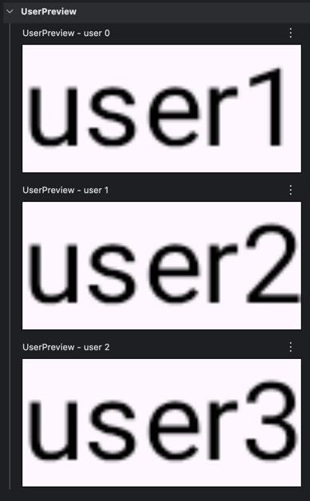

### Q34. Canvas는 어떤 역할을 하나요?

Canvas는 커스텀 그래픽, 애니메이션 및 시각 효과를 만들 수 있도록 직접 원, 선, 도형 등을 그리거나 이미지를 렌더링할 수 있는 API<br>
Jetpack Compose의 드로잉 시스템 메커니즘에 기반하여 drawRect, drawCircle, drawPath, drawText, drawImage와 같은 함수를 통해 전통적인 XML의 Canvas와 유사한 형태로 동작

#### 사용 예제

```kotlin
@Composable
fun DrawCircleCanvas() {
    Canvas(modifier = Modifier.size(200.dp)) {
        drawCircle(
            color = Color.Blue,
            radius = size.minDimension / 2,
            center = Offset(x = size.width / 2, y = size.height / 2)
        )
    }
}
```

#### 기본 변환 (Basic Transformations)

- 크기 조절 (scale): 지정된 배율로 드로잉 대상 확대 또는 축소
- 이동 (translate): 드로잉 영역 내에서 X 및 Y 축을 따라 대상 이동
- 회전 (rotate): 피벗 점 주위로 대상 회전
- 인셋 (inset): 패딩을 적용하여 드로잉 경계 조정
- 다중 변환 (withTransform): 더 나은 성능을 위해 단일 작업에서 여러 변환 결합
- 텍스트 그리기 (drawText): 정밀한 위치 지정 및 커스텀으로 텍스트 수동 렌더링

이와 같은 변환 API는 컴포저블 생명주기의 Drawing 단계 중에 적용되는데, 이는 컴포넌트의 레이아웃 크기나 위치 지정에 영향을 미치지 않음을 으미

#### 실전 질문

Q) 커스텀 애니메이션이 들어간 원형 프로그레스바를 Canvas를 사용해서 어떻게 구현할지 설명해 주세요.

A)
```kotlin
@Composable
fun CircularProgressCanvas(
    progress: Float,              // 0f..1f
    modifier: Modifier = Modifier,
    strokeWidth: Dp = 12.dp,
    backgroundColor: Color = Color(0xFFE6E6E6),
    progressColor: Color = Color(0xFF3B82F6),
    startAngle: Float = -90f,      // 12시 방향부터 시작
    roundCap: Boolean = true,
) {
    val coerced = progress.coerceIn(0f, 1f)

    Canvas(modifier = modifier) {
        val stroke = Stroke(
            width = strokeWidth.toPx(),
            cap = if (roundCap) StrokeCap.Round else StrokeCap.Butt
        )

        // 원이 잘리지 않도록 패딩(= stroke 절반)만큼 inset
        val inset = stroke.width / 2f
        val diameter = size.minDimension - stroke.width
        val topLeft = Offset(
            x = (size.width - diameter) / 2f,
            y = (size.height - diameter) / 2f
        )
        val arcSize = Size(diameter, diameter)

        // 배경 링
        drawArc(
            color = backgroundColor,
            startAngle = 0f,
            sweepAngle = 360f,
            useCenter = false,
            topLeft = topLeft,
            size = arcSize,
            style = stroke
        )

        // 진행 링
        drawArc(
            color = progressColor,
            startAngle = startAngle,
            sweepAngle = 360f * coerced,
            useCenter = false,
            topLeft = topLeft,
            size = arcSize,
            style = stroke
        )
    }
}

@Composable
fun AnimatedCircularProgressCanvas(
    targetProgress: Float,
    modifier: Modifier = Modifier,
    strokeWidth: Dp = 12.dp,
    backgroundColor: Color = Color(0xFFE6E6E6),
    progressColor: Color = Color(0xFF22C55E),
) {
    val animated by animateFloatAsState(
        targetValue = targetProgress.coerceIn(0f, 1f),
        animationSpec = tween(durationMillis = 700, easing = FastOutSlowInEasing),
        label = "progress"
    )

    CircularProgressCanvas(
        progress = animated,
        modifier = modifier,
        strokeWidth = strokeWidth,
        backgroundColor = backgroundColor,
        progressColor = progressColor,
    )
}
```

### Q35. graphicsLayer를 어떻게 활용하나요?

graphicsLayer는 개발자가 컴포저블에 변환, 클리핑 및 합성 효과를 적용할 수 있도록 하는 유용한 Modifier<br>
컴포저블을 별도의 드로잉 레이어로 렌더링하여 작동하며, 격리된 렌더링, 캐싱 및 오프스크린 래스터화와 같은 최적화를 가능하게 함

#### graphicsLayer 작동 방식

- Modifier.graphicsLayer로 래핑되면 모든 드로잉 작업이 나머지 UI와는 별도로 분리되는 격리된 레이어를 생성
- 크기 조절, 이동, 회전, 알파 변경 및 클리핑과 같은 변환을 주변 컴포저블에 영향을 주지 않고 저장 가능
- 하드웨어 가속을 사용하므로 과도한 recomposition 없이도 부드러운 애니메이션과 상호작용 가능

#### 사용 예제

```kotlin
@Composable
fun ScaledImage() {
    Image(
        painter = painterResource(id = R.drawable.sample_image),
        contentDescription = "Sample Image",
        modifier = Modifier
            .size(200.dp)
            .graphicsLayer(
                scaleX = 1.5f,
                scaleY = 1.2f,
            )
    )
}
```

#### 변환 적용하기

##### 이동 (요소 이동)

```kotlin
@Composable
fun TranslatedImage() {
    Image(
        painter = painterResource(id = R.drawable.sample_image),
        contentDescription = "Sample Image",
        modifier = Modifier
            .size(200.dp)
            .graphicsLayer(
                translationX = 50.dp.toPx(), // 오른쪽으로 50픽셀 이동
                translationY = -20.dp.toPx()  // 아래로 30픽셀 이동
            )
    )
}
```

##### 회전 (요소 회전)

```kotlin
@Composable
fun RotatedImage() {
    Image(
        painter = painterResource(id = R.drawable.sample_image),
        contentDescription = "Sample Image",
        modifier = Modifier
            .size(200.dp)
            .graphicsLayer {
                rotationX = 45f
                rotationY = 30f
                rotationZ = 90f
                transformOrigin = TransformOrigin.Center
            }
    )   
}
```

##### 클리핑 및 모양 지정 (Clipping and Shaping)

```kotlin
@Composable
fun ClippedBox() {
    Box(
        modifier = Modifier
            .size(200.dp)
            .background(Color.Blue)
            .graphicsLayer {
                clip = true
                shape = CircleShape
            }
    )    
}
```

##### 알파 (불투명도 제어)

```kotlin
@Composable
fun TransparentImage() {
    Image(
        painter = painterResource(id = R.drawable.sample_image),
        contentDescription = "Sample Image",
        modifier = Modifier
            .size(200.dp)
            .graphicsLayer {
                alpha = 0.5f // 50% 불투명도
            }
    )
}
```

##### 합성 전략 (Compositing Strategies)

1. Auto (기본값): 속성에 따라 렌더링을 자동으로 최적화
2. Offscreen: 합성하기 전에 콘텐츠를 오프스크린 텍스처로 렌더링
3. ModulateAlpha: 전체 레이어 대신 드로잉 작업벼로 alpha 적용

```kotlin
@Composable
fun OffscreenBlendEffect() {
    Image(
        painter = painterResource(id = R.drawable.sample_image),
        contentDescription = "Sample Image",
        modifier = Modifier
            .size(200.dp)
            .graphicsLayer {
                compositingStrategy = CompositingStrategy.Offscreen
                // 여기에 BlendMode 등 적용 가능
            }
    )
}
```

##### 컴포저블로부터 Bitmap 획득하기

Compose 1.7.0부터 graphicsLayer를 사용하여 컴포저블을 비트맵으로 추출 가능

```kotlin
@Composable
val coroutineScope = rememberCoroutineScope()
val graphicsLayer = rememberGraphicsLayer()

Box(
    modifier = Modifier
        .drawWithContent {
            graphicsLayer.record {
                this@drawWithContent.drawContent()
            }
            drawLayer(graphicsLayer)
        }
        .clickable {
            coroutineScope.launch {
                val bitmap = try {
                    graphicsLayer.toImageBitmap()
                } catch (e: Exception) {
                    Log.e("GraphicsLayer", "Failed to capture bitmap", e)
                    null
                }
            }
            bitmap?.let { /* 비트맵 처리 로직 */ }
        }
        .background(Color.White)
) {
    Text("Hello Compose", fontSize = 26.sp)
}
```

#### 실전 질문

Q) 70%의 투명도와 원본 사이즈보다 1.2배 크기의 원 모양으로 클리핑된 프로필 이미지 컴포넌트를 구현해야 한다면, 어떻게 구현하실 건가요?

A) 
```kotlin
@Composable
fun ProfileImage(
    imageResId: Int,
    modifier: Modifier = Modifier,
    size: Dp = 100.dp,
) {
    Image(
        painter = painterResource(id = imageResId),
        contentDescription = "Profile Image",
        modifier = modifier
            .size(size)
            .graphicsLayer {
                alpha = 0.7f // 70% 투명도
                scaleX = 1.2f // 가로 1.2배 확대
                scaleY = 1.2f // 세로 1.2배 확대
                clip = true
                shape = CircleShape // 원 모양으로 클리핑
            },
        contentScale = ContentScale.Crop
    )
}
```

Q) graphicsLayer API의 사용 목적은 무엇이며, scale, rotate, alpha와 같은 다른 Modifier 대신 이것을 사용하는 이유가 무엇인가요? 또한 graphicsLayer는 렌더링 성능과 컴포지션 격리에 어떤 영향을 미치나요?

A) graphicsLayer는 Compose 노드를 별도의 RenderLayer로 분리하여, 변형(scale, rotate), 알파(alpha), 클리핑을 GPU 단계에서 처리하기 위한 API이다.<br>
일반적인 scale, rotate, alpha Modifier는 Compose의 draw 단계에서 동작해 상태 변화 시 draw 재실행이 발생하지만, graphicsLayer는 RenderLayer를 생성해 한 번 그린 결과를 캐시하고 이후에는 GPU의 transform matrix만 갱신한다.<br>
이로 인해 실시간으로 변하는 상태값에도 draw 재실행이나 리컴포지션 없이 레이어만 갱신할 수 있어, 고빈도 애니메이션에서 렌더링 성능이 크게 향상된다.<br>
또한 콘텐츠의 컴포지션과 변형을 분리함으로써 컴포지션 격리(Composition Isolation)를 제공한다.

### Q36. Jetpack Compose에서 애니메이션을 어떻게 구현하나요?

#### AnimatedVisibility로 가시성 애니메이션 구현하기

```kotlin
@Composable
fun AnimatedVisibilityExample() {
    var isVisible by remember { mutableStateOf(true) }

    Column {
        Button(
            onClick = { isVisible = !isVisible }
        ) {
            Text(text = "Toggle Visibility")
        }

        AnimatedVisibility(
            visible = isVisible,
            // 진입 애니메이션: 페이드 인 + 수직 확장
            enter = fadeIn(
                animationSpec = tween(durationMillis = 300)
            ) + expandVertically(),
            // 퇴장 애니메이션: 페이드 아웃 + 수직 축소
            exit = fadeOut(
                animationSpec = tween(durationMillis = 300)
            ) + shrinkVertically()
        ) {
            // 애니메이션될 콘텐츠
            Box(
                modifier = Modifier
                    .size(100.dp)
                    .background(Color.Blue)
            )
        }
    }
}
```

#### Crossfade를 사용하여 부드러운 전환 만들기

```kotlin
@Composable
fun CrossfadeExample() {
    var selectedScreen by remember { mutableStateOf("Home") }

    Column {
        Row {
            Button(
                onClick = { selectedScreen = "Home" }
            ) {
                Text(text = "Home")
            }

            Button(
                onClick = { selectedScreen = "Profile" }
            ) {
                Text(text = "Profile")
            }
        }

        Crossfade(
            targetState = selectedScreen,
            label = "ScreenCrossfade"
        ) { screen ->
            when (screen) {
                "Home" -> {
                    Text(text = "Home Screen")
                }

                "Profile" -> {
                    Text(text = "Profile Screen")
                }
            }
        }
    }
}
```

#### animate*AsState를 사용하여 세밀한 애니메이션 구현하기

```kotlin
@Composable
fun AnimatedContentExample() {
    var count by remember { mutableStateOf(0) }

    Row {
        Button(
            onClick = { count++ }
        ) {
            Text(text = "Increment")
        }

        Spacer(modifier = Modifier.width(16.dp))

        // targetState가 변경될 때 콘텐츠 애니메이션
        AnimatedContent(
            targetState = count,
            label = "CountAnimation",
            // 전환 애니메이션 정의
            transitionSpec = {
                if (targetState > initialState) {
                    slideInVertically { height -> height } + fadeIn() togetherWith
                        slideOutVertically { height -> -height } + fadeOut()
                } else {
                    slideInVertically { height -> -height } + fadeIn() togetherWith
                        slideOutVertically { height -> height } + fadeOut()
                }.using(
                    // 크기 변경 애니메이션 비활성화
                    SizeTransform(clip = false)
                )
            }
        ) { targetCount ->
            // 애니메이션될 콘텐츠
            Text(
                text = "Count: $targetCount",
                fontSize = 24.sp
            )
        }
    }
}
```

#### animateContentSize로 크기 변경 처리하기

```kotlin
@Composable
fun AnimateContentSizeExample() {
    var expanded by remember { mutableStateOf(false) }

    Column {
        Button(
            onClick = { expanded = !expanded }
        ) {
            Text(
                text = if (expanded) "Collapse" else "Expand"
            )
        }

        Box(
            modifier = Modifier
                .background(Color.Red)
                // 콘텐츠 크기 변경 시 자동으로 애니메이션 적용
                .animateContentSize()
                .padding(16.dp)
        ) {
            // expanded 상태에 따라 텍스트 변경
            Text(
                text = if (expanded) {
                    "This is a longer text that will expand the size of the Box. " +
                        "AnimateContentSize smoothly animates the layout change."
                } else {
                    "Short Text"
                },
                fontSize = 18.sp
            )
        }
    }
}
```

#### 요약

- AnimatedVisibility: 컴포저블을 자연스럽게 나타나게 하거나 사라지게 함
- Crossfade: UI 상태 간 부드러운 전환을 제공
- AnimatedContent: 콘텐츠 업데이트를 동적으로 애니메이션화
- animate*AsState: 값에 기반한 애니메이션을 실행하여 크기, 불투명돠, 위치 등 세밀한 값을 조정
- animateContentSize: 컴포저블의 크기를 추적하여 별도의 구현 없이 자동적으로 크기 변화 애니메이션을 구현

#### 실전 질문

Q) 콘텐츠에 따라 크기가 동적으로 변하는 텍스트 블록에 크기 관련 애니메이션 효과를 어떻게 구현하실 건가요?

A)
```kotlin
@Composable
fun AnimatedTextBlock() {
    var expanded by remember { mutableStateOf(false) }
    Column {
        Button(
            onClick = { expanded = !expanded }
        ) {
            Text(text = if (expanded) "Collapse" else "Expand")
        }

        Box(
            modifier = Modifier
                .background(Color.LightGray)
                .animateContentSize( // 크기 변경 시 애니메이션 적용
                    animationSpec = tween(
                        durationMillis = 300,
                        easing = FastOutSlowInEasing
                    )
                )
                .padding(16.dp)
        ) {
            Text(
                text = if (expanded) {
                    "This is a longer text block that expands when the button is clicked. " +
                        "The animateContentSize modifier smoothly animates the size change of this text block."
                } else {
                    "Short Text"
                },
                fontSize = 18.sp
            )
        }
    }
}
```

Q) Canvas, Painter 및 애니메이션을 사용하여 로딩 중인 컴포넌트에 대해 쉬머(shimmer) 애니메이션 효과를 주고 싶은 경우 어떻게 구현하시겠습니까?

로딩 중인 쉬머 애니메이션을 적용하기 위해 Canvas 또는 Painter로 기본 플레이스홀더 UI를 그린 뒤, 

```kotlin
val transition = rememberInfiniteTransition()
val translateX = transition.animateFloat(
    initialValue = -width,
    targetValue = width,
    animationSpec = infiniteRepeatable(
        animation = inifiniteRepeatable(
            animation = tween(durationMillis = 1000, easing = LinearEasing)
        )
    )
)

val brush = Brush.linearGradient(
    colors = listOf(
        Color.LightGray,
        Color.White,
        Color.LightGray
    ),
    start = Offset(translateX, 0f),
    end = Offset(translateX + gradientWidth, 0f)
)

Canvas(modifier = Modifier.fillMaxSize()) {
    drawRoundRect(
        brush = brush,
        cornerRadius = CornerRadius(12.dp.toPx())
    )
}
```

### Q37. 화면 간 네비게이션을 어떻게 구현하나요?

#### 네비게이션 직접 구현하기 (Manual Navigation)

SavedStateHolder를 사용하여 수동으로 네비게이션 시스템을 구현

```kotlin
@Composable
fun <T: Any> Navigation(
    currentScreen: T,
    modifier: Modifier = Modifier,
    content: @Composable (T) -> Unit
) {
    // SaveableStateHolder 생성 및 기억
    val saveableStateHolder = rememberSaveableStateHolder()
    
    Box(modifier) {
        // AnimatedContent를 사용하여 화면 전환 시 애니메이션 효과 적용
        AnimatedContent(
            targetState = currentScreen,
            label = "NavigationContent"
        ) { targetScreen ->
            // SaveableStateProvider로 현재 화면 콘텐츠 래핑 (key로 화면 상태 구분)
            saveableStateHolder.SaveableStateProvider(key = targetScreen) {
                content(targetScreen) // 실제 화면 콘텐츠 렌더링
            }
        }
    }
}

// 메인 컴포저블 (화면 전환 버튼 및 Navigation 호출)
fun SaveableStateHolderExample() {
    var screen by rememberSaveable { mutableStateOf("screen1") }
    
    Column {
        // 화면 전환 버튼
        Row(
            modifier = Modifier.fillMaxWidth(),
            horizontalArrangement = Arrangement.SpaceEvenly
        ) {
            Button(onClick = { screen = "screen1" }) { Text("Go to screen1") }
            Button(onClick = { screen = "screen2" }) { Text("Go to screen2") }
            
            // Navigation 컴포저블을 사용하여 화면 표시
            Navigation(currentScreen = screen, modifier = Modifier.fillMaxSize()) { currentScreen ->
                when (currentScreen) {
                    "screen1" -> Screen1()
                    "screen2" -> Screen2()
                }
            }
        }
    }
}

// 화면 1 컴포저블
@Composable
fun Screen1() {
    var counter by rememberSaveable { mutableStateOf(0) }

    Column(
        modifier = Modifier.padding(16.dp),
        horizontalAlignment = Alignment.CenterHorizontally
    ) {
        Text(text = "Screen 1")

        Spacer(modifier = Modifier.height(16.dp))

        Button(
            onClick = { counter++ }
        ) {
            Text(text = "Counter: $counter")
        }
    }
}

// 화면 2 컴포저블
@Composable
fun Screen2() {
    var text by rememberSaveable { mutableStateOf("") }

    Column(
        modifier = Modifier.padding(16.dp),
        horizontalAlignment = Alignment.CenterHorizontally
    ) {
        Text(text = "Screen 2")

        Spacer(modifier = Modifier.height(16.dp))

        TextField(
            value = text,
            onValueChange = { text = it },
            label = { Text(text = "Enter text") }
        )
    }
}
```

- SaveableStateHolder와 rememberSaveable을 사용하여 네비게이션을 직접 구현할 수 있지만, 결과 값 전달, 딥링크 기능과 같은 작업을 구현하기에는 만만하지 않음
- Jetpack ViewModel을 사용하는 경우 해당 생명주기는 네비게이션 상태를 기반으로 관리해야 함

#### Jetpack Compose Navigation

1. NavHost: 네비게이션 그래프를 정의하고 컴포저블 화면을 라우트(routes)와 연결
2. NavController: 네비게이션 스택을 관리하고 목적지(destinations) 간의 네비게이션을 처리
3. Composable Destinations: 네비게이션 그래프 내의 개별 화면

#### NavHost로 네비게이션 정의하기

```kotlin
import androidx.compose.runtime.Composable
import androidx.compose.ui.Modifier
import androidx.navigation.NavHostController
import androidx.navigation.compose.NavHost
import androidx.navigation.compose.composable
import androidx.navigation.compose.rememberNavController
import kotlinx.serialization.Serializable // Kotlinx Serialization 사용 예시

// 화면 경로 정의 (Type-safe Navigation 사용)
@Serializable
sealed interface PokedexScreen {

    @Serializable
    data object Home : PokedexScreen

    @Serializable
    data object Details : PokedexScreen
}

@Composable
fun AppNavHost(
    modifier: Modifier = Modifier,
    navController: NavHostController = rememberNavController()
) {
    NavHost(
        modifier = modifier,
        navController = navController,
        startDestination = PokedexScreen.Home
    ) {

        // Home 화면
        composable<PokedexScreen.Home> {
            HomeScreen(
                onNavigateToDetails = {
                    navController.navigate(PokedexScreen.Details)
                }
            )
        }

        // Details 화면
        composable<PokedexScreen.Details> {
            DetailsScreen(
                // 예시: 뒤로 가기
                // onBack = { navController.popBackStack() }
            )
        }
    }
}
```

#### 화면 간 네비게이션하기

```kotlin
import androidx.compose.runtime.Composable
import androidx.compose.ui.Modifier
import androidx.navigation.NavHostController
import androidx.navigation.compose.NavHost
import androidx.navigation.compose.composable
import androidx.navigation.compose.rememberNavController
import kotlinx.serialization.Serializable // Kotlinx Serialization 사용 예시

// 화면 경로 정의 (Type-safe Navigation 사용)
@Serializable
sealed interface PokedexScreen {

    @Serializable
    data object Home : PokedexScreen

    @Serializable
    data object Details : PokedexScreen
}

@Composable
fun AppNavHost(
    modifier: Modifier = Modifier,
    navController: NavHostController = rememberNavController()
) {
    NavHost(
        modifier = modifier,
        navController = navController,
        startDestination = PokedexScreen.Home
    ) {

        // Home 화면
        composable<PokedexScreen.Home> {
            HomeScreen(
                onNavigateToDetails = {
                    navController.navigate(PokedexScreen.Details)
                }
            )
        }

        // Details 화면
        composable<PokedexScreen.Details> {
            DetailsScreen(
                // 예시: 뒤로 가기
                // onBack = { navController.popBackStack() }
            )
        }
    }
}
```

Jetpack Compose Navigation 라이브러리는 전환 애니메이션, 딥 링크, Type-safety, 중첩 네비게이션, 테스틎 너략, Hilt 통합 기능 지원을 포함한 광범위한 기능을 제공

#### 실전 질문

Q) Navigation 라이브러리를 사용하지 않고 멀티 화면으로 구성된 Compose 앱에서, 화면 간 네비게이션 기능과 화면 간 이동으로부터 상태를 보존하려면 어떤 방법을 사용할 수 있을까요?

A) SaveableStateHolder와 rememberSaveable을 활용하여 화면 간 상태를 보존하는 네비게이션 시스템을 직접 구현할 수 있습니다. SaveableStateHolder는 각 화면의 상태를 키-값 쌍으로 저장하고 복원할 수 있게 해주며, rememberSaveable은 컴포저블 내에서 상태를 저장하고 재구성 시에도 유지할 수 있도록 도와줍니다. 이를 통해 사용자가 화면을 전환하더라도 이전 화면의 상태가 유지되도록 할 수 있습니다.

Q) Jetpack Compose Navigation에서 NavHost 및 NavController 시스템은 백 스택 및 ViewModel 생명주기를 어떻게 처리하나요?

A) Jetpack Compose Navigation에서 NavHost는 화면 전환 그래프를 정의하고, NavController는 실제 화면 이동과 백 스택(back stack)을 관리한다.<br>
각 화면(destination)은 백 스택 엔트리(NavBackStackEntry)로 표현되며, 이 엔트리가 LifecycleOwner이자 ViewModelStoreOwner 역할을 수행한다.<br>
따라서 viewModel() 또는 hiltViewModel()로 생성된 ViewModel은 해당 destination의 backstack entry에 스코프되며, entry가 제거될 때 함께 정리된다.

### Q38. Compose Preview는 어떻게 작동하고 사용하고 계신 Preview 어노테이션은 어떤 것이 있나요?

#### @Preview를 사용하여 Composable 렌더링하기

```kotlin
@Preview(
    name = "light mode",
    uiMode = Configuration.UI_MODE_NIGHT_NO
)
@Preview(
    name = "light mode",
    uiMode = Configuration.UI_MODE_NIGHT_YES
)
@Composable
private fun MyPreview() {
    MaterialTheme {
        Text(
            text = "Lorem ipsum dolor sit amet, consectetur adipiscing elit.",
            color = if (isSystemInDarkTheme()) {
                Color.White
            } else {
                Color.Yellow // 라이트 모드에서는 노란색
            }
        )
    }
}
```

#### 미리보기 커스텀하기

```kotlin
@Preview(
    name = "Dark Mode Pixel 4 XL",            // 미리보기 이름
    showBackground = true,                    // 배경 표시 여부
    backgroundColor = 0xFF212121,             // 배경색 (ARGB)
    uiMode = Configuration.UI_MODE_NIGHT_YES, // 다크 모드
    device = Devices.PIXEL_4_XL               // 시뮬레이션 기기
    // locale = "ko",                         // 로케일 (선택)
    // fontScale = 1.5f                       // 글꼴 크기 배율 (선택)
)
@Composable
fun DarkModePreview() {
    // Greeting 컴포저블 (예시)
    MaterialTheme {
        Greeting(name = "skydoves")
    }
}

@Composable
fun Greeting(name: String) {
    Text(text = "Hello $name!")
}
```

#### @PreviewParameter를 사용한 미리보기



```kotlin
// 미리보기용 데이터 클래스
data class User(
    val name: String
)

// User 데이터를 제공하는 PreviewParameterProvider 구현
class UserPreviewParameterProvider : PreviewParameterProvider<User> {

    override val values: Sequence<User>
        get() = sequenceOf(
            User(name = "user1"),
            User(name = "user2"),
            User(name = "user3") // 필요에 따라 데이터 추가 가능
        )
}

// @PreviewParameter를 사용하여 데이터 주입
@Preview(name = "UserPreview")
@Composable
private fun UserPreview(
    @PreviewParameter(
        provider = UserPreviewParameterProvider::class
    ) user: User
) {
    // MaterialTheme 등으로 감싸는 것이 좋음
    Surface {
        Text(
            text = user.name,
            color = Color.Black
        )
    }
}
```

#### 미리보기의 상호작용 모드 (Interactive Mode)

클릭 가능한 컴포넌트, 애니메이션 및 상태 업데이트를 미리보기 창에서 직접 눌러보거나 시각적으로 테스트 가능

```kotlin
@Preview(showBackground = true) // 배경 표시
@Composable
fun InteractivePreview() {
    var count by remember { mutableStateOf(0) }

    Column(
        horizontalAlignment = Alignment.CenterHorizontally
    ) {
        Text(text = "Count: $count")

        Spacer(modifier = Modifier.height(8.dp))

        Button(
            onClick = { count++ }
        ) {
            Text(text = "Increment")
        }
    }
}
```

#### 멀티 프리뷰 어노테이션 (MultiPreview Annotations)

Jetpack Compose는 @PreviewLightDark, @PreviewFontScale, @PreviewDynamicColors, @PreviewScreenSizes와 같이 다양한 UI 조건을 빠르게 테스트할 수 있도록 멀티 프리뷰 어노테이션 프리셋 제공

```kotlin
@Preview(
    name = "light mode",
    uiMode = Configuration.UI_MODE_NIGHT_NO
)
@Preview(
    name = "light mode",
    uiMode = Configuration.UI_MODE_NIGHT_YES
)
@Composable
private fun MyPreview() {
    // ...
}

@PreviewLightDark
@Composable
private fun MyPreview() {
    // ...
}
```

#### 실전 질문

Q) @Preview 어노테이션은 어떻게 개발 워크플로를 개선하며, 이와 함께 사용해 본 주요 어노테이션(다크 테마, 화면 크기, 멀티 프리뷰 어노테이션 등)은 어떤 것이 있나요?

A) @Preview 어노테이션을 사용하여 직접적인 빌드 및 실행 없이도 다양한 UI 상태를 빠르게 확인할 수 있습니다. name, showBackground, uiMode 들을 커스텀해서 여러 조건에서의 UI를 미리 볼 수 있어 개발 속도를 향상시킨 적이 있습니다.

### Q39. Compose UI 컴포넌트 또는 스크린 유닛 테스트를 작성해 본 적이 있나요? 어떤 시나리오에서 작성해 봤나요?

#### Compose UI 테스트 설정하기

Compose 테스트는 AndroidJUnit4를 사용하여 작성할 수 있으며, 테스트 환경을 구성하는 ComposeTestRule이라는 Compose 전용 테스트 규칙이 필요

```kotlin
import androidx.compose.material3.Text
import androidx.compose.ui.test.assertExists
import androidx.compose.ui.test.junit4.createComposeRule
import androidx.compose.ui.test.onNodeWithText
import androidx.test.ext.junit.runners.AndroidJUnit4
import org.junit.Rule
import org.junit.Test
import org.junit.runner.RunWith

@RunWith(AndroidJUnit4::class)
class MyComposeTest {

    @get:Rule
    val composeTestRule = createComposeRule() // Compose 테스트 규칙 생성

    @Test
    fun verifyTextDisplayed() {
        // 테스트할 UI 설정
        composeTestRule.setContent {
            Text(text = "Hello, skydoves!")
        }

        // "Hello, skydoves!" 텍스트를 가진 노드 찾기
        composeTestRule
            .onNodeWithText("Hello, skydoves!")
            .assertExists() // 노드가 존재하는지 검증
    }
}
```

#### UI 상호 작용 테스트하기

```kotlin
@Test
fun clickButtonUpdatesText() {
    composeTestRule.setContent {
        var text by remember { mutableStateOf("Hello, skydoves!") }

        Column {
            // 현재 텍스트 표시
            Text(text = text)

            Button(
                onClick = { text = "Hello, Kotlin!" } // 클릭 시 텍스트 변경
            ) {
                Text(text = "Click me")
            }
        }
    }

    // "Click me" 버튼 찾아서 클릭 수행
    composeTestRule
        .onNodeWithText("Click me")
        .performClick()

    // "Hello, Kotlin!" 텍스트가 존재하는지 확인
    composeTestRule
        .onNodeWithText("Hello, Kotlin!")
        .assertExists()
}
```

#### 동기화 및 유휴 리소스 (Synchronization and Idling Resources)

Jetpack Compose UI 테스트는 단일 스레드에서 실행되므로 Compose는 유휴 리소스(Idling Resources)를 통해 테스트 동기화를 보장할 수 있음

```kotlin
@Test
fun testLoadingState() {
    composeTestRule.setContent {
        var isLoading by remember { mutableStateOf(true) }

        // LaunchedEffect를 사용하여 딜레이 후 로딩 상태 변경
        LaunchedEffect(Unit) {
            delay(2_000) // 2초 지연
            isLoading = false
        }

        if (isLoading) {
            CircularProgressIndicator(
                modifier = Modifier.testTag("loadingIndicator")
            ) // 테스트 태그 추가
        } else {
            Text(text = "Loaded")
        }
    }

    // 로딩 인디케이터가 사라질 때까지 대기 (예시)
    // composeTestRule.waitUntilDoesNotExist(hasTestTag("loadingIndicator"), 3000)
    
    // "Loaded" 텍스트가 정확히 하나 존재할 때까지 최대 3초 대기
    composeTestRule.waitUntilExactlyOneExists(
        matcher = hasText("Loaded"),
        timeoutMillis = 3_000
    )

    // 로딩 완료 후 "Loaded" 텍스트가 표시되는지 확인
    composeTestRule
        .onNodeWithText("Loaded")
        .assertIsDisplayed()
}
```

```kotlin
// matcher와 일치하는 노드가 하나 이상 존재할 때까지 대기
composeTestRule.waitUntilAtLeastOneExists(matcher, timeoutMs)

// matcher와 일치하는 노드가 존재하지 않을 때까지 대기
composeTestRule.waitUntilDoesNotExist(matcher, timeoutMs)

// matcher와 일치하는 노드가 정확히 하나 존재할 때까지 대기
composeTestRule.waitUntilExactlyOneExists(matcher, timeoutMs)

// matcher와 일치하는 노드 수가 지정된 개수가 될 때까지 대기
composeTestRule.waitUntilNodeCount(matcher, count, timeoutMs)
```

#### 지연 목록(Lazy Lists) 테스트하기

```kotlin
@Test
fun scrollToItem() {
    val list = List(100) { "item$it" } // 100개의 아이템 생성

    composeTestRule.setContent {
        LazyColumn(
            modifier = Modifier
                .testTag("lazyColumn")
                .height(200.dp) // 높이 제한
        ) {
            items(items = list) { value ->
                Text(
                    text = value,
                    modifier = Modifier
                        .testTag(value)
                        .height(50.dp) // 아이템 높이 지정
                )
            }
        }
    }

    // 초기에는 item50이 보이지 않음을 확인
    composeTestRule
        .onNodeWithTag("item50")
        .assertDoesNotExist()

    // item50 텍스트를 가진 노드로 스크롤
    composeTestRule
        .onNode(hasScrollAction())
        .performScrollToNode(hasText("item50"))

    // 스크롤 후 item50이 표시되는지 확인
    composeTestRule
        .onNodeWithTag("item50")
        .assertIsDisplayed()
}
```

#### UI 시맨틱스 및 접근성 검증하기

```kotlin
@Test
fun testContentDescription() {
    composeTestRule.setContent {
        Icon(
            imageVector = Icons.Default.Home,
            contentDescription = "Home Icon"
        )
    }

    // contentDescription이 "Home Icon"인 노드가 존재하는지 확인
    composeTestRule
        .onNodeWithContentDescription("Home Icon")
        .assertExists()
}
```

#### 실전 질문

Q) 컴포저블이 올바른 UI 컴포넌트를 렌더링 하는지 확인하기 위해 UI 테스트를 어떻게 작성하면 좋을까요? 만약 리스트의 50번째 항목과 같이 리스트의 하단에 위치한 아이템의 경우는 어떻게 확인하나요?

A) performScrollToNode()를 사용하여 해당 아이템으로 스크롤한 후, assertIsDisplayed()로 해당 아이템이 화면에 표시되는지 확인할 수 있습니다.
```kotlin
@Test
fun scrollToItem() {
    val list = List(100) { "item$it" } // 100개의 아이템 생성

    composeTestRule.setContent {
        LazyColumn(
            modifier = Modifier
                .testTag("lazyColumn")
                .height(200.dp) // 높이 제한
        ) {
            items(items = list) { value ->
                Text(
                    text = value,
                    modifier = Modifier
                        .testTag(value)
                        .height(50.dp) // 아이템 높이 지정
                )
            }
        }
    }

    // 초기에는 item50이 보이지 않음을 확인
    composeTestRule
        .onNodeWithTag("item50")
        .assertDoesNotExist()

    // item50 텍스트를 가진 노드로 스크롤
    composeTestRule
        .onNode(hasScrollAction())
        .performScrollToNode(hasText("item50"))

    // 스크롤 후 item50이 표시되는지 확인
    composeTestRule
        .onNodeWithTag("item50")
        .assertIsDisplayed()
}
```

Q) performClick()과 같은 상호작용 테스트 API나 assertExists() 또는 assertTextEquals()와 같은 assert 관련 API는 어떤 시나리오에서 유용한지 설명해 주세요.

A) performClick()은 버튼 클릭과 같은 사용자 상호작용을 시뮬레이션하는 데 유용하며, 이를 통해 UI가 예상대로 반응하는지 테스트할 수 있습니다. 예를 들어, 버튼 클릭 후 텍스트가 변경되는지 확인할 때 사용됩니다. assertExists()는 특정 UI 요소가 화면에 존재하는지 확인하는 데 사용되며, assertTextEquals()는 텍스트가 예상 값과 일치하는지 검증하는 데 유용합니다. 이러한 API들은 UI 컴포넌트의 상태와 동작을 검증하는 데 필수적입니다.

### Q40. 스크린샷 테스트(screenshot testing)란 무엇이며, UI 일관성을 보장하는 데 어떻게 도움이 되나요?

스크린샷 테스트는 실제 기기에서 앱을 실행하지 않고 UI 렌더링 결과를 확인하는 효과적인 방법

#### Compose 스크린샷 테스트 플러그인

Compose Preview 스크린샷 테스트 도구를 사용하여 다음 항목을 수행:
- 스크린샷 테스트를 위한 컴포저블 미리보기 선택
- 비교를 위한 참조 이미지 생성
- UI 변경 사항 자동 감지 및 HTML 리포트 생성
- 테스트 범위를 확장하기 위해 uiMode 및 fontScale과 같은 @Preview 매개변수 사용
- 모듈화를 위해 screenshotTest 소스 세트를 사용하여 테스트 구성

#### Paparazzi

- Cash App에서 개발한 오픈 소스 라이브러리로, 에뮬레이터나 실제 기기 없이 스크린샷 테스트를 가능하게 함
- 모든 작업은 JVM에서 실행되므로 UI 스냅샷을 캡처하는 빠르고 효율적이 방법

```kotlin
import app.cash.paparazzi.DeviceConfig.Companion.PIXEL_5
import app.cash.paparazzi.Paparazzi
import org.junit.Rule
import org.junit.Test

class LaunchViewTest {

    @get:Rule
    val paparazzi = Paparazzi(
        deviceConfig = PIXEL_5, // 기기 종류 설정
        theme = "android:Theme.Material.Light.NoActionBar"
        // 더 많은 옵션은 Paparazzi 문서 참고
    )

    @Test
    fun launchView() {
        // XML 레이아웃 인플레이트
        val view = paparazzi.inflate<LaunchView>(R.layout.launch)
        // 또는 프로그래밍 방식으로 View 생성
        // val view = LaunchView(paparazzi.context)

        // 모델 설정
        view.setModel(
            LaunchModel(title = "paparazzi")
        )

        // 스냅샷 생성
        paparazzi.snapshot(view)
    }

    @Test
    fun launchComposable() {
        // Composable 스냅샷 생성
        paparazzi.snapshot {
            MyComposable()
        }
    }
}
```

#### Roborazzi

- Roborazzi는 Jetpack Compose를 포함한 안드로이드 스크린샷 테스트를 위해 설계된 오픈 소스 라이브러리
- Roblectric 위에서 동작하여, Hilt와 함께 테스트를 실행할 수 있고 보다 현실적인 환경에서 UI 컴포넌트와 상호 작용 가능
- JVM 환경이 아닌 에뮬레이터나 실제 디바이스에서 실행되기 때문에, 실제 렌더링 환경에서의 스크린샷을 캡처함으로써 Paparazzi가 커버하지 못하는 한계점을 개선

#### 실전 질문

Q) 팀 워크플로의 일부로 스크린샷 테스트를 사용해본 적이 있나요? 개발 또는 프로세스를 어떻게 개선했으며, 경험하신 구체적인 이점은 무엇인가요?

A) Roborazzi를 사용하여 Jetpack Compose UI 컴포넌트의 스크린샷 테스트를 도입한 경험이 있습니다. 이를 통해 UI 변경 사항을 빠르게 감지하고, 시각적 회귀를 방지할 수 있었습니다. 특히, 다양한 기기 구성과 테마에서의 UI 일관성을 보장하는 데 큰 도움이 되었습니다. 또한, 개발자와 디자이너 간의 커뮤니케이션이 원활해져, 디자인 의도와 실제 구현 간의 차이를 줄일 수 있었습니다.

### Q41. Jetpack Compose에서 접근성을 어떻게 보장하나요?

Jetpack Compose에서 접근성 보장은 스크린 리더와 같은 어시스턴트 기능을 통해 앱 화면이나 기능을 쉽게 해석하고 상호 작용할 수 있도록 함

#### 시맨틱스 Modifier (Semantics Modifier)

```kotlin
Modifier.semantics {
    // 역할 부여 (예: 버튼 역할)
    // role = Role.Button

    // 콘텐츠 설명 설정
    contentDescription = "전송 버튼" // "Send Button"

    // 클릭 액션 설명 추가
    // onClick(
    //     label = "메시지 전송",
    //     action = { true }
    // )
}
```

#### 이미지 및 아이콘을 위한 contentDescription

```kotlin
Icon(
    imageVector = Icons.Default.Send,
    contentDescription = "전송" // "Send"
)
```

```kotlin
Icon(
    painter = painterResource(id = R.drawable.divider),
    contentDescription = null // 별다른 역할을 하지 않는 이미지는 설명을 null로 설정
)
```

#### 그룹화된 콘텐츠에 대한 시맨틱스 병합 (Merging Semantics)

여러 컴포넌트를 하나의 단일 논리 단위로 표시해야 하는 경우 Modifier.clearAndSetSemantics { } 또는 Modifier.semantics(mergeDescendants = true)를 사용

```kotlin
Column(
    // 자식 요소들의 시맨틱스를 병합하여 하나로 읽도록 함
    modifier = Modifier.semantics(mergeDescendants = true) { }
) {
    Text("항공편: NZ123")
    Text("출발: 오전 10:30")
}
```

#### 커스텀 접근성 작업 (Custom Accessibility Actions)

```kotlin
Modifier.semantics {
    // 커스텀 클릭 액션 추가
    customActions = listOf(
        CustomAccessibilityAction(
            label = "북마크하려면 두 번 탭하세요",
            action = { /* 북마크 로직 구현 */ true }
        )
    )
    // 기본 클릭 액션도 설정 가능
    // onClick("북마크") { ... }
}
```

#### 접근성 테스트하기

Accessbility Scanner 또는 Compose UI 테스트의 AccessibilityTestRule을 사용하여 접근성 레이블, 역할 및 계층 구조를 검증할 수 있음

```kotlin
// contentDescription이 "전송"인 노드가 존재하는지 검증
composeTestRule
    .onNodeWithContentDescription("Send")
    .assertExists()
```

#### 실전 질문

Q) 시맨틱스 Modifier의 목적은 무엇인가요?

A) 시맨틱스 Modifier는 Jetpack Compose에서 UI 컴포넌트에 접근성 정보를 제공하기 위한 도구입니다. 이를 통해 스크린 리더와 같은 보조 기술이 UI 요소의 역할, 상태 및 설명을 이해할 수 있도록 도와줍니다. 시맨틱스 Modifier를 사용하면 콘텐츠 설명(contentDescription), 역할(role), 상태(state) 등을 설정하여 사용자 경험을 향상시키고, 접근성을 보장할 수 있습니다.

Q) Compose 컴포넌트에 접근성을 추가할 때 UI 컴포넌트를 그룹화하려면 어떻게 해야 하나요?

A) Modifier.clearAndSetSemantics { } 또는 Modifier.semantics(mergeDescendants = true)를 사용하여 여러 컴포넌트의 시맨틱스를 병합할 수 있습니다. 이렇게 하면 스크린 리더가 해당 컴포넌트들을 하나의 논리 단위로 인식하여 사용자에게 더 명확한 정보를 제공할 수 있습니다.