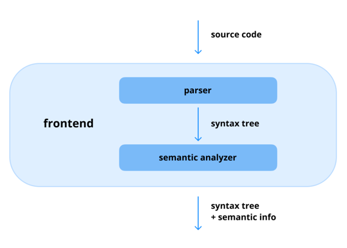
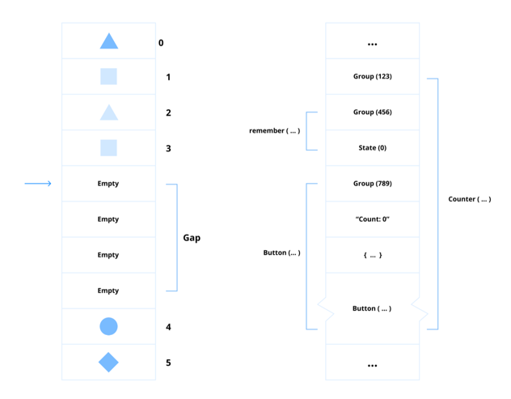
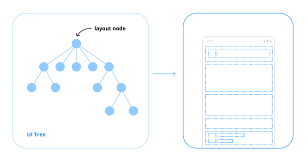
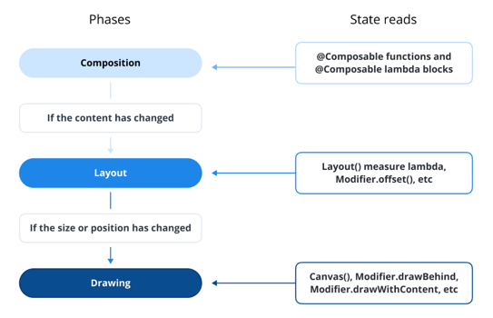
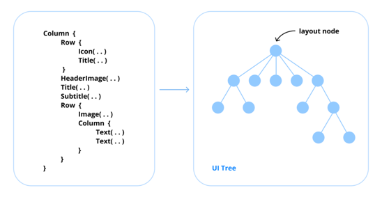
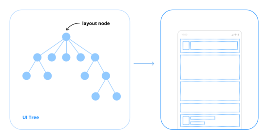
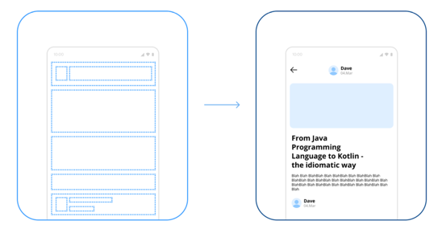
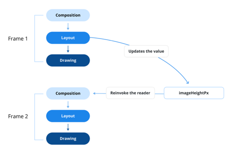

### 66. 초기 데이터 로딩을 위한 작업을 Compose의 LaunchedEffect와 ViewModel.init() 중 어디에서 하는 것이 가장 이상적인가요?

- 공식 안드로이드 문서 및 architecture-samples 예제는 일반적으로 구성 변경 시 더 나은 생명 주기 관리 및 데이터 지속성을 위해 ViewModel.init() 내에서 데이터를 로드할 것을 예시로 보여주고 있음

#### ViewModel.init()을 지지하는 입장

- LaunchedEffect를 사용하는 것은 앱에 무엇을 해야 할지 지시하기 위해 UI에 의존함을 뜻한다
- 따라서 ViewModel.init()를 사용하는 것이 LaunchedEffect 내에서 직접 데이터를 가져오는 것보다 더 나은 관심사 분리를 제공하여 비즈니스 로직과 UI 상태 관리가 구분되도록 보장

#### LaunchedEffect를 지지하는 입장

- ViewModel.init()에만 의존하면 특정 동작이 트리거 되는 시점에 대한 제어가 어려워지고 단위 테스트가 복잡해질 수 있음
- LaunchedEffect를 사용하면 더 큰 유연성과 제어권을 제공

#### 둘 다 안티패턴. 지연 관찰(Lazy Observation) 사용하기

- ViewModel.init()에서 초기 데이터 로드 시 ViewModel 생성 중 의도치 않은 사이드 이펙트가 발생할 뿐만 아니라
- UI 상태 관리라는 의도된 역할에서 벗어나 생명주기 처리를 복잡하게 만들 수 있음

- LaunchedEffect 내에서 데이터를 초기화하면 매 첫 컴포지션마다 반복적으로 트리거될 위험이 있음
- ViewModel의 생명주기가 Compose 함수의 생명주기보다 길기 때문에, Composable 함수가 새로 컴포지션에 진입할 때마다 동일한 ViewModel 인스턴스에 대해서 동일한 비즈니스 로직을 반복적으로 트리거

- 지연 초기화를 위해 cold flow 사용 권장

#### 지연 관찰 모범 사례

```kotlin
val pokemon: StateFlow<Pokemon?> = savedStateHandle.getStateFlow("pokemon", null)

val pokemonInfo: StateFlow<PokemonInfo?> = pokemon.filterNotNull().flatMapLatest { pokemon ->
    detailRepository.fetchPokemonInfo(
        name = pokemon.name,
        onComplete = { isLoading = false },
        onError = { errorMessage = it }
    )
}.stateIn(
    scope = viewModelScope,
    started = SharingStarted.WhileSubscribed(5_000),
    initialValue = null
)
```

- upstream 호출(detailsRepository.fetchPokemonInfo())은 실제로 구독될 때까지 실행되지 않음
- 그런 다음 결과는 캐시되어 stateIn 메소드를 사용하여 상태로 변환됨
- stateIn 메소드는 cold flow를 hot flow를 StateFlow로 변환
- 결과적으로 pokemonInfo 속성이 how flow로 정의되더라도 가장 최근에 방출된 값은 upstream flow의 단일 실행 인스턴스에서 나옴

#### 실전 질문

Q) ViewModel.init() 또는 Jetpack Compose의 LaunchedEffect에서 초기 데이터를 로드하는 것의 장단점은 무엇이며, 언제 어떤 접근 방식을 사용하시나요? 만약 다른 접근법을 선호한다면 어떤 것이 있나요?

A) ViewModel.init()에서 초기 데이터를 로드하는 것은 생명주기 관리와 관심사 분리에 유리합니다. ViewModel은 UI 구성 요소의 생명주기와 독립적으로 존재하므로, 구성 변경 시에도 데이터가 유지됩니다. 그러나 이 접근법은 ViewModel이 생성될 때마다 데이터를 로드하게 되어 불필요한 네트워크 호출이나 데이터베이스 쿼리가 발생할 수 있습니다.
LaunchedEffect를 사용하는 경우, Composable 함수가 컴포지션에 진입할 때마다 데이터 로드가 트리거될 수 있어, 동일한 ViewModel 인스턴스에 대해 반복적인 데이터 로드가 발생할 수 있습니다. 하지만, 이 방법은 UI 상태에 따라 더 유연하게 데이터를 로드할 수 있는 장점이 있습니다.
초기 데이터 로드에 대한 유연한 제어가 필요한 경우 LaunchedEffect, 그 외의 경우에는 ViewModle.init()을 사용하고 있습니다.

Q) ViewModel.init() 또는 LaunchedEffect와 비교할 때 cold flow를 사용한 지연 관찰은 초기 데이터를 로드할 때 효율성을 어떻게 개선하나요? 해당 접근 방식이 유익한 시나리오 예를 들어주세요.

A) ViewModel이 생성되거나 Composable 함수가 컴포지션에 진입할 때마다 데이터를 즉시 로드하는 대신, cold flow를 사용한 지연 관찰은 실제로 데이터가 필요할 때까지 로드를 연기합니다. collectAsStateWithLifecycle()과 사용하면 생명주기를 인식하여 화면시 사라지면 자동으로 수집을 멈춰 리소스 낭비를 방지합니다.
여러 탭을 가지고 있는 화면에서 실제로 사용자가 특정 탭을 선택할 때만 해당 탭의 데이터를 로드하는 시나리오에서 유용합니다. 사용자가 탭을 전환하지 않는 한, 불필요한 데이터 로드를 방지하여 앱의 성능과 반응성을 향상시킬 수 있습니다.

## Jetpack Compose Fundamentals

- Jetpack Compose는 시스템적으로 `Compose Compiler`, `Compose Runtime`, `Compose UI`의 세 가지 게층 구조로 구성되어 있음
- remember, LaunchedEffect, Box, Column, Row와 같이 UI 화면을 만들기 위해 개발자들이 사용하는 API는 대부분 `Runtime` 및 `UI` 계층에서 제공

### 0. Jetpack Compose의 동작 구조는 어떻게 이루어져 있나요?

- Compose의 구조는 `Compose Compiler`, `Compose Runtime`, `Compose UI`의 세 가지 주요 계층으로 dlfndjwu dlTdma
- 각 계층은 UI 코드를 상호 작용 가능한 애플리케이션으로 변환하는 데 중요한 역할을 함


#### Compose Compiler



- Compose Compiler는 Kotlin으로 작성된 선언적 UI 코드를 Jetpack Compose가 실행할 수 있는 최적화된 코드로 변환
- 컴파일 타임에 @Composable 함수를 처리하고, 필요한 UI 업데이트 및 recomposition 로직을 생성
- Compose Compiler 플러그인은 FIR (Frontend Intermediate Representation)에서 직접 작동
  - 컴파일러는 컴파일 타임에 정적 코드에 대해 더 자세하게 접근 가능
  - 개발자가 작성한 Kotlin 소스 코드를 동적으로 변환하고 최적화된 Java 바이트코드를 생성

#### Compose Runtime



- Compose Runtime은 recomposition 및 상태 관리를 지원하는 데 필요한 핵심 기능을 제공
- 변경 가능한 상태(mutable stats)를 처리하고, 스냅샷(snapshots)을 관리하며, 애플리케이션 상태가 변경될 때마다 UI 업데이트를 트리거
- gap buffer 자료구조에서 영감을 받은 slot table을 사용하여 컴포지션 상태를 메모이징(memoizing)하는 방시으로 작동
  - gap buffer는 텍스트 편집기에서 문자의 동작 시퀀스를 효율적으로 관리하는 데 사용되는 자료 구조
  - 필요할 때만 요소를 이동하여 빠른 삽입 및 삭제를 하용하는 `갭(gap)`이 있는 연속적인 메모리 블록을 유지하여 빈번한 수정 오버헤드를 줄임
  - slot table은 컴포지션 단계 중 UI 컴포넌트의 상태를 저장하고 관리하기 위해 Jetpack Compose에서 사용되는 자료 구조
  - UI 컴포넌트, 해당 관계 및 연관된 상태를 효율적으로 추저가여 상태 변경에 영향을 받는 요소만 업데이트하여 최적화된 recomposition을 가능하게 함

#### Pro Tips for Mastery: Gap Buffer에서 Link Table로 마이그레이션

- Android Open Source Project 코드를 살펴보면 Gap Buffer에서 Link Table로 마이그레이션하는 과정을 확인할 수 있음
- Link Table은 연결된 노드를 사용하여 데이터를 구성하므로 요소의 효율적인 삽입, 삭제 및 재배열이 가능
- SlotTable의 편집 기능을 향상시키면서, 동시에 현재 구현된 동작 방식의 효율성을 유지하는 것을 목표로 함

#### Compose UI



- Compose UI 계층은 애플리케이션 구축을 위한 고수준 컴포넌트 및 UI 위젯 제공
- Compose Runtime에 의해 처리되는 Compose 레이아웃 트리 구축을 단순화하도록 설계된 광범위한 컴포넌트를 제공
- 최근에는 Compose Multiplatform을 ㅈ거극적으로 발전시켜, Android뿐만 아니라 iOS, 웹, 데스크톱 애플리케이션 개발도 지원

#### 실전 질문

Q) Compose Compiler의 역할은 무엇이고, KAPT 또는 KSP와 같은 전통적인 어노테이션 프로세서와 어떻게 다른가요?

A) 컴파일 타임에 @Composable 함수를 처리하고, 필요한 UI 업데이트 및 recomposition 로직을 생성하는 역할을 합니다. 
KAPT/KSP는 FIR 이전 단계의 소스(PSI) 수준에서 동작하는 외부 어노테이션 프로세서로 단순히 주석을 읽어 새로운 소스 코드를 생성할 뿐, 컴파일러의 내부 의미 정보에는 접근하지 않습니다.
반면, Compose Compiler는 FIR 기반으로 동작하여 이미 의미 분석이 끝난 AST(FIR)을 직접 변환하여 Compose 런타임에 최적화된 바이트코드를 생성합니다.

Q) Compose Runtime은 recomposition과 상태를 어떻게 관리하며, 내부적으로 어떤 자료 구조를 사용하나요?

A) Compose Runtime은 Snapshot 기반 상태 시스템으로 변경을 감지하고, SlotTable에 저장된 Composition 구조를 기반으로 Recomposer가 필요한 부분만 다시 실행하는 구조를 가집니다.
즉, 내부적으로 SlotTable(Composition 트리)와 Snapshot 상태 시스템을 통해 효율적인 Recomposition을 가능하게 합니다.

### 1. Compose 페이즈(phase)에 대해 설명해 주세요



- Jetpack Compose는 UI를 화면에 그릴 때 `Composition`, `Layout`, `Drawing`의 세 가지 주요 단계로 나누어진 렌더링 파이프라인을 따름

#### Composition



- Composition 단계는 @Composable 함수를 실행하고 UI 트리를 구축하여 Composable 함수에 대한 설명을 생성하는 역할을 함
- 초기 UI 구조를 구축하고 Slot Table이라는 데이터 구조에 Composable 간의 관계를 기록
- 상태 변경이 발생하면 Composition 단계는 영향을 받는 UI에 대해 다시 계산하고, 필요한 경우 Recomposition을 트리거

##### Composition의 주요 작업

- @Composable 함수 실행
- UI 트리 생성 및 업데이트
- recomposition을 위한 변경 사항 추적

#### Layout



- Layout 단계는 Composition 단계 바로 직후에 수행
- 제공된 제약 조건에 따라 각 UI 컴포넌틔의 크기와 위치를 결정

##### Layout의 주요 작업

- UI 컴포넌트 측정
- 너비, 높이 및 위치 정의
- 부모 컨테이너 내 자식 배치

#### Drawing



- Drawing 단계는 Composition과 Layout 단계를 마친 UI 컴포넌트가 화면에 렌더링 되는 절차
- 해당 UI 들을 렌더링하기 위해 Skia 그래픽 엔진을 사용하여 부드러운 하드웨어 가속 기반의 렌더링 제공
- 커스텀 드로잉 로직은 Compose의 Canvas API를 사용하여 구현 가능

##### Drawing의 주요 작업

- 시각적 요소 렌더링
- 화면에 UI 컴포넌트 그리기
- 커스텀 드로잉 작업 적용

#### 실전 질문

Q) Composition 단계에서는 어떤 일이 발생하며, recomposition과 어떤 관련이 있나요?

A) Composition 단계에서는 @Composable 함수가 실행되어 UI 트리가 생성되고, Slot Table에 Composable 간의 관계가 기록됩니다. 이 단계는 초기 UI 구조를 구축하는 역할을 하며, 상태 변경이 발생하면 영향을 받는 UI에 대해 다시 계산하고 필요한 경우 Recomposition을 트리거합니다. 즉, Composition 단계는 UI의 현재 상태를 반영하고, 변경 사항을 추적하여 효율적인 Recomposition을 가능하게 합니다.

Q) Compose Phase에서 Layout 단계는 어떻게 작동하나요?

A) Layout 단계에서는 Composition 단계에서 생성된 UI 트리를 기반으로 각 UI 컴포넌트의 크기와 위치를 결정합니다. 이 단계에서는 제공된 제약 조건에 따라 UI 컴포넌트를 측정하고, 너비, 높이 및 위치를 정의하며, 부모 컨테이너 내에서 자식을 배치합니다.


### 2. Jetpack Compose가 선언적(declarative) UI 프레임워크라고 불리는 이유는 무엇인가요?

- Jetpack Compose는 UI가 어떻게 보여야 하는지를 설명하는 선언적 UI 프레임워크의 특성을 가짐
- 개발자가 뷰를 업데이트하고 UI 일관성을 유지하기 위해 수동으로 UI를 업데이트하는 전통적인 명령형(imperative) UI 접근 방식과 비교됨

#### Jetpack Compose에서 선언적 UI의 주요 특징

- 상태 주도 UI(State-driven UI)
  - 시스템은 각 컴포넌트의 상태를 추적하고 상태가 변경될 때 UI를 자동으로 업데이트
  - 개발자는 특정 상태에 대해 UI가 어떻게 보여야 하는지만 정의하고, 프레임워크가 렌더링 업데이트를 처리
- 컴포넌트를 함수 또는 클래스로 정의
  - UI 컴포넌트를 함수 또는 클래스로 표현되는 모듈식 컴포넌트로 정의
  - 이러한 컴포넌트는 UI 레이아웃과 동작을 모두 설명하여 XML과 같은 마크업 언어와 Kotlin 또는 Java와 같은 네티이브 프로그래밍 언어 간의 간극을 줄임
- 직접적인 데이터 바인딩(Direct Data Binding)
  - 선언적 UI 프레임워크를 사용하면 개발자가 모델 데이터를 UI 컴포넌트에 직접 바인딩하여 수동적으로 데이터를 동기화하는 수고를 덤
  - 기존의 XML처럼 추가적으로 요구되는 데이터 바인딩 계층이나 복잡한 어댑터 패턴을 사용하지 않고도 UI 개발을 크게 단순화시킴
- 컴포넌트 멱등성(Component Idempotence)
  - 컴포넌트는 호출 횟수에 관계없이 동일한 입력에 동일한 출력을 생성
  - 해당 속성은 컴포넌트의 일관성과 재사용성을 보장

#### Jetpack Compose vs. XML

- Jetpack Compose는 선언적 UI 접근 방식을 채택하였고, 이러한 접근 방식은 상태 변경에 대해 UI가 자동으로 업데이트되도록 보장하고 상태 관리와 코드 가독성 모두를 단순화

```kotlin
@Composable
fun Main() {
    var count by remember { mutableStateOf(0) }
    CounterButton(count = count, onClick = { count++ })
}

@Composable
fun CounterButton(count: Int, onClick: () -> Unit) {
    Button(onClick = onClick) {
        Text(text = "Clicked: $count")
    }
}
```

Jetpack Compose가 선언적 UI 프레임워크로 분류되는 이유는 다음과 같음:

1. 함수로 UI 정의
   1. @Composable 함수는 Compose Compiler에 의해 해석 및 변환되어 선언적 UI 생성을 가능하게 함
2. 상태 관리
   1. Compose Runtime에서 제공하는 remember와 같은 함수는 Composable의 상태와 생명주기를 효율적으로 관리
3. 직접 데이터 바인딩
   1. CounterButton 함수의 count 매개변수는 UI에 직접 바인딩되어 데이터가 UI 컴포넌트에 연결됨
4. 컴포넌트 멱등성
   1. CounterButton 함수는 동일한 입력 값에 대해 일관되어 동일한 UI 출력을 생성하여 예측 가능한 동작을 보장함

```xml
<RelativeLayout
  android:layout_width="match_parent"
  android:layout_height="match_parent"
  android:gravity="center"
  android:orientation="horizontal"
  android:padding="4dp">
  
  <Button
    android:id="@+id/button"
    android:layout_width="wrap_content"
    android:layout_height="wrap_content"
    android:layout_centerInParent="true"
    android:text="Clicked: 0" />

</RelativeLayout>
```

- XML 자체가 본질적으로 선언적이기 때문에 선언적 프로그래밍의 핵심 원칙인 `UI가 어떻게 렌더링되어야 하는지가 아니라 무엇을 렌더링할지 정의해야 하는 것과 일치`
- 하지만, 상태 관리 및 UI 업데이트는 Java 또는 Kotlin을 사용하여 명령형 코드에서 별도로 구현

```kotlin
var counter = 0

binding.button.setOnClickListener {
    counter++
    binding.button.text = counter.toString()
}
```

- 반면, Jetpack Compose와 같은 선언적 프레임워크는 상태 관리와 UI를 바인딩하여 상태가 변경될 때 자동적으로 UI 업데이트를 가능하게 함

#### 실전 질문

Q) Jetpack Compose의 선언적 UI의 특성은 전통적인 XML UI 개발과 어떻게 다르며, 어떤 이점을 제공하나요? 또한, 기존 XML UI 개발에 비해서 유의해야 할 사항은 무엇인가요?

A) Jetpack Compose는 선언적 UI 접근 방식을 채택하여, 개발자가 UI가 어떻게 보여야 하는지를 설명하는 데 집중할 수 있도록 합니다. 반면, XML UI 개발에서는 상태 관리와 UI 업데이트를 명령형 코드에서 별도로 구현해야 합니다. Compose는 상태 변경에 대해 UI가 자동으로 업데이트되도록 보장하며, 상태 관리와 코드 가독성을 단순화합니다. 또한, 컴포넌트 멱등성을 통해 일관성과 재사용성을 보장합니다. 그러나, 상태 관리와 UI 업데이트가 자동으로 처리되기 때문에 불필요한 Recomposition이 일어나지 않도록 유의해야 합니다.

Q) Jetpack Compose는 어떻게 컴포저블 함수에 대해 멱등성을 보장하며, 이것이 선언적 UI 시스템에서 중요한 이유는 무엇인가요?

A) Jetpack Compose는 컴포저블 함수가 동일한 입력에 대해 항상 동일한 출력을 생성하도록 설계되어 멱등성을 보장합니다. 클래스나 함수를 통해 UI를 정의하는 선언적 UI의 특성상 동일한 상태에 대해 일관된 출력을 제공하는 멱등성이 중요합니다. 이는 UI 일관성과 예측 가능성을 보장해주기 때문입니다.

### 3. recomposition이란 무엇이며 언제 발생하나요? 또한 앱 성능과 어떤 관련이 있나요?



- Jetpack Compose는 이미 렌더링된 UI 레이아웃을 업데이트 하기 위해 세 가지 주요 단계(Composition, Layout, Drawing)를 통하여 상태 변경이 발생할 때마다 UI를 다시 그리는 리컴포지션(Recomposition) 프로세스를 사용
- Recomposition이 발생하면 Composable Node는 UI 변경 사항을 Compose Runtime에 알리고, 업데이트된 UI가 최신 상태를 반영하도록 보장

#### Recomposition이 발생하는 조건

1. 매개변수에 변경이 발생했을 때(Input changes)
    * Composable 함수는 입력 매개변수가 변경될 때 recomposition을 트리거
    * Compose Runtime은 equals() 메소드를 통해 새 매개변수 값과 이전 매개변수 값을 비교해, 비교 결과가 false라면 recomposition 트리거
2. 상태 변경이 관찰되었을 때(Observing State Changes)
    * Jetpack Compose는 remember 함수와 State API를 함께 사용하여 상태 변경을 모니터링
    * 상태 객체를 메모리에 보존하고 recomposition이 발생했을 때에도 메모리에 저장된 값을 복원하여 UI에 최신 상태를 일관되게 반영하도록 보장

#### Recomposition과 성능

- Layout Inspector를 사용하여 실제 앱 내에서 발생하는 recomposition 횟수를 추적함으로써 불필요한 recomposition을 식별하는 것이 효과적
- Android Studio의 Layout Inspector는 recomposition이 발생할 때 UI의 어떤 부분이 reocmposition을 트리거하는지 쉽게 찾아낼 수 있도록 도와줌
- Composition Tracing을 사용해볼 수도 있음
  - 시스템 추적을 통해 오버헤드가 낮은 측정을 제공하고
  - 메소드 추적을 통해 세부적인 함수 호출 추적을 제공하지만, 앱 성능에는 직접적으로 영향을 미치지 않음

Q) 불필요한 recomposition을 줄이고 앱 성능을 최적화보신 경험이 있나요? 앱 성능을 향상시키기 위해 어떤 전략을 사용해볼 수 있을까요?

A) 네, Layout Inspector를 활용하여 불필요한 recomposition을 식별한 경험이 있습니다.
특히 동적으로 offset을 변경하는 UI가 있었는데, 기존에는 Modifier.offset(x = value, y = value)와 같은 방식으로 값을 전달하여 값이 변경될 때마다 전체 컴포저블이 재구성되는 문제가 있었습니다.
이 문제를 해결하기 위해, Modifier.offset에 람다 형태로 값을 전달하여 상태가 변경될 때마다 UI를 동적으로 최적화할 수 있었습니다.

### 4. Composable 함수는 내부적으로 어떻게 작동하나요?

#### 컴파일러 변환 (Compiler Transformation)

- 함수에 @Composable 어노테이션을 추가하면 Compose Compiler Plugin이 Kotlin 컴파일 프로세스를 가로챔
- 컴파일러는 Composable 함수를 표준적인 Kotlin 함수로 취급하지 않고, Compose의 반응형 시스템을 추가하기 위해 기존의 함수에 추가적인 매개변수와 각종 로직 주입
- 가장 중요한 매개변수 중 하나는 컴포지션 상태를 추적하고 UI 상태가 변경될 때 recomposition을 처리하는 Composer 매개변수

```kotlin
@Composable
fun MyComposable() {
    Text("Hello, Compose!")
}
```

```java
private static final void MyComposable(Composer $composer, int $changed) {
    $composer = $composer.startRestartGroup(1017251926);
    ComposerKt.sourceInformation($composer, "C(MyComposable)119@3919L23:MainActivity.kt#nzuxg3");

    if ($changed == 0 && $composer.getSkipping()) {
        $composer.skipToGroupEnd();
    } else {
        if (ComposerKt.isTraceInProgress()) {
            ComposerKt.traceEventStart(
                1017251926, 
                $changed, 
                -1, 
                "com.xperiventure.vlip.ui.MyComposable (MainActivity.kt:118)"
            );
        }

        TextKt.Text‑Nvy7gAk(
            "Hello, Compose!", 
            (Modifier) null, 
            0L, 
            (TextAutoSize) null, 
            0L, 
            (FontStyle) null, 
            (FontWeight) null, 
            (FontFamily) null, 
            0L, 
            (TextDecoration) null, 
            (TextAlign) null, 
            0L, 
            0, 
            false, 
            0, 
            0, 
            (Function1) null, 
            (TextStyle) null, 
            $composer, 
            6, 
            0, 
            262142
        );

        if (ComposerKt.isTraceInProgress()) {
            ComposerKt.traceEventEnd();
        }
    }

    ScopeUpdateScope var10000 = $composer.endRestartGroup();
    if (var10000 != null) {
        var10000.updateScope(MainActivityKt::MyComposable$lambda$0);
    }
}
```

- 다음과 같이 간단한 MyComposable 함수가 컴파일되면, Compose Compiler는 내부적으로 Composer 매개변수를 추가하고, recomposition을 처리하기 위한 로직을 삽입

#### 컴포지션 및 리컴포지션 (Composition and Recomposition)

- Composition 단계에서 Compose Runtime은 Composable 함수를 실행하고 UI 트리를 구축
- 해당 트리는 Slot Table이라는 데이터 구조에 저장되어, Compose가 UI를 효율적으로 관리하고 업데이트하는 역할을 담당
- 만약, 상태가 변경되면 Recomposition이 트리거되고, Compose Runtime은 Slot Table을 참조하여 영향을 받는 Composable 함수만 다시 실행

#### Remember 및 상태 관리 (Remember and State Management)

- 상태를 관리하기 위해 Compose는 remember 및 State와 같은 API를 제공

```kotlin
@Composable
fun Counter() {
    var count by remember { mutableStateOf(0) }
    Button(onClick = { count++ }) {
        Text("Count: $count")
    }
}
```

- remember는 count 상태가 recomposition이 발생하더라도 값이 메모리에 유지되도록 보장하고
- mutableStateOf는 상태가 변경될 때 Compose에 이 사실을 알리고 recomposition을 트리거

#### 실전 질문

Q) 함수에 @Composable 어노테이션을 추가하면 컴파일 시 내부적으로 어떻게 동작하고, 이것이 Jetpack Compose를 선언형 UI로 작동하도록 하는 데 어떤 역할을 하나요?

A) Composable 어노테이션이 붙은 함수는 Compose Compiler에 의해 처리되어, Composer 매개변수와 recomposition 로직이 추가된 표준 Kotlin 함수로 변환됩니다.
이때 Compose는 내부적으로 UI 요소의 상태 및 속성을 관리하기 위해 Composer와 Recomposer 객체를 사용합니다.
예를 들어, @Composable Text("Hello, World!")가 호출되면, UI 트리는 Composer에 의해 관리되며, state 변경 시 해당 트리만 다시 그려집니다.

#### Pro Tips for Mastery: Compose Compiler와 Composer

- Compose Compiler는 빌드 프로세스 중에 @Composable 함수의 중간 표현(IR)을 최적화된 코드로 변환

##### Composable 함수 변환

- @Composable 어노테이션이 붙은 Kotlin 함수에 대해 Compose Compiler는 Composer라는 암시적 매개변수를 추가하여 함수 자체를 바꿈
- Composer는 Composable 함수와 Compose Runtime 간의 다리 역할을 하며 런타임이 UI 상태, recomposition 및 기타 핵심 기능을 효율적으로 관리하도록 함

```kotlin
@Composable
fun Greeting(name: String) {
    Text(text = "Hello, $name!")
}
```

- 위 함수는 Compose Compiler에 의해 다음과 같은 함수로 변환

```kotlin
fun Greeting(name: String, composer: Composer, key: Int) {
    composer.startRestartGroup(key) // 리컴포지션 그룹 시작
    val nameArgChanged = composer.changed(name) // name 매개변수 변경 감지
    
    // name이 변경되었거나 그룹이 처음 생성된 경우 Text 실행
    if (nameArgChanged || composer.inserting) {
        composer.startReplaceableGroup() // 대체 가능 그룹 시작
        Text("Hello, $name!", composer = composer, changed = 0) // Text 호출 시 Composer 전달
        composer.endReplaceableGroup() // 대체 가능 그룹 종료
    } else {
        composer.skipToGroupEnd() // 변경 없으면 스킵
    }
    
    composer.endRestartGroup()?.updateScope { // 리컴포지션 그룹 종료 및 스코프 업데이트
        Greeting(name, composer, key or 1) // 리컴포지션 시 호출될 람다 설정
    }
}
```

- 이와 같은 코드 변환은 런타임이 입력 매개변수의 변경 사항을 추적하고 recomposition의 필요 여부를 결정하기 위한 hook 기법이 사용된 것
- hook를 활용하여 Compose는 변경되지 않은 UI에 대해 recomposition을 건너뛰고 성능을 최적화할 수 있음

##### Composer의 역할

1. 상태 관리(State Management)
   - 상태를 추적하고 매개변수 입력값이 변경될 때 Composable 함수가 올바르게 recompose 되도록 보장
2. UI 계층 구조 구성(UI Hierarchy Construction)
   - UI의 트리 구조를 유지하고 상태가 변경됨에 따라 노드를 효율적으로 업데이트
3. 최적화(Optimization)
   - 입력 매개변수의 변경 사항을 분석하여 UI의 어떤 부분을 recompose해야 하는지 결정
4. 리컴포지션 제어(Recomposition Control)
   - 특정 Composable에 대한 recomposition 시작, 건너뛰기 또는 종료를 포함한 recomposition의 생명주기를 조정

Composer는 recomposition이 점진적으로 수행될 수 있도록 보장. 즉, UI의 트리의 필요한 부분만 업데이트하여 불필요한 연산을 줄이고 성능을 향상시킴

#### Pro Tips for Mastery: Composable 함수 내에서 직접 비즈니스 로직 호출을 피해야 하는 이유

- 구글의 Compose 팀 소속 엔지니어는 Composable 함수가 멀티스레드 환경에서 돌아갈 가능성을 염두하고 코드를 작성하는 것이 좋다라고 함
- 향후 백그라운드 스레드 풀에서 Composable을 병렬로 실행할 수 있게 된다면 다음 사항을 준수해야 함
  - 사이드 이펙트 방지(Avoid Side Effects)
    - Composable 함수는 사이드 이펙트로부터 자유로워야 함
    - 외부 상태나 해당 범위 내 변수를 Composablee 함수 내에서 직접적으로 수정하거나 무언가를 요청하지 않아야 함
  - 콜백에서 사이드 이펙트 트리거(Trigger Side Effects in Callbacks)
    - 사이드 이펙트를 발생시킬 수 있는 모든 UI 관련 상호작용 작업에는 onClick과 같은 콜백을 사용해야 함
    - 이러한 콜백은 항상 UI 스레드에서 실행되어 일관성을 보장
  - 가변적인 상태 피하기(Avoid Mutable Shared State)
    - 상태를 나타내는 가변적인 변수(var)를 통해 UI를 업데이트하는 행위는 멀티 스레드 환경에서 안전하지 않음
    - Composable 함수 내에서 이와 같은 공유 변수를 사용하여 업데이트하면 안 됨
    - 상태를 올바르게 사용하기 위해선 remember와 State를 올바르게 사용해서 상태값을 관리해야 함

##### 사이드 이펙트가 없는 Composable vs. 사이드 이펙트가 발생하는 Composable

```kotlin
@Composable
fun SideEffectFree(text: String) {
    Card {
        Text(text = "This is a side-effect-free composable: $text")
    }
}
```

```kotlin
@Composable
fun SideEffect() {
    var items = 0 // 상태 정의를 위해 로컬 변수 사용
    
    Card {
        Text(text = "$items")
        items++
    }
}
```

- 위의 Composable 함수는 items를 함수 내에서 직접 수정하기 때문에, recompostion 때마다 items 값이 늘어남
- 따라서 값을 쓰는 행위 자체만 해도 멀티 스레드 환경에서 안전하지 않고, 개발자가 의도하지 않은 대로 동작할 가능성이 높음

##### 어떤 순서로든 실행될 수 있는 Composable 함수

- Composable 함수가 순차적으로 실행되는 것처럼 보일 수 있지만 순서 그대로의 동작을 보장하지 않음
- Composable 함수가 여러 자식 Composable을 호출하는 경우 해당 자식은 어떤 순서로든 실행될 수 있음

```kotlin
@Composable
fun TabLayout() {
    Row {
        FirstComposable { /* ... */ }
        SecondComposable { /* ... */ }
        ThirdComposable { /* ... */ }
    }
}
```

- 위의 TabLayout 함수에서 FirstComposable, SecondComposable, ThirdComposable은 어떤 순서로든 실행될 수 있음
- 따라서, 사이드 이펙트를 피하기 위해선 컴포저블이 공통적으로 가변성을 가진 전역 변수 등에 의존하면 안됨

```kotlin
var globalCounter = 0 // 전역 변수

@Composable
fun FirstComposable() {
    globalCounter++ // 전역 변수 값 변경
    Text("First Counter: $globalCounter")
}

@Composable
fun SecondComposable() {
    globalCounter++ // 전역 변수 값 변경
    Text("Second Counter: $globalCounter")
}

@Composable
fun TabLayout() {
    Row {
        FirstComposable()
        SecondComposable()
    }
}
```

- 예를 들어, FirstComposable 함수는 SecondComposable에서 값을 변경하는 전역 변수의 값에 의존한다고 가정하고 코딩하면 안 됨

### 5. Jetpack Compose의 안정성(stability)이란 무엇이며, 성능과 어떤 관련이 있나요?

- Jetpack Compose의 안정성(Stability)은 클래스나 타입이 동일한 매개변수 입력값에 대해 일관된 결과를 생성하도록 보장하는 속성을 나타냄
- 안정적인 클래스나 함수는 recomposition이 여러 번 발생하더라도 개발자의 의도와는 다르게 동작이 변경되지 않도록 보장
- Compose Compiler는 Composable 함수의 매개변수를 검사하고 stable 또는 unstablefh qnsfb

#### Stable vs. Unstable

- String을 포함한 원시 타입(Primitive Types)이 읽기 전용인 val로 정의된다면, 고유한 값은 변경되지 않으므로 stable
- 값을 캡처하지 않는 람다 표현식(예: (Int) -> String)과 같은 함수 타입(Function Types)도 동작이 예측 가능하므로 stable로 간주
- 클래스(Classes), 특히 읽기 전용이거나(val) 변경 불가능하고(immutable) stable한 public 속성을 가진 데이터 클래스는 stable로 간주
- @Stable 또는 @Immutable과 같은 안정성 어노테이션이 명시적으로 붙어있는 클래스는 stable로 간주

```kotlin
data class User(val id: Int, val name: String)
```

- 해당 클래스는 읽기 전용(val)이며, 원시 타입의 프로퍼티로 구성된 클래스로 Stable로 간주
- 반면에, Compose Compiler는 다음 기준에 따라 특정 매개변수 타입을 unstable로 간주
  - 인터페이스 및 추상 클래스(Interfaces and Abstract Classes)
    - List, Map 또는 Any와 같은 인터페이스는 컴파일 시점에 구현체의 종류를 보장할 수 없기 때문에 unstable로 간주
  - 가변적인 프로퍼티를 가진 클래스(Classes with Mutable Properties)
    - 하나 이상의 가변적이거나 본질적을 불안정하다고 간주되는 타입의 public 프로퍼티를 포함하는 클래스는 unstable로 분류

```kotlin
data class MutableUser(val id: Int, var name: String)
```

- 위의 예제에서 가변적인 프로퍼티(name)의 존재로 unstable로 간주

#### Composable 함수 추론하기

- 성능을 최적화하기 위해 컴파일러는 Composable 함수를 Restartable, Skippable, Moveable, Replaceable과 같은 유형으로 분류
- 재실행 가능(Restartable)
  - 매개변수 입력값 또는 상태가 변경되면 Compose Runtime은 UI를 업데이트하기 위해 recomposition을 위해 함수를 재호출
  - 대부분의 함수는 restartable로 간주되어 필요할 때마다 recomposition 트리거 가능
- 생략 가능(Skippable)
  - Skippable 함수는 스마트 recomposition에 의해 활성화된 조건 하에서 recomposition을 건너뛸 수 있음
  - recomposition을 건너뛰면 하위 함수를 재호출 하지 않아도 되기 때문에 루트 Composable의 성능 향상에 중요함
  - Restartable이면서 Skippable일 수 있는데 필요할 때 recomposition을 수행할 수 있지만, 조건이 허용되면 건너뛸 수 있음을 의미

#### 실전 질문

Q) Compose 컴파일러는 매개변수가 stable인지 unstable인지 어떻게 결정하며, 이것이 recomposition 동작에 어떤 영향을 미치나요?

A) Compose 컴파일러는 매개변수가 stable인지 unstable인지 결정하기 위해 해당 타입의 특성을 분석합니다. 예를 들어, 원시 타입(Primitive Types)이나 읽기 전용(val) 프로퍼티로 구성된 데이터 클래스는 stable로 간주됩니다. 반면에, 인터페이스나 추상 클래스, 가변적인 프로퍼티를 가진 클래스는 unstable로 분류됩니다. 이 안정성 판단은 recomposition 동작에 영향을 미치며, stable 매개변수는 변경되지 않는 한 recomposition을 건너뛸 수 있어 성능 최적화에 기여합니다.

Q) Jetpack Compose의 @Stable 및 @Immutable 어노테이션은 무엇이며, 어디에, 어떻게 사용해야 하나요?

A) 명시적으로 @Stable이나 @Immutable 어노테이션을 붙이면 해당 클래스나 타입이 stable하다는 것을 컴파일러에 알릴 수 있습니다. @Immutable은 클래스가 불변(immutable)임을 나타내며, 모든 프로퍼티가 읽기 전용(val)이고 stable 타입으로 구성되어야 합니다. @Stable은 클래스가 안정적이지만 반드시 불변일 필요는 없음을 나타냅니다. 이러한 어노테이션은 성능 최적화를 위해 recomposition을 건너뛸 수 있는 기회를 제공하므로, 안정성을 보장할 수 있는 데이터 모델이나 상태 객체에 적용하는 것이 좋습니다.

#### Pro Tips for Mastery: Smart Recomposition이란?

- Smart Recomposition은 컴파일러에서 제공하는 안정성 데이터에 의존하여 불필요한 업데이트를 선택적으로 건너뜀

##### Smart Recomposition 작동 방식

- Stable 매개변수, 입력값 변화 없음
  - 매개변수가 stable하고 이전 값과 동일(equals()가 true 반환)한 경우, Compose는 해당 UI 컴포넌트의 recomposition을 건너뜀
- Stable 매개변수, 입력값 바뀜
  - stable 매개변수의 값이 변경된 경우(equals()가 false 반환), 런타임은 recomposition을 트리거하여 UI를 업데이트함
- Unstable 매개변수
  - 매개변수가 unstable인 경우, Compose는 해당 UI 컴포넌트의 recomposition을 항상 수행하여 최신 상태를 반영

##### 불필요한 Recomposition을 피하는 것의 중요성

- 중복된 recomposition을 건너뛰면 함수를 다시 실행하고 UI 컴포넌트를 다시 그리는데 필요한 산술적인 오버헤드가 줄어듦
- 특히 복잡한 UI 계층 구조에서 불필요한 recomposition을 피하는 것은 앱의 성능과 반응성을 크게 향상시킬 수 있음

#### Pro Tips for Mastery: 안정성 어노테이션(stability annotations)의 종류와 각 차이점

##### @Immutable

- 클래스를 완전 변경 불가능(fully immutable)으로 표시하여, 클래스 내의 모든 속성이 컴파일러에 의해 변경 불가능한 것으로 처리되도록 보장
- @Immutable의 주요 특징은 아래와 같음:
  - 클래스의 모든 속성을 변경 불가능한 것으로 간주
  - 일반적으로 가변적인 프로퍼티가 없는(읽기 전용 또는 immutable한) 클래스에 사용
  - 클래스 내 상태 변경이 없음을 보장하여 Compose 컴파일러의 부담을 덜고 UI 성능 최적화를 단순화

```kotlin
@Immutable
data class User(val id: Int, val name: List<String>)
```

- items 프로퍼티는 List이므로 unstable 유형으로 간주되지만, @Immutable 어노테이션이 붙어있기 때문에 전체 User 클래스는 stable로 간주

##### @Stable

- @Stable 어노테이션은 속서잉 immutable 하거나 recomposition에 영향을 미치지 않는 제어된 가변성을 가지는 클래스에 사용
- 클래스 자체는 stable로 간주되지만 해당 속성은 여전히 변경될 수 있음
- public 속성이 읽기 전용이거나 immtutable하지만 읽기 전용이지만, 클래스 자체가 stable로 간주될 수 없는 클래스에 가장 적합
- @Stable의 주요 특징은 아래와 같음:
  - 일부 가변 속성을 허용하지만 클래스의 전반적인 안정성을 보장함
  - 특정 가변성이 내부적으로 잘 관리되는 클래스에 적합
  - 완전한 불변성을 보장할 수 없는 경우 유연하게 사용할 수 있음

```kotlin
@Stable
interface State<out T> {
    val value: T
}

@Stable
interface MutableState<T> : State<T> {
    override var value: T
    operator fun component1(): T
    operator fun component2(): (T) -> Unit
}
```

- MutableState에 의해 생성된 State 인스턴스는 setValue를 사용하여 값을 바꿀 수 있음
- State 인터페이스가 보유한 value는 읽기 전용이지만, 타 구현체에 의해 값이 언제든지 바뀔 수 있음을 의미
- 하지만, setValue를 사용하여 동일한 값을 넣는다면 동일한 결과값이 나옴
  - Compose는 이를 가변성이 내부적으로 잘 관리되며 예측이 가능하다고 판단
  - 따라서, State 및 MutableState 인터페이스는 @Stable로 표시

```kotlin
@Stable
fun Modifier.clipScrollableContainer(orientation: Orientation) =
    then(
        if (orientation == Orientation.Horizontal) {
            Modifier.clip(VerticalScrollableClipShape)
        } else {
            Modifier.clip(HorizontalScrollableClipShape)
        }
    )
```

##### @Immutable과 @Stable의 차이점

- @Immutable 어노테이션은 클래스의 모든 public 속성이 완전히 변경 불가능해야 함을 보장
- @Stable 어노테이션은 멱등성(동일 입력에 대해 동일 출력)의 성질을 가진 가변 속성이 있는 객체에 적합

| 특성     | @Immutable                                        | @Stable                                                   |
|--------|---------------------------------------------------|-----------------------------------------------------------|
| 불변성 요구 사항 | 모든 프로퍼티를 불변으로 간주해야 함.              | 일부 프로퍼티에 대해 제어가 가능한 가변성 허용.              |
| 유즈 케이스 | 변경이 완전히 불가능해야 하는 데이터 모델 클래스.     | UI 상태와 같이 제어할 수 있는 가변적인 클래스.              |
| Recomposition 동작 | 동일한 매개변수를 가진 종속 Composable에 대해 recomposition을 완전히 건너뛰는 방식. | 가변 프로퍼티가 변경되면 언제든지 recomposition이 트리거 될 수 있음. |

- @Immutable 어노테이션은 특히 Kotlin 데이터 클래스를 사용할 때 I/O 작업(네트워크 응답 또는 데이터베이스 엔티티)의 응답 모델과 같이 내부 프로퍼티들이 읽기 전용인 경우에 적합

```kotlin
@Immutable
public data class User(
    private val id: String,
    private val nickname: String,
    public val profileImages: List<String>
)
```

- 반대로 @Stable 어노테이션은 다양한 구현을 허용하고 내부에서 가변 상태를 포함할 수 있는 인터페이스에 적합

```kotlin
@Stable
interface UiState<T: Result<T>> {
    val value: T?
    val exception: Throwable?
    
    val hasSuccess: Boolean
        get() = exception == null
}
```

#### Pro Tips for Mastery: @Immutable 대신 @Stable를 잘못 사용한다면?

- 특정 클래스에 @Immutable 대신 @Stable을 실수로 사용하더라도 즉각적인 문제는 발생하지 않음
- 한 가지 추측으로는 구글 Compose 팀이 향후 최적화나 동작 변경에 대한 가능성을 열어두고 의도적으로 두 어노테이션의 목적을 구분했다는 것