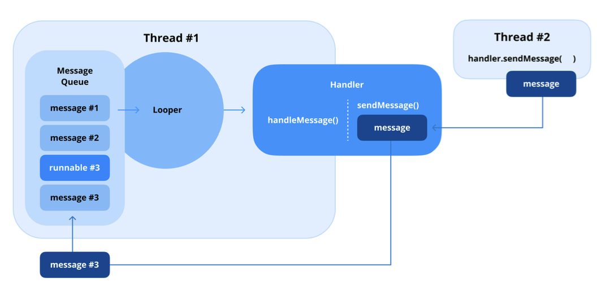

### Q17.) Bundle의 사용 목적에 대해서 설명해 주세요.

- Bundle은 Activity, Fragment, Service와 같은 컴포넌트 간에 데이터를 전달하는 데 사용되는 키-값 쌍 데이터 구조임.
- 일반적으로 앱 내에서 작은 용량의 데이터를 효율적으로 전송하는 데 사용됨.
- Bundle은 가볍고 안드로이드 운영 체제가 쉽게 관리하고 전송할 수 있는 형식으로 데이터를 직렬화하도록 설계되어 있음.

<br><br><br>

#### Bundle의 일반적인 사용 사례

1. Activity간 데이터 전달 : 새 Activity를 시작할 때 Intent에 Bundle을 담아서 대상 Activity에 데이터를 전달할 수 있음

2. Fragment간 데이터 전달 : Fragment 트랜잭션에서 Bundle은 setArguments() 및 getArguments()와 함께 전달되어 Fragment간에 데이터를 보냄.

3. 인스턴스 상태 저장 및 복원 : Bundle은 onSaveInstanceState() 및 onRestoreInstanceState()와 같은 생명주기 메서드에서 구성 변경 중에 임시 UI 상태를 저장하고 복원하는 데 사용됨

4. Service에 데이터 전달 : Service를 시작하거나 바인딩된 Service에 데이터를 전달할 때 Bundle을 통해 데이터를 운반할 수 있음

<br><br><br>

#### Bundle 작동 방식

- Bundle은 데이터를 키-값 구조로 직렬화하여 작동
- 키는 문자열이며 값은 기본 유형, Serializable, Parcelable 객체 또는 다른 Bundle일 수 있음.
- 이를 통해 데이터를 효율적으로 저장하고 전송할 수 있음.
- [저장된 인스턴스 상태를 백업으로 사용하여 시스템에서 시작된 프로세스 종료 처리](https://developer.android.com/topic/libraries/architecture/saving-states?hl=ko#onsaveinstancestate) 를 살펴보면 Bundle은 메모리에 저장되지만, 프로세스 외부의 메모리에 저장되므로 매모리 부족에 의해 해당 프로세스가 Kill되어도 어느정도 데이터를 살릴 수 있음. 이는 Android API 버전에 따라 바뀔 수도 있다고 함.

<br><br><br>

#### 요약

- Bundle은 컴포넌트 및 생명주기 이벤트 간에 데이터를 효율적으로 전달하고 보존하기 위한 안드로이드의 중용한 국성 요소임
- 가볍고 유연한 구조로 인해 어플리케이션 상태 및 데이터 전송 관리에 필수적인 도구임.

<br><br><br>

#### 실전 질문

Q) 구성 변경 중 onSaveInstanceState()는 UI 상태를 보존하기 위해 Bundle을 어떻게 활용하며, Bundle에 어떤 유형의 데이터를 담을 수 있나요?
A) onSaveInstanceState()에서 상태를 보존할 데이터를 Bundle형태로 저장할 수 있는데, 원시 타입이나 Serializable혹은 Parcelable만 저장시킬 수 있다. onRestoreInstanceState()에 저장한 데이터를 복원 시킬 수 있으며, 이 때 저장된 Bundle은 어플리케이션 프로세스 외부 메모리에 저장되어서 일시적으로 프로세스가 죽어도 살아있을 수 있지만, 확실하지 않으며 이를 보장하기 위해서는 Room이나 DataStore같은 디스크 저장 장치에 저장해야 함. 또한, Android API가 증가함에 따라 동작이 바뀔 수도 있음.

<br><br><br>

### Q18.) Activity 또는 Fragment 간에 데이터를 어떻게 전달하나요?

- Activity 또는 Fragment간의 데이터 전송은 상호 작용적이고 동적인 화면을 구성하는 데 중요한 역할을 함.

<br><br><br>

#### Activity간 데이터 전달

- 한 Activity에서 다른 Activity로 데이터를 전달하는 가장 일반적인 메커니즘은 Intent
- 데이터는 키-값 쌍의 형태로 Intent에 추가되고, 수신하는 Activity는 getIntent()를 사용하여 해당 값을 가져옴

<br><br><br>

#### Fragment간 데이터 전달

- Fragment간 데이터 젇날에도 Bundle을 사용할 수 있음. 
- 보내는 Fragment는 키-값 쌍의 형태로 Bundle을 생성하고 Arguments를 통해 수신하는 Fragment로 전달함

<br><br><br>

#### Jetpack Navigation 라이브러리로 Fragment간 데이터 전달하기

- Jetpack Navigation 라이브러리가 지원하는 SafeArgs 플러그인을 사용하면 대상 간 Type-Safe 네비게이션과 인수 전달을 가능하게 하는 direction 및 argument 클래스가 컴파일 타임에 자동적으로 생성되어, 런타임 시 값을 안전하게 가져올 수 있음.

1. 네비게이션 그래프에서 인수 정의하기

```kotlin
<fragment
    android:id="@+id/secondFragment" 
    android:name="com.example.SecondFragment"> 
        <argument
            android:name="username"
            app:argType="string" /> 
</fragment>
```

2. 소스 프래그먼트에서 데이터 전달하기

- Safe Args 플러그인은 컴파일 타임에 대상 객체와 빌더 클래스를 생성하여 아래 예시와 같이 인수를 안전하고 명시적으로 전달할 수 있도록 함

```kotlin
val action = FirstFragmentDirections.actionFirstFragmentToSecondFragment(username = "skydoves")

findNavController().navigate(action)
```

3. 대상 프레그먼트에서 데이터 검색하기

- 마지막으로, 아래 코드와 같이 전달된 인수를 통해 데이터를 가져올 수 있음

```kotlin
val username = arguments?.let {
    SecondFragmentArgs.fromBundle(it).username
}
```

- SafeArgs를 사용하여 정의된 인수를 컴파일 타임에 검사하여 정적인 코드로 만들고, 런타임에 해당 인수 값을 안전하게 가져옴으로써 런타임 오류를 줄일 수 있음.

<br><br><br>

#### Shared ViewModel 사용하기

- 동일한 Activity 내에서 Fragment끼리 통신해야 하는 경우 Shared ViewModel을 고려해볼 수 있음
- Shared ViewModel은 동일한 Activity 내의 여러 Fragment 간에 공유되는 ViewModel 인스턴스를 의미
- Jetpack의 fragment-ktx 라이브러리 내의 activityViewModels() 메서드를 사용하여 구현할 수 있음.
- ViewModel의 생명범위를 Activity로 지정하여 Fragment가 동일한 ViewModel 인스턴스에 접근하고 공유할 수 있도록 함.

<br><br><br>

#### 요약

1. Intent는 putExtra()와 getIntent()를 사용하여 Activity간 데이터를 전달하는 데 사용할 수 있다.
2. Bundle은 argument 속성을 통해 Fragment간 데이터를 전달하는 데 사용할 수 있다.
3. Jetpack Navigation과 Safe Args 플러그인을 사용하면 컴파일 타임에 생성된 direction 및 argument 클래스를 통해 Fragment간 타입 세이프하게 인수 전달이 가능하다.
4. 동일한 Activity내 Fragment간 데이터 공유는 SharedViewModel이 유용하고, 안드로이드의 공식문서에서 권장하는 방식 중 하나이다. 상황에 따라 활용되는 방법이 다르고, 기능의 요구 사항에 따라서 적절하게 활용하면 가장 효과적인 방법이 될 수 있다.

<br><br><br>

#### 실전 질문

Q) 동일한 Activtiy 내에서 Fragment간 데이터를 주고받을 때 어떤 방법이 효과적인지 설명해주시고, ViewModel을 활용한다면 Bundle이나 직접적인 Fragment 트랜잭션을 사용하는 것과 비교했을 때 어떤 이점이 있나요?
A) Activity 하위에서 생성되는 Fragment들이 모두 사용하는 데이터라면 SharedViewModel이 효과적일 수 있음. Bundle이나 Frament 트랜잭션에 비해 보일러 플레이트 코드가 적으며, LiveData나 StateFlow를 반응형도 대응할 수 있음. 반면, 많은 Fragment에서 사용하지 않는 데이터인데도 Shared ViewModel로 모두 올려버리면 Massive가 될 수도 있으며, 불필요하게 메모리를 점유할 수도 있으므로 잘 고민해야 함.

<br><br><br>

#### Fragment Result API

- 상황에 따라 Fragment에서 다른 Fragment 혹은 Activity 간에 일회성으로 값을 전달해야할 수 있음.
- 예를 들어, QR 코드 스캔을 수행하는 Fragment가 스캔된 데이터를 이전의 Fragment로 다시 보내야 하는 상황
- 각 FragmentManager가 FragmentResultOwner를 구현하여, Fragment가 서로 직접 참조할 필요 없이 결과 리스너를 통해 통신할 수 있음.
- 수신하는 측에서는 Fragment가 Started 상태에 들어갈 때 실행됨

```kotlin
// 수신하는 쪽
class FragmentA : Fragment() {
    override fun onCreate(savedInstanceState: Bundle?) {
        super.onCreate(savedInstanceState)
        
        // 데이터를 수신하기 위해 리스너 등록
        parentFragmentManager.setFragmentResultListener("requestKey", this) { requestKey, bundle ‐>
            val result = bundle.getString("bundleKey")
            // 수신한 결과 값 처리
        } 
    }
}
```

- FragmentA가 활성 상태가 아니라면, Fragment A가 재개되고 리스너를 등록할 때 까지 값이 계속 저장되어 있음.

```kotlin
// 송신쪽
class FragmentB : Fragment() {
    private lateinit var button: Button
    
    override fun onViewCreated(view: View, savedInstanceState: Bundle?) { super.onViewCreated(view, savedInstanceState)
        button = view.findViewById(R.id.button)
        button.setOnClickListener {
            val result = "result"
            // 값을 Fragment A로 전달 parentFragmentManager.setFragmentResult("requestKey", bundleOf("bundleKey" to result))
        }
    } 
}
```

- 키-리스너의 1:1 관계 : 각 키는 한 번에 하나의 리스너와 하나의 결과만 가질 수 있음
- 보류 중인 결과는 덮여쓰여짐 : 리스너가 활성화되기 전에 여러 결과가 설정되면 최신 결과만 저장됨
- 결과는 소비 후 삭제됨 : Fragment가 결과를 수신하고 처리하면 결과는 FragmentManager에서 제거됨
- 백스택의 프래그먼트는 결과를 받지 못함 : Fragment는 결과를 받으려면 백 스택에서 팝되지 않고 Started 상태여야 함
- Started 상태의 리스너는 즉시 트리거됨 : FragmentB가 결과를 설정할 때 FragmentA가 이미 활성 상태라면 리스너는 즉시 실행됨

<br><br><br>

### Q19.) 화면 회전과 같은 구성 변경이 발생하면 Activity에 어떤 변화가 생기나요?

- 안드로이드에서 구성 변경(화면 회전, 테마 변경, 글꼴 크기 조정, 언어 업데이트)이 발생하면 시스템은 새 구성을 적용하기 위해 현재 Activity를 종료하고 다시 실행하게 됨.
- 이러한 동작은 앱의 리소스가 변경된 구성을 새롭게 반영하고 앱이 다시 로드되도록 보장

<br><br><br>

#### 구성 변경 중 기본 동작

1. Activity 종료 및 재시작
- 시스템은 현재 실행 중인 Activity의 onPause(), onStop(), onDestoy() 메서드를 순차적으로 호출
- 구성을 변경하면 Activity는 다시 시작되고, onCreate() 메서드가 호출

2. 리소스 다시 로드하기
- 시스템은 새 구성에 따라 리소스를 다시 로드하여 앱이 화면 방향, 테마 또는 언어와 같은 변경 사항이 반영될 수 있도록 함

3. 데이터 손실 방지
- 개발자는 재생성 중 데이터 손실을 방지하기 위해 onSaveInstanceState() 및 onRestoreInstnaceState() 메서드를 사용하거나 ViewModel을 활용하여 인스턴스 상태를 저장하고 복원할 수 있음.

```kotlin
override fun onSaveInstanceState(outState: Bundle) { 
    super.onSaveInstanceState(outState) outState.putString("user_input", editText.text.toString())
}

override fun onCreate(savedInstanceState: Bundle?) { 
    super.onCreate(savedInstanceState) setContentView(R.layout.activity_main)
    
    val restoredInput = savedInstanceState?.getString("user_input")
    editText.setText(restoredInput)
}
```

<br><br><br>

#### 재생성을 유발하는 구성 변경

1. 화면 회전 : 화면 방향을 세로와 가로 간에 변경하여 새 크기에 맞게 레이아웃을 다시 로드
2. 다크/라이트 테마 변경 : 사용자가 다크 모드와 라이트 모드 간에 전환하면 앱은 테마별 리소스를 다시 로드
3. 글꼴 크기 변경 : 기기의 글꼴 크기 설정 조정은 새 배율을 반영하도록 텍스트 리소스를 다시 로드
4. 언어 변경 : 시스템 언어 업데이트는 현지화된 리소스를 다시 로드

<br><br><br>

#### Activity 재설정 피하기

- Activity를 다시 시작하지 않고 구성 변경을 처리하려면 매니페스트 파일에서 android:configChanges 속성을 추가하면 됨.
- 이 방식은 변경 사항을 개발자가 수동적으로 처리하는 형태로 책임을 개발자에게 위임

```kotlin
<activity
android:name=".MainActivity" android:configChanges="orientation│screenSize│keyboardHidden" />
```

- 이렇게 되면 시스템은 Activity를 소멸시키고 다시 생성하지 않는 대신, onConfigurationChanged() 메서드가 호출되어 개발자가 변경 사항을 수동적으로 처리할 수 있게 됨.

```kotlin
override fun onConfigurationChanged(newConfig: Configuration) {
    super.onConfigurationChanged(newConfig)

    if (newConfig.orientation == Configuration.ORIENTATION_LANDSCAPE) {
        // 화면이 가로로 변경된 경우 로직 처리
    } else if (newConfig.orientation == Configuration.ORIENTATION_PORTRAIT) {
        // 화면이 세로로 변경된 경우 로직 처리
    }
}
```

<br><br><br>

#### 실전 질문

Q) 구성 변경으로 인한 Activity 재생성 중 발생하는 데이터 손실을 어떻게 복원 및 보존할 수 있으며, UI 상태를 어떻게 복구시키는 지 설명해 주세요.
A) onSaveInstanceState() - onRestoreInstanceState()를 사용하여 ConfigurationChange시에 상태를 보존할 데이터를 저장 및 불러올 수 있으며, ConfiguartionChanged보다 생명 주기가 더 긴 ViewModel에 데이터를 저장시킬 수도 있음. 혹은 AndroidManifest에 ConfigurationChange를 위임받을 행위들을 작성한 뒤, onConfigurationChanged() 메서드를 직접 개발자가 구현하며 위임 받아 처리할 수도 있음.

<br><br><br>

### Q20.) ActivityManager란 무엇인가요?


- ActivityManager는 기기에서 실행 중인 Activity, 태스크, 프로세스에 대한 정보를 제공하고 관리하는 안드로이드 시스템 서비스임.
- 이는 안드로이드 프레임워크의 일부로, 개발자가 앱 생명주기, 메모리 사용량 및 태스크 관리 측면과 상호 작용하고 제어할 수 있도록 함.

1. 태스크 및 Activity 정보
- ActivityManager는 실행 중인 태스크, Activity 및 해당 스택 상태에 대한 세부 정보를 추적할 수 있음.

2. 메모리 관리
- 앱의 메모리 소비 및 시스템 전체 메모리 상태를 포함하여 시스템 전체의 메모리 사용량에 대한 정보를 제공. 개발자는 이를 사용하여 앱 성능을 최적화하고 메모리 부족 상태를 처리할 수 있음.

3. 앱 프로세스 관리
- ActivityManager는 실행 중인 앱 프로세스 및 Service에 대한 세부 정보를 쿼리할 수 있음. 개발자는 이 정보를 사용하여 앱 상태를 감지하거나 프로세스 수준의 변화에 응답할 수 있음.

4. 디버깅 및 진단
- 힙 덤프 생성 또는 앱 프로파일링과 같이 디버깅을 위한 도구를 제공하여 성능 병목 현상이나 메모리 누수를 식별하는 데 도움이 될 수 있음.

<br><br><br>

#### ActivityManager에서 제공하는 메서드

- getRunningAppProcesses(): 기기에서 현재 실행 중인 프로세스 목록을 반환함

- getMemoryInfo(ActivityManager.MemoryInfo memoryInfo): 사용 가능한 메모리, 임계 메모리, 기기가 메모리 부족 상태인지 여부 등 시스템에 대한 자세한 메모리 정보를 검색함. 메모리 부족 상태 동안 앱 동작을 최적화 하는데 유용

- killBackgroundProcess(String packageName): 시스템 리소스를 확보하기 위해 지정된 앱의 백그라운드 프로세스를 종료함. 이는 리소스 집약적인 앱을 테스트하거나 관리하는 데 유용함

- isLowRamDevice(): 기기가 저사양 Ram으로 분류되는지 확인하여 앱이 저메모리 기기에 대한 리소스 사용량을 최적화하는 데 도움을 줌

- appNotResponding(String messsage): 테스트 목적으로 ANR 이벤트를 시뮬레이션 함. 디버깅 중에 앱이 ANR 상황에서 어떻게 동작하거나 응답하는 지 이해하는 데 사용할 수 있음.

- clearApplicationUserData(): 파일, 데이터베이스 및 SharedPreferences를 포함하여 애플리케이션과 관련된 모든 사용자별 데이터를 지움. 공장 초기화나 앱을 기본 상태로 재설정하는 경우에 종종 사용됨

<br><br><br>

#### 사용 예제

```kotlin
val activityManager = getSystemService(Context.ACTIVITY_SERVICE) as ActivityManager

val memoryInfo = ActivityManager.MemoryInfo()
activityManager.getMemoryInfo(memoryInfo)

Log.d(TAG, "Low memory state: ${memoryInfo.lowMemory}")
Log.d(TAG, "Available memory: ${memoryInfo.availMem / (1024 * 1024)} MB")
Log.d(TAG, "Threshold memory: ${memoryInfo.threshold / (1024 * 1024)} MB")

val processes = activityManager.runningAppProcesses
if (processes != null && processes.isNotEmpty()) {
Log.d(TAG, "Process name: ${processes.first().processName}")
}

// 테스트 목적으로 ANR(App Not Responding) 이벤트를 시뮬레이션합니다. (주의해서 사용)
// activityManager.appNotResponding("Pokedex is not responding")

// 애플리케이션이 디스크에서 할당 중인 데이터를 지우도록 허용 (주의해서 사용)
// activityManager.clearApplicationUserData()
```

<br><br><br>

#### LeakCanary에서 ActivityManager 활용 사례

- LeakCanary는 Block이라는 기업에서 관리하는 안드로이드 애플리케이션용 오픈 소스 메모리 누수 감지 라이브러리임.
- 개발 중에 앱의 메모리 누수를 자동으로 모니터링하고 감지하여, 개발자가 메모리 누수를 효율적으로 고치는 데 도움이 될만한 분석을 제공함.
- LeakCanary는 내부적으로 메모리 상태 및 정보 추적을 위해 ActivityManager를 활용

<br><br><br>

#### 실전 질문

Q) ActivityManager.getMemoryInfo()를 어떻게 앱 성능 최적화에 활용할 수 있으며, 시스템이 메모리 부족 상태에 들억마녀 개발자는 어던 조치를 취해야 하나요?
A) 해당 메서드를 통해 현재 메모리 상태를 파악할 수 있으며, 가용 가능한 남은 메모리 공간 정보를 얻을 수 있음. 만약 사용할 수 있는 공간 크기가 적다면 애니메이션을 Off하거나 이미지 라이브러리의 메모리 케싱 기능을 off 하는 등의 메모리 최적화를 수행할 수 있음.

<br><br><br>

### Q21.) SparseArray를 사용하면 어떤 이점이 있나요?

- SparseArray는 HashMap과 유사하게 정소 키를 객체 값에 매핑하는 안드로이드에 최적화된 데이터 구조임.
- 정수인 키와 함께 사용하도록 최적화되어 있어 정수 기반 키를 사용할 때 일반적인 Java/Kotlin의 Map이나 HashMap보다 메모리 관리 측면에서 효율이 좋고 상황에 따라 성능이 더 좋음

<br><br><br>

#### SparseArray의 주요 특징

1. 메모리 효율성
- 키-값 매핑을 위해 HashTable을 사용하는 HashMap과 달리 SparseArray는 오토박싱을 피하고 Entry 객체와 같은 추가 데이터 구조에 의존하지 않음. 이로 인해 훨씬 적은 메모리를 소비함

2. 성능
- 매우 큰 데이터 셋의 경우 HashMap만큼 빠르지는 않지만, SparseArray는 메모리 최적화 덕분에 중간 크기의 데이터 셋에서 더 나은 성능을 제공함

3. Null 키 값 사용 불가
- SparseArray는 키 값으로 기본 정수를 사용하므로 키 값에 Null을 허용하지 않음

<br><br><br>

#### SparseArray 사용의 이점

1. 오토박싱 방지
- HashMap<Integer, Objet>에서는 키가 Integer 객체로 저장되어 박싱 및 언박싱 작업으로 인한 오버헤드가 발생함.
- SparseArray는 int 키로 직접 작동하여 메모리와 계산 작업을 절약함

2. 메모리 절약
- SparseArray는 키와 값을 저장하기 위해 내부적으로 기본 배열을 사용하여, Entry와 같은 여러 객체를 생성하는 HashMap 구현에 비해 메모리 차지 공간을 줄임

3. 컴팩트한 데이터 저장에 효율적
- 적은 수의 키-값 쌍이 있는 밀도가 낮은 데이터 셋이나 키가 넓은 정수 범위에 걸쳐 드문드문 분포된 데이터 셋에 적합함.

4. 안드로이드 특화
- 제한된 리소스 시나리오를 처리하기 위해 안드로이드에 특화된 구조로 설계되어, 안드로이드 UI 컴포넌트에서 View ID를 객체에 매핑하는 등의 시나리오에 특해 효과적임.

<br><br><br>

#### SparseArray의 한계

1. 성능 트레이드 오프
- SparseArray의 요소 접근은 키 조회를 위해 이진 탐색을 사용하기 때문에 매우 큰 데이터 셋의 경우 HashMap보다 느림

2. 정수 키만 사용 가능
- 정수 키로 제한되어 다른 유형의 키가 필요한 사용 사례에는 적합하지 않음

<br><br><br>

#### 실전 질문

Q) HashMap 대신 SparseArray를 사용하는 것이 어떤 시나리오에서 더 효율적이며, 성능 및 사용성 측면에서 트레이드오프는 무엇인가요?
A) 대규모 데이터 셋을 저장해야 하는 상황이 아닌, 적은 수 혹은 넓은 범위지만 드문 드문 분포되어 있는 키-값 데이터 셋을 저장하는 데 효과적. 내부적으로 원시 타입 int를 사용하여 오토박싱을 피하며 HashMap에 비해서 메모리 절약적임. 하지만 많은 수의 데이터를 저장한다면 내부적으로 BinarySearch를 통해 탐색하기 때문에 HashMap에 비해서 느릴 수 있으며, 정수형 키만 사용할 수 있다는 단점이 있음.

<br><br><br>

### Q22.) 런타임 권한을 어떻게 처리하나요?

- 안드로이드에서 런타임 권한을 처리하는 것은 원활한 사용자 경험을 보장하면서 사용자 데이터에 접근하는 데 필수적임.
- 안드로이드 6.0 (API 레벨 23)부터 앱은 설치 시 자동으로 권한을 획득하는 대신 런타임에 위험 권한을 명시적으로 요청해야 함
- 이 접근 방식은 사용자가 필요할 때만 권한을 부여하도록 허용하여 사용자 개인 정보 보호를 강화함

<br><br><br>

#### 권한 선언 및 확인

- 권한을 요청하기 전에 앱은 AndroidManifest.xml 파일에 해당 권한을 선언해야 함.
- 런타임 시에는 사용자가 해당 권한이 필요한 기능과 상호작용할 때만 권한을 요청해야 함.
- 사용자에게 요청하기 전에 ContextCompat.checkSelfPermission()을 사용하여 권한이 이미 부여되었는 지 확인하는 것이 중요함.

```kotlin
when {
    ContextCompat.checkSelfPermission(this, Manifest.permission.CAMERA) == PackageManager.PERMISSION_GRANTED -> {
        // 권한 부여됨, 동작 이어서 진행
    }
    ActivityCompat.shouldShowRequestPermissionRationale( this, Manifest.permission.CAMERA) ‐> {
        // 사용자가 권한 요청을 거부한 경우 
        showPermissionRationale()
        }
    else ‐> {
        // 사용자 권한 요청
        requestPermissionLauncher.launch(Manifest.permission.CAMERA)
    }
}
```

<br><br><br>

#### 권한 요청하기

- 권한 요청에 권장되는 방법은 권한 처리를 단순화하는 ActivityResultLauncher API를 사용하는 것

```kotlin
val requestPermissionLauncher = registerForActivityResult(ActivityResltContracts.RequestPermission()) { isGranted ->
    if (isGranted) {
        // 권한 부여됨, 동작 이어서 진행
    } else {
        // 권한 거부됨
    }
}
```

- 시스템은 권한 요청을 관리하고, 사용자에게 다이얼로그를 표시하며, 사용자는 권한을 동의하거나 거절할 수 있음.

<br><br><br>

#### 권한 요청 근거 제공하기

- 경우에 따라 시스템은 shouldShowRequestPermissionRationale()을 사용하여 권한을 요청하기 전에 해당 기능을 사용하기 위해 권한이 필요한 근거를 표시할 것을 권장함.
- true인 경우 UI는 해당 권한이 필요한 이유를 설명해야 함.
- 이는 사용자 경험을 개선하고 권한 획득 가능성을 높임

```kotlin
fun showPermissionRationale() { 
    AlertDialog.Builder(this) .setTitle("권한 필요")
    .setMessage("이 기능이 제대로 작동하기 위해 카메라 접근 권한이 필요합니다.") 
    .setPositiveButton("확인") { _, _ ‐>
        requestPermissionLauncher.launch(Manifest.permission.CAMERA)
    }
    .setNegativeButton("취소", null)
    .show() 
}
```

<br><br><br>

#### 권한 거부 처리하기

- 사용자가 권한을 여러 번 거부하면 안드로이드는 이를 영구 거부로 처리하여 앱이 다시 요청할 수 없게 됨.
- 앱은 사용자에게 기능 제한에 대해 알리고 필요한 경우 시스템 설정으로 안내해야 함.

```kotlin
if (!ActivityCompat.shouldShowRequestPermissionRationale(this, Manifest.permission.CAMERA) && ContextCompat.checkSelfPermission(this, Manifest.permission.CAMERA) != PackageManager.PERMISSION_GRANTED) {
    // 사용자가 영구적으로 권한을 거부함 ('다시 묻지 않음' 선택)
    showSettingsDialog()
}

fun showSettingsDialog() {
    val intent = Intent(Settings.ACTION_APPLICATION_DETAILS_SETTINGS).apply {
        data = Uri.parse("package:$packageName") 
    }
    startActivity(intent)
}
```

<br><br><br>

#### 위치 권한 처리하기

- 위치 권한은 포그라운드 및 백그라운드 접근으로 분류됨.
- 포그라운드 위치 접근에는 ACCESS_FINE_LOCATION 또는 ACCESS_COARSE_LOCATION이 필요하며, 백그라운드 접근에는 추가적으로 ACCESS_BACKGROUND_LOCATION 권한이 필요함

```kotlin
<uses‐permission android:name="android.permission.ACCESS_FINE_LOCATION" /> <uses‐permission android:name="android.permission.ACCESS_BACKGROUND_LOCATION" />
```

- 안드로이드 10 (API 레벨 29)부터 백그라운드 위치를 요청하는 앱은 먼저 포그라운드 접근 권한을 요청한 다음 별도로 백그라운드 권한을 요청해야 함

<br><br><br>

#### 일회성 권한 (One-Time Permissions)

- 안드로이드 11 (API 레벨 30)은 위치, 카메라, 마이크에 대해 일회성 권한을 도입하였음.
- 사용자는 임시적으로 접근 권한을 부여할 수 있으며, 앱을 종료하면 해당 권한을 사라짐.

<br><br><br>

#### 실전 질문

Q) 안드로이드의 런타임 권한 시스템은 사용자 개인 정보를 어떻게 보호하며, 민감한 권한을 요청하기 전에 앱은 어떤 시나리오를 고려해야하나요?
A) 민감한 정보는 런타임 권한을 요청함으로써 사용자에게 해당 데이터에 접근 및 사용함을 알려줌으로써 보호하고, 사용자가 권한을 수락할 수 있도록 그 근거에 대해서 설명 및 거절 하였을 때에 대한 시나리오도 고려하여 앱을 설계해야 한다.

<br><br><br>

### Q23.) Looper, Handler, HandlerThread의 역할은 무엇인가요?

- Looper, Handler, HandlerThread는 스레드를 관리하고 비동기 통신을 처리하기 위해 함께 작동하는 컴포넌트임.
- 이들은 백그라운드 스레드에서 작업을 수행하면서 UI 업데이트를 위해 메인 스레드와 상호작용하기 위한 필수적인 컴포넌트임



<br><br><br>

#### Looper

- Looper는 스레드를 살아있게 유지하여 메시지 또는 작업 큐를 순차적으로 처리하는 안드로이드 스레딩 모델의 일부
- 안드로이드의 메인 스레드 및 다른 워커 스레드에서 중심적인 역할을 함

- 목적 : 메시지 큐를 지속적으로 모니터링하고 메시지나 작업을 적합한 해들러에 가져와 디스패치함
- 사용법 : 메시지를 처리하는 모든 스레드에는 Looper가 필요함. 메인 스레드에는 자동으로 Looper가 있지만, 워커 스레드의 경우 명시적으로 준비해야 함.
- 초기화 : Looper.prepare()를 사용하여 스레드에 Looper를 연결하고 Looper.loop()를 사용하여 루프를 시작함.

```kotlin
val thread = Thread {
    Looper.prepare() // 스레드에 Looper 연결
    val handler = Handler(Looper.myLooper()!!) // Looper를 사용하여 Handler 생성
    Looper.loop() // 메시지 루프 시작
}
thread.start()
```

<br><br><br>

#### Hanlder

- Handler는 스레드의 메시지 큐 내에서 메시지나 작업을 보내고 처리하는 데 사용됨. Looper와 함께 작동

- 목적 : 한 스레드에서 다른 스레드로 작업이나 메시지를 전달
- 동작 : Handler가 생성될 때, 생성된 스레드 및 해당 스레드의 Looper에 연결됨. Handler로 전송된 작업은 해당 스레드에서 처리됨

```kotlin
val handler = Handler(Looper.getMainLooper()) // 메인 스레드에서 실행됨

handler.post {
    // UI 업데이트 코드
    textView.text = "Updated from background thread"
}
```

<br><br><br>

#### HandlerThread

- HandlerThread는 내장된 Looper를 가진 특수한 Thread임. 작업 또는 메시지 큐를 처리할 수 있는 백그라운드 스레드를 생성하는 과정을 단순화 함.

- 목적 : 자체 Looper를 가진 워커 스레드를 생성ㅎ아ㅕ 해당 스레드에서 작업을 순차적으로 처리할 수 있도록 함.
- 생명주기 : start()로 HandlerThread를 시작한 다음 getLooper()를 사용하여 Looper를 얻음. 리소스를 해제하려면 항상 quit() 또는 quiteSafely()를 사용하여 Looper를 종료해야 함.

```kotlin
val handlerThread = HandlerThread("WorkerThread")
handlerThread.start() // 스레드 시작

val workerHandler = Handler(handlerThread.looper) // 해당 Looper를 사용하여 작업 처리

workerHandler.post {
// 백그라운드 작업 수행 
Thread.sleep(1000) 
Log.d("HandlerThread", "Task completed")
}

// 스레드 종료
handlerThread.quitSafely() // 처리 중인 메시지 완료 후 안전하게 종료
```

<br><br><br>

#### 주요 차이점 및 관계

1. Looper : 메시지 처리의 중추이며, 스레드를 살아있게 유지하고 메시지 큐를 처리
2. Handler : Looper와 상호작용하여 메시지와 작업을 큐에 넣거나 처리함
3. HandlerThread : 자동 Looper 설정으로 백그라운드 스레드 생성을 단순화함

<br><br><br>

#### 사용 사례

- Looper : 메인 스레드 또는 워커 스레드에서 연속적인 메시지 큐를 관리하는 데 사용됨
- Handler : 스레드 간 통신 (가령, 백그라운드 스레드에서 UI 업데이트)에 이상적임
- HandlerThread : 데이터 처리나 네트워크 요청과 같이 전용 스레드가 필요한 백그라운드 작업에 적합함

<br><br><br>

#### 실전 질문

Q) Handler는 Looper와 어떻게 작동하여 스레드 간 통신을 용이하게 하며, Handler의 일반적인 사용 사례를 말씀해주세요.
A) 기본적으로 UI 스레드는 Looper가 장착되어 있음. 워커 스레드 또한 Looper.prepare() + Looper.loop()를 사용해서 스레드에 루프를 돌릴 수 있는데, 이는 해당 스레드에 들어온 메시지나 작업을 옵저빙하여 Handler로 보내서 스레드간 통신을 할 수 있게 해주는 객체임. Handler는 주로 워커 스레드에서 UI 작업을 하는 등에 용이함.

Q) HandlerThread란 무엇이며, Looper.prepare()를 사용하여 수동으로 스레드를 생성하는 것과 비교하여 백그라운드 스레드 관리를 어떻게 단순화하나요?
A) HandlerThread는 백그라운드 스레드를 만들고 루프를 돌게하는 작업의 보일러 플레이트 코드를 단순화 해줌.